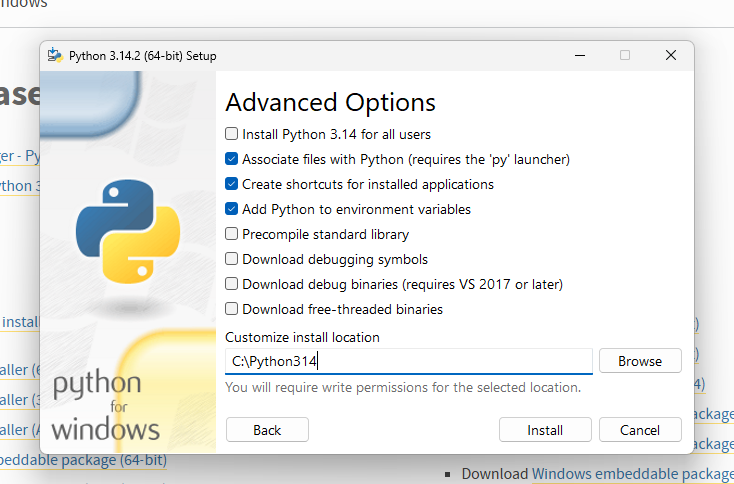

- Отличия 64-битной от 32-битной системы
- Резервное копирование в Windows


## Python

### Установка
1. `win + pause` - проверяем версию своей ОС
2. Переходим на сайт https://www.python.org/downloads/
3. Прожимаем Add to Path -> Customize -> Устанавливаем на диск C, убирая промежуточные пути (важно, могут быть ошибки из-за кириллицы): `C:\Python\314`

4. Переходим в CMD, проверяем работоспособность, (например, вводим `python`)

### Настройка VSCode

**Вывод в терминал результатов**
1. `.vscode\launch.json`
```javascript
{
    // Use IntelliSense to learn about possible attributes.
    // Hover to view descriptions of existing attributes.
    // For more information, visit: https://go.microsoft.com/fwlink/?linkid=830387
    "version": "0.2.0",
    "configurations": [
    
        {
            "name": "Python Debugger: Current File",
            "type": "debugpy",
            "request": "launch",
            "program": "${file}",
            "console": "integratedTerminal",
            "internalConsoleOptions": "neverOpen"
        }
    ]
}
```
2. `.vscode\tasks.json`
```javascript
{
    // Use IntelliSense to learn about possible attributes.
    // Hover to view descriptions of existing attributes.
    // For more information, visit: https://go.microsoft.com/fwlink/?linkid=830387
    "version": "0.2.0",
    "configurations": [
    
        {
            "name": "Python Debugger: Current File",
            "type": "debugpy",
            "request": "launch",
            "program": "${file}",
            "console": "integratedTerminal",
            "internalConsoleOptions": "neverOpen"
        }
    ]
}
```
3. `Ctrl + Shift + P` -> `Preferences: Open Keyboard Shortcut (JSON)` -> вставить забинденную комбинацию
```javascript
    {
        "key": "ctrl+f6",
        "command": "workbench.action.tasks.runTask",
        "args": "Run Python File",
        "when": "editorTextFocus"
    }
```
4. `Ctrl + K, Ctrl + S` - проверить бинд на вывод задачи (Run Task)


### Варианты исполнения команд
1. Интерактивный (немедленное выполнение интерпретатором). Преимущества: мгновенное получение результата (при отладке), недостатки: потеря раннее введённых команд.
2. Файловый (исполнение программы из текстового файла). Преимущества: сохранение данных, недостатки: более медленный.

### Плюсы
1. Простые, понятные и явные языковые конструкции
2. Хорошо читаемый текст программы
3. Богатая библиотека модулей
4. Возможность использования языка для решения различных задач
5. Кроссплатформенность
6. На Python быстрее разрабатывать программы (увеличивается скорость написания сложных алгоритмов)

### Минусы
1. Более медленная скорость работы программы
2. Больший объём используемой памяти