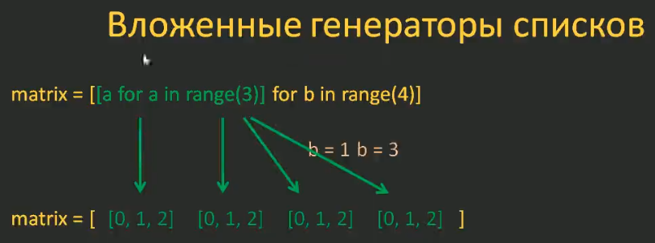
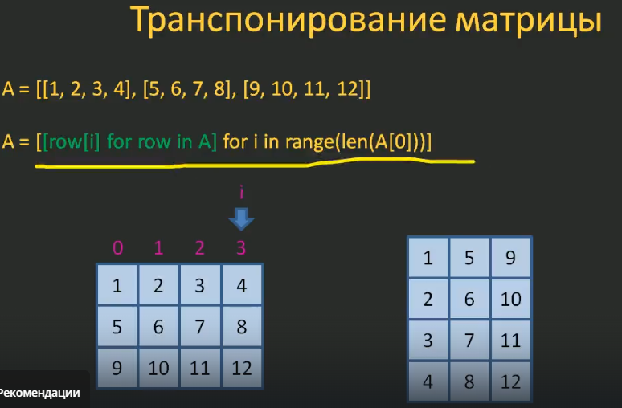

## Разница между copy и deepcopy
```python
import copy

original = [[1, 2], [3, 4]]
shallow_copy = copy.copy(original)
deep_copy = copy.deepcopy(original)

shallow_copy[0][1] = 4  # мутирут оригинал

print('original', original)  #  [[1, 4], [3, 4]]
print('shallow', shallow_copy)  #  [[1, 4], [3, 4]]
print('deepcopy', deep_copy) # [[1, 2], [3, 4]]
```
id у всех будут разные


### Отличия shallow copy и deep copy
- Shallow copy (поверхностная копия) создаёт новый внешний объект, но вложенные объекты остаются общими (копируются только ссылки на них). Создаёт новый список с другим id, но его элементы - это та же ссылка на элементы "родителя", поэтому при изменении происходит мутация.
- Deep copy создаёт полностью независимый объект: копируются и внешний контейнер, и все вложенные элементы рекурсивно. Тоже полностью независимый объект, элементы аналогично скопированы, но с другим id и изменения в deep copy не затрагивают оригинал.

**Использование**
- `copy.copy()` - нужно быстро скопировать простой список/словарь без вложенных изменяемых объектов (экономит память и время).
- `copy.deepcopy()` - есть вложенные списки, словари или другие изменяемые объекты, и нужна полная изоляция.


### ASCII значения латиницы и кириллицы
```python
print(
    alphabet_upper := [{chr(i): i} for i in range(ord('A'), ord('Z')+1)],
    alphabet_lower := [{chr(i): i} for i in range(ord('a'), ord('z')+1)],
    alphabet_rus_upper := [{chr(i): i} for i in range(ord('А'), ord('я')+1)],
    alphabet_rus_lower := [{chr(i): i} for i in range(ord('а'), ord('я')+1)],
    sep='\n\n'
)
```

### Отформатировать значение в строке
```python
digs = '1, 2,3,  4, 5,  6'
digs.replace(" ", "").split(",")
```

### Подсчёт суммы нечётных значений
```python
s = 0
d = 1

while d != 0:
    d = int(input('Введите число: '))
    if d % 2 == 0:
        continue
    s += d
    print('s = ', str(s))
```
Использование continue оправдано стремлением записи логики программы не в if, в а цикле (более читаемо)

### Перемножить элементы списка
```python
d = [1, 2, 3]
p = 1

for i in d:
    p *= i

print(p)
```

### Изменить список (for)
```python
d = [1, 2, 3, 4, 3, 2,1 ,2, 3]

for i in range(len(d)):
    d[i] = 0

print(d)
```

### Факториал числа
```python
n = int(input('Введите натуральное число не более 100: '))

# Если n не в диапазоне от 1 до 100
if not (1 <= n <= 100):
    # Исходное условие: n < 1 or n > 100
    print('Неверно введено натуральное число')
else:
    p = 1
    for i in range(1, n+1):
        p *= i
        
    print(f'Факториал {n}! = {p}')
```

### Убрать пробел в начале строки (учебный пример)
```python
words = ["python", "язык", "программирования"]

s = ''
fl_first = True

for w in words:
    s += ('' if fl_first else ' ') + w
    fl_first = False
    
print(s)
```

### Замена двухзначных чисел в списке на ноль
```python
digs = [4, 3, 100, -53, -30, 1, 34, -8, 42]

for index in range(len(digs)):
    # Если i - двухзначное число
    if 10 <= abs(digs[index]) <= 99:
        digs[index] = 0
        
print(digs)
```

Через enumarate
```python
digs = [4, 3, 100, -53, -30, 1, 34, -8, 42]

for index, value in enumerate(digs):
    # Если i - двухзначное число
    if 10 <= abs(value) <= 99:
        digs[index] = 0
        
print(digs)
```

### Замена кириллицы латиницей (учебный пример)
```python
t = ['a', 'b', 'v', 'g', 'd', 'e', 'zh', 'z', 'i', 'y', 'k', 'l', 'm', 'n', 'o', 'p', 'r', 's', 't', 'u', 'f', 'h', 'c', 'ch', 'sh', 'shch', '', 'y', '', 'e', 'yu', 'ya']

start_index = ord('а')  # Значение кода для русской 'а' 1072
title = "Программирование на Python - лучший курс"
slug = ''  # Храним преобразование кириллицы в латиницу

for s in title.lower():
    if 'а' <= s <= 'я':
        slug += t[ord(s) - start_index]  # t[1087 - 1072] = t[15] = p
        # Разница между кодом текущей буквы и кодом "a" даёт позицию буквы в алфавите (начиная с 0)
    elif s == 'ё':
        slug += 'yo'
    elif s in " !?;:.,":
        slug += '-'
    else:
        slug += s
        
while slug.count('--'):
    slug = slug.replace('--', '-')
        
print(slug)
```

### Таблица умножения
```python
a = [f"{i}*{j}={i*j}"
     for i in range(10)
     for j in range(10)
     ]

for i in a:
    print(i)
```

### Преобразование вложенных списков в один
```python
matrix = [
    [0, 1, 2, 3],
    [10, 11, 12, 13],
    [20, 21, 22, 23],
]

a = [
    x
    for row in matrix  # Перебираем строки (подсписки): row = [0, 1, 2, 3]
    for x in row  # Перебираем значения: x=0, x=1, x=2, x=3
]

print(a)  # [0, 1, 2, 3, 10, 11, 12, 13, 20, 21, 22, 23]
```

### Вложенные генераторы списков (повтор значения)
```python
M, N = 3, 4

matrix = [
    [a for a in range(M)]  # Затем запускается этот генератор [0, 1, 2]
    for b in range(N)  # Сначала отрабатывает этот список (b=0)
]

print(matrix)  # [[0, 1, 2], [0, 1, 2], [0, 1, 2], [0, 1, 2]]
```


### Возвести в квадрат вложенные списки
```python
matrix = [
    [1, 2, 3],
    [4, 5, 6],
    [7, 8, 9],
]

A = [
    [x**2 for x in row]  # Проход по элементам списка
    for row in matrix  # Проход по вложенным спискам поочерёдно
]

AA = [
    x**2 for row in matrix
    for x in row
]

print(A)  # [[1, 4, 9], [16, 25, 36], [49, 64, 81]]
print(AA)  # [1, 4, 9, 16, 25, 36, 49, 64, 81]
```

### Транспонирование матрицы
```python
A = [
    [1, 2, 3],
    [4, 5, 6],
    [7, 8, 9],
]

A = [[row[i] for row in A] for i in range(len(A[0]))]

print(A)  # [[1, 4, 7], [2, 5, 8], [3, 6, 9]]
```


### Треугольник Паскаля
Треугольник Паскаля - это структура, где каждый элемент (кроме крайних) равен сумме двух элементов над ним в предыдущей строке.
```python
N = 7
P = []

for i in range(N):  # Создаём строки треугольника
    row = [1] * (i+1)  # Создаём новую строку как список из (i+1) единиц
    for j in range(i+1):  # Проходим ко каждому индексу j в строке row (от 0 до i)
        if j != 0 and j != i:  # Проверяем, является ли элемент внутренним (не крайним)
            row[j] = P[i-1][j-1] + P[i-1][j]  # Элемент на позиции j в текущей строке равен сумме двух элементов на позициях j-1 и j в предыдущей строке
    P.append(row)
    
print(P)
```
Комментарии:
- `i - индекс строки`
- `j - индекс элемента внутри строки`

Пример для i=2 (третья строка, индексы 0,1,2):
- j=0: крайний, остаётся 1
- j=1: внутренний, row[1] = P[1][0] + P[1][1] = 1 + 1 = 2
- j=2: крайний, остаётся 1.
- Итог: row = [1, 2, 1]

### Поменять местами ключи и значения (в диапазоне от 1 до 5)
```python
m = {"безнадёжно": 0, "убого": 1, "неудовл.": 2, "удовл.": 3, "хорошо": '4', "отлично": '5'}
a = {int(value): key for key, value in m.items() if 2 <= int(value) <= 5}
print(a)
```

### Алгоритм Евклида
a = 18, b = 24
b-a = 24-18 = 6 (общий делитель)
b = 6, то есть b = b-a

a = 18, b = 6
a-b = 18-6 = 12
a = 12

пока a != b:
    находим большее среди a и b
    уменьшаем большее на величину меньшего
выводим полученные величины (a или b)

НОД(18, 24) = 6

```python
def get_nod(a, b):
    """
    Вычисляется НОД для натуральных чисел a и b по алгоритму Евклида
    
    :param a: первое натуральное число
    :param b: второе натуральное число
    :return: НОД (наибольший общий делитель)
    """
    
    while a != b:
        if a > b:
            a -= b
        else:
            b -= a
    return a

res = get_nod(18, 24)
print(res)
help(get_nod)
```
Тест
```python
def test_nod(func):
    a = 28
    b = 35
    res = func(a, b)
    if res == 7:
        print("#test-1 - OK")
    else:
        print("#test-1 - BAD")
    
res = test_nod(get_nod)
```

**Быстрый алгоритм Евклида**
```python
import time

def get_nod(a, b):
    """
    Вычисляется НОД для натуральных чисел a и b по БЫСТРОМУ алгоритму Евклида
    
    :param a: первое натуральное число
    :param b: второе натуральное число
    :return: НОД (наибольший общий делитель)
    """

    if a < b:
        a, b = b, a
        
    while b != 0:
        a, b = b, a % b
        
    return a


def test_nod(func):
    # ---- Тест №1 ----
    a = 28
    b = 35
    res = func(a, b)
    if res == 7:
        print("#test-1 - OK")
    else:
        print("#test-1 - BAD")
        
    # ---- Тест №2 ----
    a = 100
    b = 1
    res = func(a, b)
    if res == 1:
        print("#test2 - OK")
    else:
        print("#test2 - FAIL")
        
    # ---- Тест №3 ----
    a = 2
    b = 10000000  # продолжительность работы функции
    st = time.time()  # начальное время запуска
    res = func(a, b)  # наибольший общий делитель
    et = time.time()  # сколько времени прошло
    dt = et - st  # общее время работы функции
    
    if res == 2 and dt < 1:  # если результат 2 и время меньше секунды
        print("#test3 - OK")
    else:
        print("#test3 - FAIL")
        
    
res = test_nod(get_nod)
```

### Сравнение строк
```python
def cmp_str(s1, s2, reg=False, trim=True):
    if reg:
        s1 = s1.lower()
        s2 = s2.lower()
    if trim:
        s1 = s1.strip()
        s2 = s2.strip()
    return s1 == s2

print(cmp_str("Python ", " PYTHON", True, False))
```

### Оператор распаковки
```python
*x, y = (1, 2, 3)  # x = [1, 2] ; y = 3
x, *y = (1, 2, 3)  # x = 1 ; y = [2, 3]

# Распаковка списка в кортеж
a = [1, 2, 3]
a = (*a, )  # (1, 2, 3)

# Создание элементов списка с помощью оператора распаковки
d = -5, 5
[*range(*d), *(True, False), *a]  # [-5, -4, -3, -2, -1, 0, 1, 2, 3, 4, True, False, 1, 2, 3]
{*d}  # {-5, 5}
```