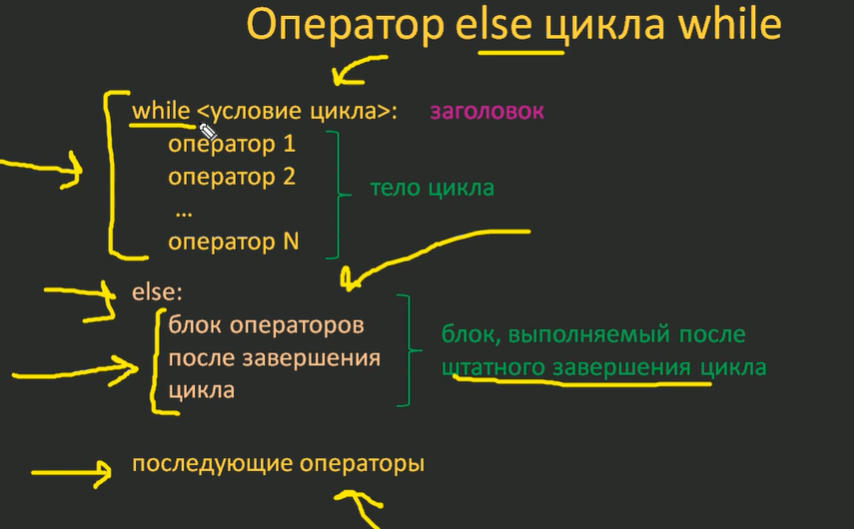
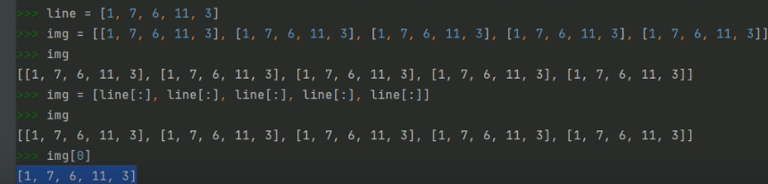
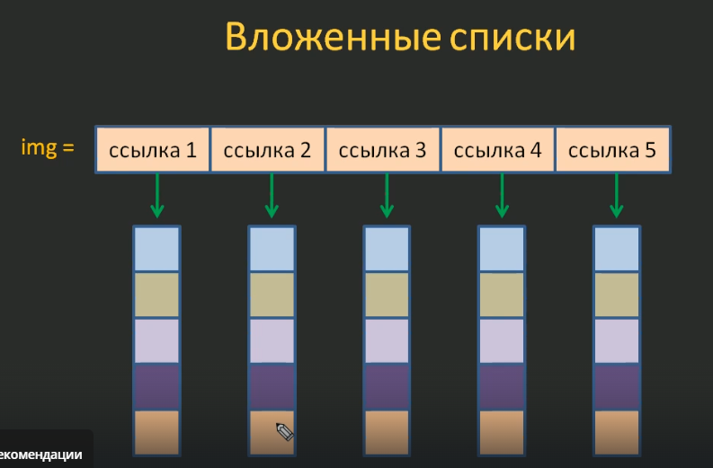

- Отличия 64-битной от 32-битной системы
- Резервное копирование в Windows
- Настройка VSCode для работы с Python + JS (Console, Terminal)
- Остаток от деления с отрицательными значениями

## Python

### Установка

1. `win + pause` - проверяем версию своей ОС
2. Переходим на сайт https://www.python.org/downloads/
3. Прожимаем Add to Path -> Customize -> Устанавливаем на диск C, убирая промежуточные пути (важно, могут быть ошибки из-за кириллицы): `C:\Python\314`
   
4. Переходим в CMD, проверяем работоспособность, (например, вводим `python`)

### Настройка VSCode

**Вывод в терминал результатов**

1. `.vscode\launch.json`

```javascript
{
    // Use IntelliSense to learn about possible attributes.
    // Hover to view descriptions of existing attributes.
    // For more information, visit: https://go.microsoft.com/fwlink/?linkid=830387
    "version": "0.2.0",
    "configurations": [

        {
            "name": "Python Debugger: Current File",
            "type": "debugpy",
            "request": "launch",
            "program": "${file}",
            "console": "integratedTerminal",
            "internalConsoleOptions": "neverOpen"
        }
    ]
}
```

2. `.vscode\tasks.json`

```javascript
{
    // Use IntelliSense to learn about possible attributes.
    // Hover to view descriptions of existing attributes.
    // For more information, visit: https://go.microsoft.com/fwlink/?linkid=830387
    "version": "0.2.0",
    "configurations": [

        {
            "name": "Python Debugger: Current File",
            "type": "debugpy",
            "request": "launch",
            "program": "${file}",
            "console": "integratedTerminal",
            "internalConsoleOptions": "neverOpen"
        }
    ]
}
```

3. `Ctrl + Shift + P` -> `Preferences: Open Keyboard Shortcut (JSON)` -> вставить забинденную комбинацию

```javascript
    {
        "key": "ctrl+f6",
        "command": "workbench.action.tasks.runTask",
        "args": "Run Python File",
        "when": "editorTextFocus"
    }
```

4. `Ctrl + K, Ctrl + S` - проверить бинд на вывод задачи (Run Task)

### Варианты исполнения команд

1. Интерактивный (немедленное выполнение интерпретатором). Преимущества: мгновенное получение результата (при отладке), недостатки: потеря раннее введённых команд.
2. Файловый (исполнение программы из текстового файла). Преимущества: сохранение данных, недостатки: более медленный.

### Плюсы

1. Простые, понятные и явные языковые конструкции
2. Хорошо читаемый текст программы
3. Богатая библиотека модулей
4. Возможность использования языка для решения различных задач
5. Кроссплатформенность
6. На Python быстрее разрабатывать программы (увеличивается скорость написания сложных алгоритмов)

### Минусы

1. Более медленная скорость работы программы
2. Больший объём используемой памяти

### Что внутри программы?

- Данные. Объект (хранилище данных): объект с числом, объект со строкой и т.д. Переменная - ссылка на объект.
- Вычисления
- Проверка условий
- Циклы

Динамическиая типизация - тип переменной определяется в момент присваивания ей значения.
Строграя типизация - тип переменной определяется в момент определения переменной.

**Присваивания**

- Каскадное

```python
a = b = c = 0
```

- Множественное

```python
a, b = 1, 2
```

- Одиночное

```python
a = b
```

**Именование переменных**

1. Имя существительное
2. Осмысленное имя, отражающее суть данных
3. Допустимые символы в именах: первый символ - любая буква латинского алфавита a-z, A-Z и символ подчёркивания \_. В качестве второго и последующих символов ещё цифры 0-9.

## Разное

- Операции в Python выполняются слева направо: `b = 2 + 3 + 4` (сначала 2 + 3, потом 5 + 4), но операция возвделение в степень выполняется справа-налево: `c = 2 ** 3 ** 4` (сначала `3**4`, затем `2 ** (3**4)`).
- `%` - остаток от деления
- разница между целочисленным делением `//` и остатком от деления `%`: `9 // 4 = 2`, `9 % 4 = 1`.

**Нюанс при возведениии в степень дробных значений**
`27 ** 1/3 = 9.0`. Сначала 27 ** 1, затем 27/3 = 9 (приоритет возведения в степень выше приоритета деления). Для более предсказуемого поведения используем скобки: `27 ** (1/3) = 3.0`.

- Строки - упорядоченный набор символов
- Списки - упорядоченная коллекция данных. Динамическая структура данных, способная изменяться в течении работы программы.

- `list("python")`. Приведение к списку итерируемого объекта выдаст

```python
['p', 'y', 't', 'h', 'o', 'n']
```

- `Дублирование списка`

```python
["Я", "люблю", "Python"] * 3  # ["Я", "люблю", "Python", "Я", "люблю", "Python", "Я", "люблю", "Python"]
```

- `else в while`
```python
s = 0
i = -10

while i < 100:  # Оператор else пропускается
    # while i < 0:  # else выводится
    if i == 0:
        break
    s += 1/i
    i += 1
else:
    print("Сумма вычислена корректно")
    
print(s)
```



## Математические операции

### Вычисление остатка от деления

Кратное число - это число, которое делится на заданное число без остатка.

**9 % 5**

1. Формула расчёта для ненулевых значений: `r = a - b * q`
   (a - делимое; b - делитель; q - сколько раз число b помещается в а без превышения;);

```python
9 % 5
r = 9 - 5 * 1
r = 4
```

**-9 % 5**

1. Берём наименьшее кратное 5 относительно -9 (-10)
2. Вычисляем по формуле: `-9-(-10) = 1`.
   

**9 % -5**

1. Берём наименьшее кратное -5 относительно 9 (10)
2. `9 - 10 = -1`

**-9 % -5**

1. Работаем в области отрицательных значений
2. `-9-(-5) = -4`.

**100 % 1000**

1. По формуле: `r = a - b * q` получается `100 - 1000 * 0 = 100 - 0 = 100`

### Математические функции

- `abs()` - модуль числа (ненулевое представление)
- `min()` - минимальное среди переданных чисел. Если меньше 2 аргументов, будет ошибка.
- `max()` - максимальное среди переданных чисел. Если меньше 2 аргументов, будет ошибка.
- `pow()` - возведение в степень. `pow(6, 2) = 6 ** 2`, квадратный корень: `pow(49, 0.5) = 7`, кубический корень: `pow(27, 1/3) = 3.0`
- `round()` - округление до ближайшего целого числа. Есть нюансы округления: `round(1.5) = 2`, `round(10.5) = 10`. Объяснение погрешности: пайтон применяет "банковское округление", или округление к ближайшему чётному при неоднозначности. Если 1.5, то целая часть (1) - нечётная, и ближайшее чётное 2. Если 10.5, то 10 - чётное, и именно до этого значения происходит округление. `5` - граничащее значение, при других условиях округление идёт в большую сторону `round(10.5000001) = 11`.
  Принимает второй аргумент (точность округления): `round(7.8765, 2) = 7.88`. Значение `-1` выполнит округление до десятков: `round(7.81283, -1) = 10.0`. Значение `-2` округит до сотых: `round(784.5575, -2) = 800.0`.
  

**Модуль math**

- `ceil()` - округление до наибольшего целого.
- `floor()` - округление до наименьшего целого.
- `factorial()` - факториал числа.
- `trunc()` - отбрасываем дробную часть. `trunc(5.8) = 5` (аналог int()).
- `log2(4)` - логарифм 4 по основанию 2.
- `log()` - натуральный логарифм. Принимает аргументы `log(27, 3)` (логирифм 27 по основанию 3)
- `sqrt()` - квадратный корень.
- `sin()` - синус.
- `cos()` - косинус.
- `pi` - число pi.
- `e` - число e.

Целиком

```python
import math

print(
    math.ceil(5.2),  # 6
    math.floor(5.2),  # 5
    math.factorial(6),  # 720
    math.trunc(5.8),  # 5
    math.log2(4),  # 2.0
    math.log(4),  # 1.3862943611198906
    math.log(27, 3),  # 3.0
    math.sin(3.14/2),  # 0.9999996829318346
    math.cos(3.14/2),  # 0.0007963267107332633
    math.pi,  # 3.141592653589793
    math.e,  # 2.718281828459045
)
```

## Команды

`help()` + `keywords` - список зарезервированных слов.

## Методы строк

- format(\*args, \*\*kwargs) - подставляет значения в шаблон строки (через `{}`).

```python
'hello {}!'.format("world")
```

- maketrans() и translate() - для массовой замены символов в таблице

```python
table = str.maketrans('ae', 'xy')
result = 'apple'.translate(table)

print(result)  # xpply
```

- zfill(width) - дополняет строку нулями слева до длины width.

```python
'42'.zfill(5)  # 00042
```

- ljust(width[, fillchar]) - выравнивает по левому краю, дополняя справа до width символов fillchar (по умолчанию пробел).

```python
'hi'.ljust(5, '.')  # hi...
```

- rjust(width[, fillchar]) - выравнивает по правому краю, дополняя справа до width символов fillchar (по умолчанию пробел).

```python
'hi'.rjust(5, '.')  # ...hi
```

- center(width[, fillchar]) - центрирует, дополняя слева и справа.

```python
'hi'.center(5, '.')  # hi...
```

- find(sub, start, end)
- rfind
- lfind

- strip
- rstrip
- lstrip

- split
- join
- replace(old, new, count)
- partition(sep) - разбивает строку на 3 части: до sep, sep и после sep (возвращает кортеж)

```python
'hello,world'.partition(',')  # ('hello', ',', 'world)
```

- splitlines(keepends=False) - разбивает по символам перевода строки (`\n`, `\r` и тд)

```python
'line1\nline2'.splitlines()  # ['line1', 'line2']
```

- reverse
- index
- count(sub, start, end)

- isalpha - только буквы (без пробелов, цифр, знаков). Алфавит
- isalnum - буквы и цифры (без знаков)
- isspace - только пробельные символы (пробел, табуляция, перевод строки)
- isnumeric
- isdigit - только цифры

- startswith
- endswith
- swapcase - меняет регистр символов на противоположный

- upper()
- lower()
- capitalize()
- title()

## Форматирование строк

Исходные данные

```python
age = 18
name = "Сергей"
height = 5.9
```

1. format (для совместимости с Python < 3.6)

```python
"Меня зовут {}, мне {} лет".format(name, age)
"Меня зовут {0}, мне {1} лет".format(name, age)
"Меня зовут {fio}, мне {old} лет".format(fio=name, old=age)  # с ключами
```

2. f-strings (для нового кода)

```python
f"Меня зовут {name}, мне {age} лет"
```

3. `%` (для старых проектов python 2.x)

```python
"Имя: %s, Возраст: %d, Рост: %.1f" % (name, age, height)

# Плейсхолдеры
# %s - строка
# %d - целое число
# %f - число с плавающей точкой
# %.2f - 2 знака после запятой
# %x - шестнадцатеричное число
```

4. Шаблонные строки `string.Template` (для безопасных шаблонов, например, email-шаблонов)

```python
from string import Template
t = Template("Привет, $name! Твой рост: $height")
result = t.substitute(name="Charile", height=6.1)
print(result)
```

## Списки

### Встроенные функции для работы со списками

- len
- max
- min
- sum
- sorted

### Операции

- + соединение двух списков в один
- * дублирование списка
- in проверка вхождения элемента в список
- del удаление элемента списка

### Срезы

Списки поддерживают срезы
Замена элементов списка с помощью срезов

```python
marks = [2, 4, 3, 2, 5, 8]
marks[2:4] = ["хорошо", "плохо"]
```

### Методы списков (КККИПАРИСЭ)
- append()
- insert(index, value) - вставка в определённую позицию указанное значение (не удаляет текущий элемент на указанной позиции, а сдвигает его вправо)
- remove() - удаление по значению. Несуществующий аргумент вызовет ошибку
- pop() - удаляет элемент по индексу, без аргументов удаляет последний элемент + возвращает его
- clear() - очищает список
- copy() - копия списка
- count() - количество элементов с указанным значением
- index(value, start) - получаем индекс первого найденного значения. Ошибка при несуществующем значении
- reverse() - изменение порядка следования элементов на обратный. Мутирует оригинал
- sort(reverse=value) - сортировка значений текущего списка по неубыванию. Мутирует оригинал, ничего не возвращает

- extend() - добавление в всех элементов из итерируемого объекта (список, кортеж, множество, строки) в конец существующего списка (каждый элемент итерируемого объекта добавляется отдельно).
```python
chars = ['x', 'y']
chars.extend('abc')
print(chars)  # ['x', 'y', 'a', 'b', 'c']
```

Добавляет только ключи из словаря
```python
data = [10, 20]
dct = {'a': 1, 'b': 2}

data.extend(dct)
print(data)  # [10, 20, 'a', 'b']
```

### Вложенные списки

