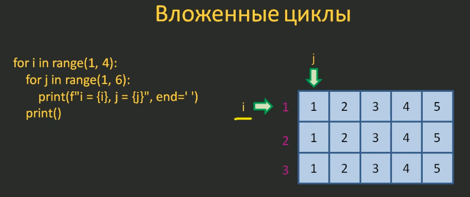
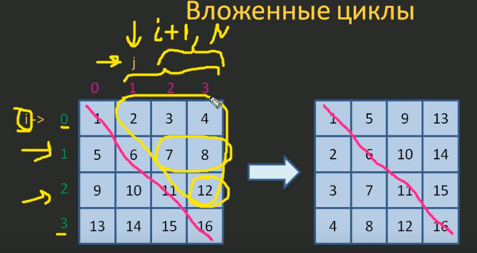
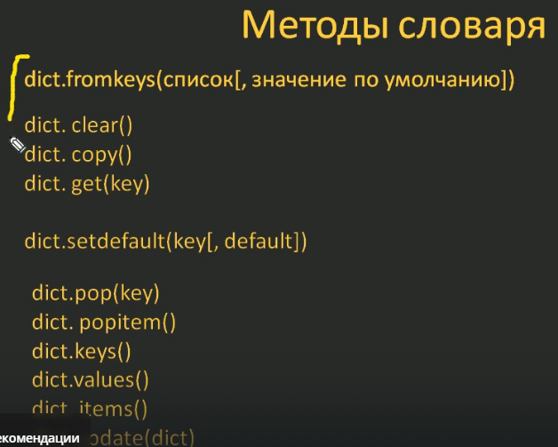
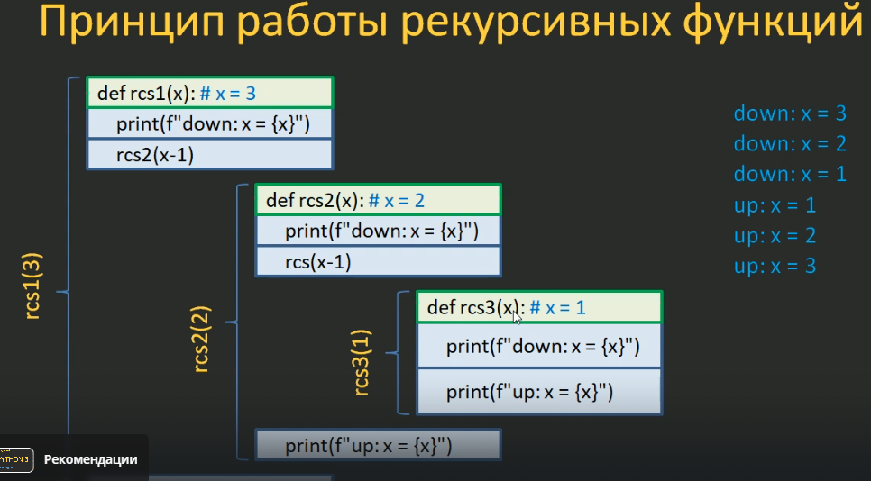
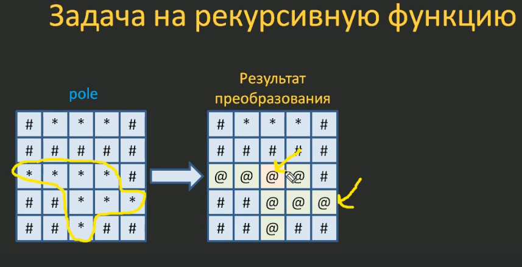
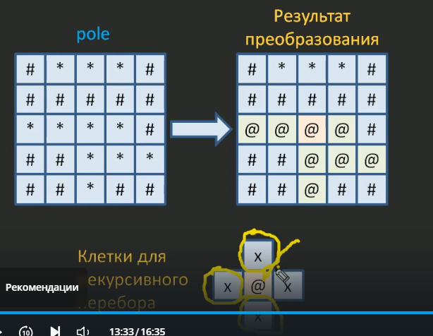
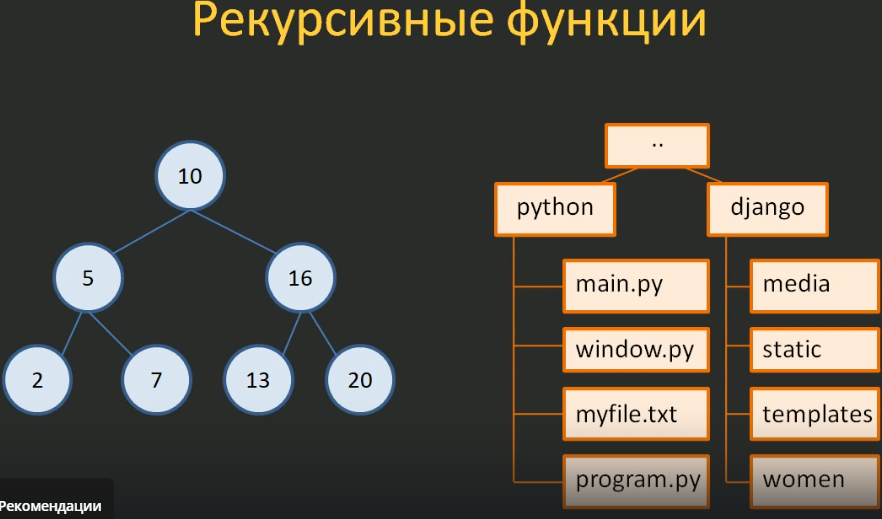

- Отличия 64-битной от 32-битной системы
- Резервное копирование в Windows
- Настройка VSCode для работы с Python + JS (Console, Terminal)
- Остаток от деления с отрицательными значениями

## Python

### Установка

1. `win + pause` - проверяем версию своей ОС
2. Переходим на сайт https://www.python.org/downloads/
3. Прожимаем Add to Path -> Customize -> Устанавливаем на диск C, убирая промежуточные пути (важно, могут быть ошибки из-за кириллицы): `C:\Python\314`
   
4. Переходим в CMD, проверяем работоспособность, (например, вводим `python`)

### Настройка VSCode

**Вывод в терминал результатов**

1. `.vscode\launch.json`

```javascript
{
    // Use IntelliSense to learn about possible attributes.
    // Hover to view descriptions of existing attributes.
    // For more information, visit: https://go.microsoft.com/fwlink/?linkid=830387
    "version": "0.2.0",
    "configurations": [

        {
            "name": "Python Debugger: Current File",
            "type": "debugpy",
            "request": "launch",
            "program": "${file}",
            "console": "integratedTerminal",
            "internalConsoleOptions": "neverOpen"
        }
    ]
}
```

2. `.vscode\tasks.json`

```javascript
{
    // Use IntelliSense to learn about possible attributes.
    // Hover to view descriptions of existing attributes.
    // For more information, visit: https://go.microsoft.com/fwlink/?linkid=830387
    "version": "0.2.0",
    "configurations": [

        {
            "name": "Python Debugger: Current File",
            "type": "debugpy",
            "request": "launch",
            "program": "${file}",
            "console": "integratedTerminal",
            "internalConsoleOptions": "neverOpen"
        }
    ]
}
```

3. `Ctrl + Shift + P` -> `Preferences: Open Keyboard Shortcut (JSON)` -> вставить забинденную комбинацию

```javascript
    {
        "key": "ctrl+f6",
        "command": "workbench.action.tasks.runTask",
        "args": "Run Python File",
        "when": "editorTextFocus"
    }
```

4. `Ctrl + K, Ctrl + S` - проверить бинд на вывод задачи (Run Task)

### Варианты исполнения команд

1. Интерактивный (немедленное выполнение интерпретатором). Преимущества: мгновенное получение результата (при отладке), недостатки: потеря раннее введённых команд.
2. Файловый (исполнение программы из текстового файла). Преимущества: сохранение данных, недостатки: более медленный.

### Плюсы

1. Простые, понятные и явные языковые конструкции
2. Хорошо читаемый текст программы
3. Богатая библиотека модулей
4. Возможность использования языка для решения различных задач
5. Кроссплатформенность
6. На Python быстрее разрабатывать программы (увеличивается скорость написания сложных алгоритмов)

### Минусы

1. Более медленная скорость работы программы
2. Больший объём используемой памяти

### Что внутри программы?

- Данные. Объект (хранилище данных): объект с числом, объект со строкой и т.д. Переменная - ссылка на объект.
- Вычисления
- Проверка условий
- Циклы

Динамическиая типизация - тип переменной определяется в момент присваивания ей значения.
Строграя типизация - тип переменной определяется в момент определения переменной.

**Присваивания**

- Каскадное

```python
a = b = c = 0
```

- Множественное

```python
a, b = 1, 2
```

- Одиночное

```python
a = b
```

**Именование переменных**

1. Имя существительное
2. Осмысленное имя, отражающее суть данных
3. Допустимые символы в именах: первый символ - любая буква латинского алфавита a-z, A-Z и символ подчёркивания \_. В качестве второго и последующих символов ещё цифры 0-9.

## Разное

- Операции в Python выполняются слева направо: `b = 2 + 3 + 4` (сначала 2 + 3, потом 5 + 4), но операция возвделение в степень выполняется справа-налево: `c = 2 ** 3 ** 4` (сначала `3**4`, затем `2 ** (3**4)`).
- `%` - остаток от деления
- разница между целочисленным делением `//` и остатком от деления `%`: `9 // 4 = 2`, `9 % 4 = 1`.

**Нюанс при возведениии в степень дробных значений**
`27 ** 1/3 = 9.0`. Сначала 27 ** 1, затем 27/3 = 9 (приоритет возведения в степень выше приоритета деления). Для более предсказуемого поведения используем скобки: `27 ** (1/3) = 3.0`.

- Строки - упорядоченный набор символов
- Списки - упорядоченная коллекция данных. Динамическая структура данных, способная изменяться в течении работы программы.

- `list("python")`. Приведение к списку итерируемого объекта выдаст

```python
['p', 'y', 't', 'h', 'o', 'n']
```

- `Дублирование списка`

```python
["Я", "люблю", "Python"] * 3  # ["Я", "люблю", "Python", "Я", "люблю", "Python", "Я", "люблю", "Python"]
```

- `else в while`
```python
s = 0
i = -10

while i < 100:  # Оператор else пропускается
    # while i < 0:  # else выводится
    if i == 0:
        break
    s += 1/i
    i += 1
else:
    print("Сумма вычислена корректно")
    
print(s)
```


- `obj.__sizeof__()` - размер объекта в байтах (включая только его собственные данные, без учёта ссылок на другие объекты)


## Математические операции

### Вычисление остатка от деления

Кратное число - это число, которое делится на заданное число без остатка.

**9 % 5**

1. Формула расчёта для ненулевых значений: `r = a - b * q`
   (a - делимое; b - делитель; q - сколько раз число b помещается в а без превышения;);

```python
9 % 5
r = 9 - 5 * 1
r = 4
```

**-9 % 5**

1. Берём наименьшее кратное 5 относительно -9 (-10)
2. Вычисляем по формуле: `-9-(-10) = 1`.
   

**9 % -5**

1. Берём наименьшее кратное -5 относительно 9 (10)
2. `9 - 10 = -1`

**-9 % -5**

1. Работаем в области отрицательных значений
2. `-9-(-5) = -4`.

**100 % 1000**

1. По формуле: `r = a - b * q` получается `100 - 1000 * 0 = 100 - 0 = 100`

### Математические функции

- `abs()` - модуль числа (ненулевое представление)
- `min()` - минимальное среди переданных чисел. Если меньше 2 аргументов, будет ошибка.
- `max()` - максимальное среди переданных чисел. Если меньше 2 аргументов, будет ошибка.
- `pow()` - возведение в степень. `pow(6, 2) = 6 ** 2`, квадратный корень: `pow(49, 0.5) = 7`, кубический корень: `pow(27, 1/3) = 3.0`
- `round()` - округление до ближайшего целого числа. Есть нюансы округления: `round(1.5) = 2`, `round(10.5) = 10`. Объяснение погрешности: пайтон применяет "банковское округление", или округление к ближайшему чётному при неоднозначности. Если 1.5, то целая часть (1) - нечётная, и ближайшее чётное 2. Если 10.5, то 10 - чётное, и именно до этого значения происходит округление. `5` - граничащее значение, при других условиях округление идёт в большую сторону `round(10.5000001) = 11`.
  Принимает второй аргумент (точность округления): `round(7.8765, 2) = 7.88`. Значение `-1` выполнит округление до десятков: `round(7.81283, -1) = 10.0`. Значение `-2` округит до сотых: `round(784.5575, -2) = 800.0`.
  

**Модуль math**

- `ceil()` - округление до наибольшего целого.
- `floor()` - округление до наименьшего целого.
- `factorial()` - факториал числа.
- `trunc()` - отбрасываем дробную часть. `trunc(5.8) = 5` (аналог int()).
- `log2(4)` - логарифм 4 по основанию 2.
- `log()` - натуральный логарифм. Принимает аргументы `log(27, 3)` (логирифм 27 по основанию 3)
- `sqrt()` - квадратный корень.
- `sin()` - синус.
- `cos()` - косинус.
- `pi` - число pi.
- `e` - число e.

Целиком

```python
import math

print(
    math.ceil(5.2),  # 6
    math.floor(5.2),  # 5
    math.factorial(6),  # 720
    math.trunc(5.8),  # 5
    math.log2(4),  # 2.0
    math.log(4),  # 1.3862943611198906
    math.log(27, 3),  # 3.0
    math.sin(3.14/2),  # 0.9999996829318346
    math.cos(3.14/2),  # 0.0007963267107332633
    math.pi,  # 3.141592653589793
    math.e,  # 2.718281828459045
)
```

## Команды

`help()` + `keywords` - список зарезервированных слов.

## Методы строк

- format(\*args, \*\*kwargs) - подставляет значения в шаблон строки (через `{}`).

```python
'hello {}!'.format("world")
```

- maketrans() и translate() - для массовой замены символов в таблице

```python
table = str.maketrans('ae', 'xy')
result = 'apple'.translate(table)

print(result)  # xpply
```

- zfill(width) - дополняет строку нулями слева до длины width.

```python
'42'.zfill(5)  # 00042
```

- ljust(width[, fillchar]) - выравнивает по левому краю, дополняя справа до width символов fillchar (по умолчанию пробел).

```python
'hi'.ljust(5, '.')  # hi...
```

- rjust(width[, fillchar]) - выравнивает по правому краю, дополняя справа до width символов fillchar (по умолчанию пробел).

```python
'hi'.rjust(5, '.')  # ...hi
```

- center(width[, fillchar]) - центрирует, дополняя слева и справа.

```python
'hi'.center(5, '.')  # hi...
```

- find(sub, start, end)
- rfind
- lfind

- strip
- rstrip
- lstrip

- split
- join
- replace(old, new, count)
- partition(sep) - разбивает строку на 3 части: до sep, sep и после sep (возвращает кортеж)

```python
'hello,world'.partition(',')  # ('hello', ',', 'world)
```

- splitlines(keepends=False) - разбивает по символам перевода строки (`\n`, `\r` и тд)

```python
'line1\nline2'.splitlines()  # ['line1', 'line2']
```

- reverse
- index
- count(sub, start, end)

- isalpha - только буквы (без пробелов, цифр, знаков). Алфавит
- isalnum - буквы и цифры (без знаков)
- isspace - только пробельные символы (пробел, табуляция, перевод строки)
- isnumeric
- isdigit - только цифры

- startswith
- endswith
- swapcase - меняет регистр символов на противоположный

- upper()
- lower()
- capitalize()
- title()

## Форматирование строк

Исходные данные

```python
age = 18
name = "Сергей"
height = 5.9
```

1. format (для совместимости с Python < 3.6)

```python
"Меня зовут {}, мне {} лет".format(name, age)
"Меня зовут {0}, мне {1} лет".format(name, age)
"Меня зовут {fio}, мне {old} лет".format(fio=name, old=age)  # с ключами
```

2. f-strings (для нового кода)

```python
f"Меня зовут {name}, мне {age} лет"
```

3. `%` (для старых проектов python 2.x)

```python
"Имя: %s, Возраст: %d, Рост: %.1f" % (name, age, height)

# Плейсхолдеры
# %s - строка
# %d - целое число
# %f - число с плавающей точкой
# %.2f - 2 знака после запятой
# %x - шестнадцатеричное число
```

4. Шаблонные строки `string.Template` (для безопасных шаблонов, например, email-шаблонов)

```python
from string import Template
t = Template("Привет, $name! Твой рост: $height")
result = t.substitute(name="Charile", height=6.1)
print(result)
```

## Списки

### Встроенные функции для работы со списками

- len
- max
- min
- sum
- sorted

### Операции

- + соединение двух списков в один
- * дублирование списка
- in проверка вхождения элемента в список
- del удаление элемента списка

### Срезы

Списки поддерживают срезы
Замена элементов списка с помощью срезов

```python
marks = [2, 4, 3, 2, 5, 8]
marks[2:4] = ["хорошо", "плохо"]
```

### Методы списков (КККИПАРИСЭ)
- append()
- insert(index, value) - вставка в определённую позицию указанное значение (не удаляет текущий элемент на указанной позиции, а сдвигает его вправо)
- remove() - удаление по значению. Несуществующий аргумент вызовет ошибку
- pop() - удаляет элемент по индексу, без аргументов удаляет последний элемент + возвращает его
- clear() - очищает список
- copy() - копия списка
- count() - количество элементов с указанным значением
- index(value, start) - получаем индекс первого найденного значения. Ошибка при несуществующем значении
- reverse() - изменение порядка следования элементов на обратный. Мутирует оригинал
- sort(reverse=value) - сортировка значений текущего списка по неубыванию. Мутирует оригинал, ничего не возвращает

- extend() - добавление в всех элементов из итерируемого объекта (список, кортеж, множество, строки) в конец существующего списка (каждый элемент итерируемого объекта добавляется отдельно).
```python
chars = ['x', 'y']
chars.extend('abc')
print(chars)  # ['x', 'y', 'a', 'b', 'c']
```

Добавляет только ключи из словаря
```python
data = [10, 20]
dct = {'a': 1, 'b': 2}

data.extend(dct)
print(data)  # [10, 20, 'a', 'b']
```

### Вложенные списки


## Итераторы и генераторы
Каждый итерируемый объект предоставляет доступ к своим элементам через итератор. С помощью итератора можно единожды пройти все элементы коллекции от начала и до конца.
```python
d = [1, 2]
it = iter(d)
print(next(it))  # 1
print(next(it))  # 2
print(next(it))  # StopIteration
```

Используем, если в программе нужно перебирать итерируемые объекты разных типов, то итераторы - единственный универсальный и безопасный способ.

### Итераторы в Python
Итераторы - это объекты, позволяющие последовательно обходить элементы коллекции (например, списка, строки или файла) без необходимости загружать всю коллекцию в память сразу. Они реализуют протокол итератора, который включает два метода: `__iter__` (возвращает сам итератор) и `__next__` (возвращает следующий элемент или вызывает `StopIteration`, если элементов больше нет.)

**Как работают**
- Любой объект, поддерживающий итерацию (например, списки, кортежи, словари), имеет встроенный итератор.
- Итераторы "ленивые" - они вычисляют элементы по мере необходимости, что экономит память.
- После исчерпания итератор нельзя перезапустить; нужно создать новый.

**Практические примеры**
1. Итератор по списку
```python
my_list = [1, 2, 3, 4, 5]
iterator = iter(my_list)
print(next(iterator))  # 1
print(next(iterator))  # 2
print(next(iterator))  # 3
print(next(iterator))  # 4
print(next(iterator))  # 5
print(next(iterator))  # StopIteration
```

2. Итератор в цикле for (цикл for автоматически использует итератор)
```python
for item in my_list:
    print(item)  # 1, 2, 3, 4
```

3. Итератор Фибоначчи
```python
class FibonacciIterator:
    def __init__(self, max_n):
        self.max_n = max_n
        self.a, self.b = 0, 1
        self.count = 0  # счётчик сгенерированных чисел. нужен для остановки после max_n итераций

    def __iter__(self):
        return self

    def __next__(self):
        if self.count >= self.max_n:
            raise StopIteration
        value = self.a
        self.a, self.b = self.b, self.a + self.b
        self.count += 1
        return value


fib_iter = FibonacciIterator(5)

print(next(fib_iter))  # 0
print(next(fib_iter))  # 1
print(next(fib_iter))  # 1
print(next(fib_iter))  # 2
print(next(fib_iter))  # 3

# for num in fib_iter:
#     print(num)  # 0, 1, 1, 2, 3
```
Множественное присваивание обусловлено необходимостью обновления нескольких переменных, зависящих друг от друга. Это гарантирует, что все вычисления будут основаны на исходных значениях.


### Генераторы
Генераторы - это специальный вид итераторов, которые создаются с помощью функций, содержащих ключевое слово `yield`. Они позволяют генерировать значения "на лету", без хранения всей последовательности в памяти. Генераторы автоматически реализуют протокол итератора.

**Работа**
1. Когда функция встречает `yield`, она приостанавливается и возвращает значение, сохраняя состояние (локальные переменные, стек вызовов).
2. При следующем вызове `next()` выполнение возобновляется с места остановки.
3. Генераторы идеальны для больших данных или бесконечных последовательностей.

**Практические примеры**
1. Простой генератор
```python
def simple_generator():
    yield 1
    yield 2
    yield 3
    
gen = simple_generator()
print(next(gen))  # 1
print(next(gen))  # 2
print(next(gen))  # 3
print(next(gen))  # StopIteration
```

3. Генераторное выражение (компактный синтаксис): аналогично списковым включениям, но возвращает генератор:
```python
gen_expr = (x**2 for x in range(5))
print(list(gen_expr))  # [0, 1, 4, 9, 16]
```
Генераторные выражения ленивые: не создают список, а вычисляют сумму на лету.

4. Практический пример: чтение большого файла построчно
```python
def read_large_file(file_path):
    with open(file_path, 'r') as f:
        for line in f:
            yield line.strip()  # Возвращает строку без пробелов

# Использование:
for line in read_large_file('large_file.txt'):
    print(line)  # Обрабатывает файл по одной строке, не загружая целиком
```

Генераторы - мощный инструмент для работы с большими данными, потоками или бесконечными последовательностями.

**Сравнение итераторов и генераторов**
- Итераторы. Более общий концепт; требуют реализации `__iter__` и `__next__`. Могут быть созданы из любого итерируемого объекта.
- Генераторы: специализированные итераторы, созданные с помощью yield. Проще в написании, автоматически управляют состоянием.
- Память: оба ленивые, но генераторы часто эффективнее для генерации последовательностей.
- Переиспользование: итераторы исчерпываются; генераторы можно перезапустить, вызвав функцию заново.

### Вложенные списки
**Примеры**
1. Абстрактно
```python
for i in range(1, 4):
    for j in range(1, 6):
        print(f"i = {i}; j = {j}", end=' ')
    print()  # перевод на новую строчку

# i = 1; j = 1 i = 1; j = 2 i = 1; j = 3 i = 1; j = 4 i = 1; j = 5 
# i = 2; j = 1 i = 2; j = 2 i = 2; j = 3 i = 2; j = 4 i = 2; j = 5 
# i = 3; j = 1 i = 3; j = 2 i = 3; j = 3 i = 3; j = 4 i = 3; j = 5 
```


2. Перебор вложенного списка
```python
a = [[i for i in range(1, 5)], [i for i in range(5, 10)], [i for i in range(10, 16)]]

for row in a:
    print(row, type(row))  # [1, 2, 3, 4] <class 'list'> (для первой итерации)
    for x in row:
        print(x, type(x), end=' ')  # 1 <class 'int'> 2 <class 'int'> 3 <class 'int'> 4 <class 'int'> 
    print()
```

3. Суммирование элементов двух списков через цикл
```python
a = [[1, 2, 3, 4], [2, 2, 2, 2], [3, 3, 3, 3]]
b = [[4, 4, 4, 4], [5, 5, 5, 5], [6, 6, 6, 6]]
c = []

for i, row in enumerate(a):
    # i: 0
    # row: [1, 1, 1, 1]
    r = []
    for j, x in enumerate(row):
        # j = 0 ; x = 1
        r.append (x + b[i][j])  # 1 + b[0][0]
    c.append(r)
    
print(c)
```

2. Форматирование строк в списке (моё решение)
```python
t = [
    'Lorem ipsum dolor sit       amet.',
    'Lorem ipsum dolor sit amet.',
    'Lorem ipsum dolor sit amet.',
    'Lorem ips         um dolor sit amet.',
    'Lorem ipsum dolor sit amet.',
    'Lorem ipsum dolor sit amet.',
    'Lorem ipsum         dolor sit amet.',
    '            Lorem ipsum dolor sit amet.',
]

formatted_list = []

for i, row in enumerate(t):
    formatted_string = ''
    for j, x in enumerate(row):
        formatted_string += x
    formatted_list.append(formatted_string.strip().replace('  ', ''))

print(formatted_list)
```

2.1 Форматирование строк (решение учителя)
```python
t = [
    'Lorem ipsum dolor sit       amet.',
    'Lorem ipsum dolor sit amet.',
    'Lorem ipsum dolor sit amet.',
    'Lorem ips         um dolor sit amet.',
    'Lorem ipsum dolor sit amet.',
    'Lorem ipsum dolor sit amet.',
    'Lorem ipsum         dolor sit amet.',
    '            Lorem ipsum dolor sit amet.',
]

for i, line in enumerate(t):
    while line.count('  '):
        line = line.replace('  ', ' ')
    t[i] = line.strip()  # strip добавил я
    
print(t)
```

3. Создать список из нулей (+ замена на единицы)
```python
M, N = list(map(int, input("Введите M и N: ").split()))
zeros = []

for i in range(M):
    zeros.append([0] * N)
    
"""Заменяем значения на 1"""
for i in range(M):
    for j in range(N):
        zeros[i][j] = 1
        
print(zeros)
```

4. Преобразование строк в столбы (транспонирование матрицы)
```python
A = [[1, 2, 3, 4], [5, 6, 7, 8], [9, 10, 11, 12], [13, 14, 15, 16]]

for i in range(len(A)):
    for j in range(i+1, len(A)):
        A[i][j], A[j][i] = A[j][i], A[i][j]
        
for r in A:
    for x in r:
        print(x, end='\t')
    print()
```


**Примеры вложенных списков**
1. Вложение с условием
```python
a = [(i, j) 
     for i in range (3) if i % 3 == 0 # 0-3
     for j in range(4) if j % 2 == 0
     ]

print(a)  # [(0, 0), (0, 2)]
```

2. Таблица умножения
```python
a = [f"{i}*{j}={i*j}"
     for i in range(10)
     for j in range(10)
     ]
```

3. Получение квадратов чисел от 1 до 5 (перебор вложенного списка)
```python
g = [u**2 for u in [x+1 for x in range(5)]]
print(g)  # [1, 4, 9, 16, 25]
```

## Методы словаря
- `dict.fromkeys()` - установление значения ключам
```python
lst = ["+7", "+6", "+5", "+4"]
a = dict.fromkeys(lst)
b = dict.fromkeys(lst, 'код страны')
print(a)  # {'+7': None, '+6': None, '+5': None, '+4': None}
print(b)  # {'+7': 'код страны', '+6': 'код страны', '+5': 'код страны', '+4': 'код страны'}
```
- `dict.clear()`
- `dict.copy()`
- `dict.copy()` или `dict(d)` (d - другой словарь)
- `dict.get('ключ')` - не вызывает ошибку, а dict[key] вызывает ошибку при несуществующем ключе
- `dict.setdefault('ключ', default)` - возвращает значение по заданному ключу, но при отсутствии создаётся запись в словаре с несуществующим ключом и default-значением.
- `del dict` - удаление словаря
- `dict.pop('ключ', default)` - удаление элемента по ключу (возвращает ошибку, если не задано default-значение). Например, `dict.pop('key', default=False)
- `dict.popitem()` - удаляет последнюю запись
- `dict.keys()` - возвращает список ключей
- `dict.values()` - возвращает список значение
- `dict.items()` - возвращает список кортежей в формате ключ-значений
- `dict.update(dict1)` - обновление словаря значениями другого словаря (если ключи совпали, значение перезаписывается, если нет - добавляются).
- `d2 = {**d, **d1}` или `d | d1`- объединение словарей



## Кортежи
Кортежи - упорядоченная неизменяемая коллекция произвольных данных

### Методы кортежей
- `count()` - количество упоминаний value в кортеже
```python
a = ("abc", 2, [1, 2], True, 2, 5)
print(a.count("abc"))  # 1
```

- `index(value, start)` - возвращает индекс значения
```python
a = ("abc", 2, [1, 2], True, 2, 5)
print(a.index([1, 2]))  # 2
```

## Множества
Множество - изменяемая неупорядоченная коллекция уникальных элементов. Элементами множества могут быть неизменяемые типы данных: числа, булевы значения, строки, кортежи. Изменяемые типы данных использовать нельзя. Множества нельзя использовать внутри множеств.

### Методы множеств
- `add()` - добавление 1 элемента
- `update()` - добавление нескольких элементов (перечисляем в итерируемом объекте)
```python
b = set()
b.update([1, 2])
#  {1, 2}
```
- `discard()` - удаление существующего элемента (нет ошибки при несуществующем элементе)
```python
b = {1, 2}
b.discard(2)
#  {1}
```
- `remove()` - удаление существующего элемента (ошибка при несуществующем элементе)
```python
b = {1, 2}
b.discard(2)
#  {1}
```
- `pop()` - удаление произвольного элемента (ошибка при вызове на пустом элементе)
- `clear()` - очистка множества

### Операции над множествами
- `intersection()` - пересечение элементов множеств. Альтернатива - `&`. При несовпадении возвращает пустое множество `set()`. Не обновляет множество, только выводит результат. Для обновления есть `intersection_update()`.
```python
setA = {1, 2, 3, 4}
setB = {3, 4, 5, 6, 7}

print(
    setA.intersection(setB)  # setA & setB
)
# >>> {3, 4}
```
Пример неизменяемости значений
```python
setA = {1, 2, 3, 4}
setB = {3, 4, 5, 6, 7}

print(setA.intersection(setB))  # {3, 4}
print(setA)  # {1, 2, 3, 4}
```
- `intersection_update()` - обновление конкретного множества элементами, пересекающемся с другим множеством. Альетрнатива `setA &= setB`.
```python
setA = {1, 2, 3, 4}
setB = {3, 4, 5, 6, 7}

setA.intersection_update(setB)
print(setA)  # {3, 4}
```

- `union()` - объединение двух множеств. Альтернатива - `|`. Не меняет исходное множество, для сохранения `setA |= setB`.
```python
setA = {1, 2, 3, 4}
setB = {3, 4, 5, 6, 7}

print(setA.union(setB))  # {1, 2, 3, 4, 5, 6, 7}
print(setA)  # {1, 2, 3, 4}
```

- `difference()` - вычитание. `Множество-1 - Множество-2` вернёт элементы множества-1, не определённые в множестве-2. 
```python
setA = {1, 2, 3, 4}
setB = {3, 4, 5, 6, 7}

print(setA - setB)  # {1, 2} - только уникальные в A
print(setB - setA)  # {5, 6, 7} - только уникальные в B
```
- `difference_update()` Для сохранения результата. Альтернатива: `setA -= setB`.

- `symmetric_difference` - Симметричная разность. Возвращает элементы, уникальные для обоих множеств. Альтернатива - `^`.
```python
setA = {1, 2, 3, 4}
setB = {3, 4, 5, 6, 7}

print(setA.symmetric_difference(setB))  # {1, 2, 5, 6, 7}
print(setA ^ setB)  # {1, 2, 5, 6, 7}
```

- Сравнение. 
1. `==` - Множества равны, если длина и количество элементов совпадают.
```python
setA = {1, 2, 5, 6, 7}
setB = {1, 2, 5, 6, 7}

print(setA == setB)
```
2.  `!=` - Неравенство.
3.  `<` - Одно множество больше другого, если включает все его элементы
```python
setA = {7, 6, 5, 4, 3}
setB = {3, 4, 5}

setB < setA  # True
setB > setA  # False
```
Если добавить в множество-B хоть 1 элемент, которого нет в А, то операции с `<>` будут давать False в обоих случаях, потому что ни одно из множеств не входит в другое.
```python
setA = {7, 6, 5, 4, 3}
setB = {3, 4, 5}

setB.add(22)
print(setB < setA, setB > setA)  # False  # False
print(setB <= setA, setB >= setA)  # False  # False
```

### args, kwargs
1. Работа с функцией преобразования строки
```python
def os_path(*args, **kwargs):
    print(args)  # ('F:\\stepik.org', 'Добрый, добрый Python', '39\\p39. Функции.docx')
    print(kwargs)  # {'sep': '/', 'trim': True}
    path = "\\".join(args)
    return path

p = os_path("F:\\stepik.org", "Добрый, добрый Python", "39\\p39. Функции.docx", sep='/', trim=True)
print(p)  # F:\stepik.org\Добрый, добрый Python\39\p39. Функции.docx
```

2. Распаковка
```python
*x, y = (1, 2, 3)  # x = [1, 2] ; y = 3
x, *y = (1, 2, 3)  # x = 1 ; y = [2, 3]

# Распаковка списка в кортеж
a = [1, 2, 3]
a = (*a, )  # (1, 2, 3)

# Создание элементов списка с помощью оператора распаковки
d = -5, 5
[*range(*d), *(True, False), *a]  # [-5, -4, -3, -2, -1, 0, 1, 2, 3, 4, True, False, 1, 2, 3]
{*d}  # {-5, 5}
```

## Рекурсия
Рекурсивная функция - та, что вызывает сама себя

1. Принцип работы рекурсивной функции
```python
def rcs3(x):  # x=1
    print(f"down: x={x}")
    print(f"up: x={x}")
    
def rcs2(x):  # x=2
    print(f"down: x={x}")
    rcs3(x - 1)
    print(f"up: x={x}")
    
def rcs1(x):  # x=3
    print(f"down: x={x}")
    rcs2(x - 1)
    print(f"up: x={x}")
    
rcs1(3) 

"""
down: x=3
down: x=2
down: x=1
up: x=1
up: x=2 (управление передаётся предыдущей функции rcs2)
up: x=3
"""
```


Пример рекурсии
```python
def rcs(x): 
    print(f"down: x={x}")
    if x > 1:
        rcs(x-1)
    print(f"up: x={x}")
    
print(rcs(3))
```

2. Задача на рекурсивную функцию (замена звёздочек на собачку в диапазоне)


```python
def set_zeros(p, i, j, sz):
    """
    Docstring for set_zeros
    
    :param p: поле
    :param i: начальная координата (строка)
    :param j: начальная координата (положение)
    :param sz: размер поля
    """
    
    if p[i][j] != '*':
        return
    
    p[i][j] = '@'
    
    # Вычисляем координаты соседних звёздочек для замены
    if i-1 >= 0 and p[i-1][j] == '*':
        set_zeros(p, i-1, j, sz)
    if i+1 < sz and p[i+1][j] == '*':
        set_zeros(p, i+1, j, sz)
    if j-1 >= 0 and p[i][j-1] == '*':
        set_zeros(p, i, j-1, sz)
    if j+1 < sz and p[i][j+1] == '*':
        set_zeros(p, i, j+1, sz)


field = [
    ['#', '*', '*', '*', '#',],
    ['#', '#', '#', '#', '#',],
    ['*', '*', '*', '*', '#',],
    ['#', '#', '*', '*', '*',],
    ['#', '#', '*', '#', '#',],
]

N = len(field)
set_zeros(field, 2, 2, N)
print(*field, sep='\n') 
"""
['#', '*', '*', '*', '#']
['#', '#', '#', '#', '#']
['@', '@', '@', '@', '#']
['#', '#', '@', '@', '@']
['#', '#', '@', '#', '#']
"""
```

**Преимущества**
1. Рекурсия удобна при переборе иерархических данных в сложной структуре, и обычными циклами проходить было бы затруднительно. Рекурсия используется для перебора бинарных деревьев, а также каталогов и файлов (везде, где есть иерархическая структура)


2. Разделение более сложной задачи на подзадачи (разделяй и властвуй)

**Недостатки**
1. Рекурсивные вызовы работают медленнее, чем итерации операторов циклов, поэтому, если задачу относительно просто можно реализовать через циклы, то именно их и следует применять. 

2. Рекурсия не может идти до бесконечности; программа аварийно завершится, когда стек вызова будет полностью заполнен, поэтому если в задаче сложно оценить максимальную глубину рекурсии, то от использования рекурсивных функций лучше отказаться.