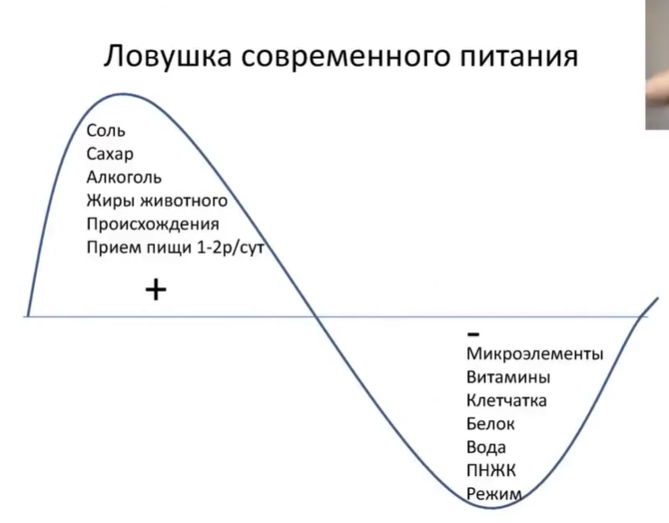
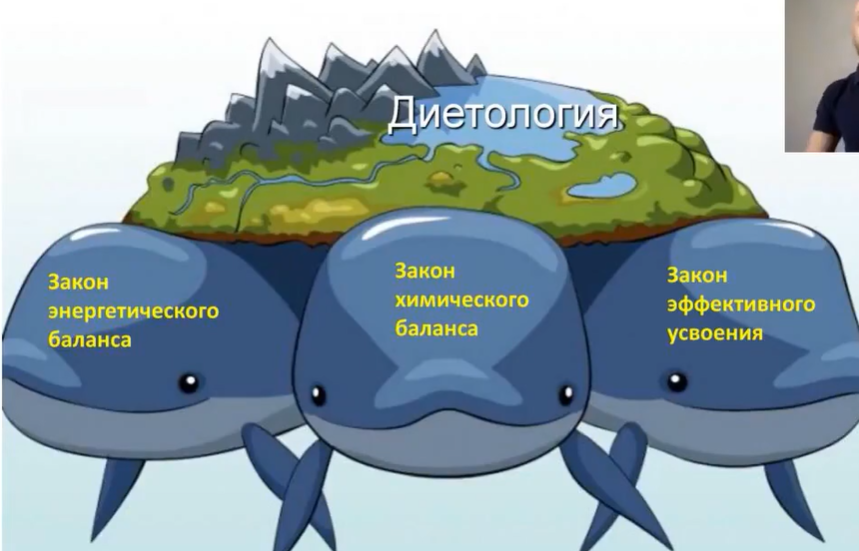
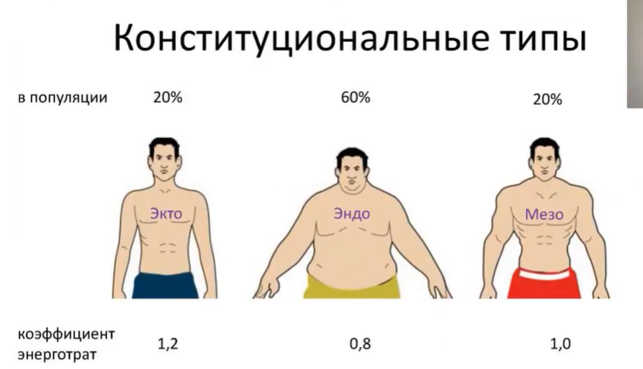

# Курс "Оптимальное питание"
https://fit-standard-online.ru/pl/teach/control/lesson/view?id=342719978&editMode=0

https://app.blackbox.ai/chat/jM54l4P

- читмил - как часто? как выглядит?
- омега-3
- ТГК, РБК жирные кислоты (рыбий жир)
- льняное масло
- эссенциальный фактор
- микронутриенты
- объём метахондриальный массы
- химический баланс (закон)
- работа с прогнозами (сколько кг можно набрать за месяц жира и мышц)
- гомеостаз
- пластические субстраты

- метаболизм
- митохондрии
- атф
- биопсия
- синтезирование
- калории
- аминокислоты
- жирные кислоты
- глюкоза
- анаболизм

## Проблемы современного питания и законы диетологии
Современное питание не успевает за ритмом жизни.

Питание необходимо человеку для поддержки гомеостаза (?). Организм - не замкнутая система, а система, которая общается с внешним миром. Мы получаем энергию, пластические (?) материалы, выводим ненужное. Человеку необходимо получать необходимые энергетические и пластические субстраты (?) в усваеваемой форме в необходимом количестве и необходимой кратности в течении дня.

**Ловушка современного питания**

- Сахар едим не отдельно, а в дополнение к основному приёму пищи (это снижает гликемический индекс (?)).
- Раз в неделю читмил разрешён
- Жиры усваиваются эффективнее, если человек питается редко

В день нужно есть 400г овощей (в любом виде для поддержания формы), фрукты - 200г.

## Фундамент науки диетология
Диетология: закон энергетического баланса, закон химического баланса, закон эффективного усвоения. Набор/потеря массы, нарушение здоровья зависят от соблюдения законов энергетического баланса, химического баланса, эффективного усвоения. 

### Энергетический баланс
Набор массы - любой живой организм, набирающий массу, должен получать с пищей энергии больше, чем он тратит. 
Поддерживающий - поступающая энергия соразмерна тратам.
Похудение - траты выше энергии, потребляемые с пищей.

### Закон химического баланса
Человек за сутки тратит определённый объём энергии и пластических субстратов (БЖУ), а также витаминов и  микронутриенты, которые необходимо восполнять. Необходимо сбалансировать рацион по профилю БЖУ в зависимости от индивидуальных потребностей. Баланса макронутриентов (БЖУ) для поддержания веса и здоровья.

### Закон эффективного усвоения
Необходимо сформировать суточный рацион в усваиваемой форме

### Конституциональные типы
Эктоморф, эндоморф, мезоморф (легко худеет, легко поправляется)

Конституциональный тип зависит от объёма метохондриальной массы, длины кишечника, пищевого поведения

- Хроническое ожирение нельзя вылечить, но можно привести к состоянию стойкой ремиссии.
- Эндоморфам объяснить, что проблемы с весом навсегда, нужно привести к состоянию стойкой ремиссии, перейдя сначала на гиппорацион (мало калорий) для снижения жировой прослойки, а затем перейти на ПОДДЕРЖИВАЮЩИЙ (не на прежний) для сохранения клеточной массы и чтобы не набирать лишний жир.

### Эссенциальный фактор
Эссенциальный фактор - это ключевые питательные вещества, которые организм не может синтезировать сам и должен получать из пищи. Включает витамины (A, B, C, D), минералы (железо, кальций), аминокислоты (лейцин, изолейцин) и жирные кислоты (омега-3). Витамин C для иммунитета, кальций для костей, - дефицит приводит к болезням.
В фитнесе важен для восстановления мышц и энергии.

### Микронутриенты
Микронутриенты - витамины и минералы, необходимые в малых количествах для метаболизма, иммунитета и здоровья. Включают витамины (A, B-комплекс, C, D, E, K) и минералы (железо, цинк, йод, кальций). Поддерживают ферменты, гормоны и клеточные функции. Дефицит (например, витамина D) вызывает усталость или рахит. Источники: фрукты, овощи, орехи, мясо.

### Митохондриальная масса
Митохондриальная масса - объём митохондрий в клетках, отвечающих за производство энергии (АТФ). Увеличивается при физических нагрузках (аэробных и силовых), улучшая выносливость и метаболизм. Факторы роста: тренировки, калорийный дефицит, холодовые воздействия; снижение связано со старением или сидячим образом жизни.

### Работа с прогнозами
Прогнозы набора веса зависят от генетики, тренинга, питания и гормонов.
- Мышцы: 0.5-1 кг в месяц для новичков (с силовыми тренировками и профицитом калорий 300-500 ккал/день). Для опытных - 0.25-0.5кг.
- Жир: 0.5-1 кг в месяц при профиците 500+ ккал/день, но минимизировать для чистого набора мышц.
Реалистично: 1-2 кг общего веса (смешанный набор). Использовать трекинг (весы, фото, измерения) и корректировать диету.

### Гомеостаз
Гомеостаз - способность организма поддерживать внутреннюю стабильность (температура, pH, уровень сахара) несмотря на внешние изменения. Регулируется гормонами (инсулин для глюкозы). Тренировки нарушают гомеостаз из-за стресса, вызывая адаптацию (рост мышц).

### Пластические субстраты
Пластические субстраты - строительные материалы для синтеза тканей, такие как аминокислоты, жирные кислоты и глюкоза. Они используются в анаболизме для роста мышц, костей и клеток.

### ?
- Объём сахара не должен превышать полграмма на кг веса тела