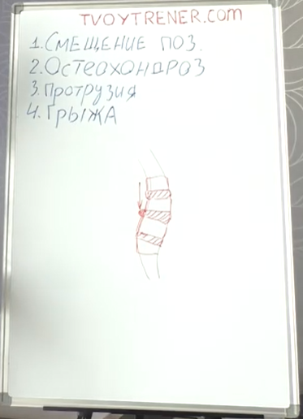
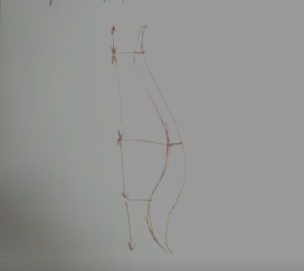
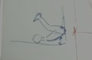

## Как избавиться от боли в коленях
Боли в коленях возможны вследствие истощения хряща (мениска), который истончается под действием нагрузок. Чем тоньше мениск, тем больше нагрузка на сустав, и больше вероятность, что сустав начнёт воспалятся от трения, а восполение будет вызывать боль.

**Способ избавления**
1. В конце каждой тренировки делать упражнение "запрыгивание на козла/тумбу": 3 подхода, 6-9 раз
- Чем выше запрыгиваем, тем лучше
- Приседаем с полного седа
- После месяца тренировок становится легче, через 3 месяца - боли полностью проходят.

## Тренировки во время болезни
- Если есть температура, тренировку нужно пропустить
- Если температуры нет и есть желание, посещаем тренировку
- В любом случае облегчаем тренировку
- Понять, что тренировка во время болезни будет для поддержания формы

**Способы облегчения тренировки**
1. Сократить время тренировки (от 30 минут и не больше часа)
2. Сократить количество рабочих подходов (минимум на 1) либо в нескольких упражнениях, либо во всех
3. Снизить веса на 20-30%
4. Сократить кардио (максимум 15-20 минут суммарно за тренировку, пульс максимум 120-130 ударов/минута)

## Как тренироваться при болях в спине
- Не нужно полностью прекращать тренировки

**Причины боли в спине**
Изменения формы позвоночника:
1. Смещение позвонка

2. Остеохандроз межпозвоночных дисков - истончение межпозвоночного диска (хроническое заболевание опроно-двигательного аппарата, связанное с дегенеративными и дистрофическими изменениями в структурах позвоночника, прежде всего в межпозвоночных дисках).

3. Протрузия - предгрыжевое состояние, когда грыжи ещё нет, но диск начинает смещаться (выбухание пульпозного ядра межпозвоночного диска через фиброзное кольцо без его разрыва, одна из стадий остеохондроза)

4. Грыжа - межпозвоночный диск выпячивается в ту или иную сторону (патологическое состояние, при котором внутренние органы или их части выходят за пределы нормального анатомического положения через отверстия или ослабленные участки в стенках тела). Диски между позвонками могут вылазить в ту или иную сторону под действием давления.
- Смещение позвонка может произойти сразу (неправильная техника упражнения)
- Остеохондроз, протрузии, грыжи нарабатываются годами

**Симпотмы болей**
1. Тянущая боль слева или справа от позвонков - мышечная боль, связанная с хроническим спазмом мышц. При смещении позвоночника организм пытается "вернуть" его на место и спазмирует мыщцы. Из-за хронического спазма мышцы переходят в состояние хронического гипертонуса и появляется тянущая боль, особо остро ощущаемая по утрам.

2. Боли острого характера (простреливающие) - определённый корешок позвонка цепляет нерв.

3. Боли, отдающие в другие области. Если поясница, по седалищному нерву отдаёт в ягодицу и заднюю поверхность ноги, если грудной отдел, то отдаёт в руки или лопатку.

**Обоснование болей**
Боли характерны как для спортсменов, так и для обычных людей, потому что форма позвонка у человека так, что в процессе жизни неревально прожить, не заработав проблемы со спиной. Форма спины не прямая, а волнообразная

Структура позвоночнка:

- Шейный отдел
- Грудной отдел
- Поясничный отдел
- Крестцовый отдел

Пример: если взять 10 кубиков, поставить в линию с разных концов надавить, то если линия прямая, они упрутся друг в друга. А если разложить кубики по форме позвоночника и надаваить, то кубики вылезут по краям.

### Тренировки при мышечных болях
1. Не прекращать тренировки
2. Убрать осевую нагрузку (присед, становая, жимы стоя, наклоны со штангой)
3. Растягивать позвонки (цель: вывести мышцы из состояния спазма, убрав ноющую боль, и возврат позвонка на место в случае смещения)

**Упражнения**
1. Вис на перекладине (полностью расслабив спину) - по возможности (от 20 секунд). Желательно каждый день (утром и вечером), или перед тренировкой и после тренировки.
2. Жим ногами (без веса или с лёгким весом) - опускаем платформу плавно медленно низко, чтобы таз оторвался. Поясница получает нагрузку, но не осевую, а начинает растягиваться, в таком положении нужно посидеть. Выполнять с осторожностью.
3. Лечь на пол, таз за стенку, ноги за голову.

4. Если боли не сильные, выполняем упражнения со статической осевой нагрузкой и со слабой осевой нагрузкой:
- статическая нагрузка - тяга штанги в наклоне
- слабая осевая нагрузка - жимы сидя, гакк-приседания

**Рекомендации при болях**
1. Убираем осевую нагрузку
2. Добавляем гиперэкстензию (классическая или обратная) - тренируют поясницу без осевой нагрузки
3. Выполнять в начале каждой тренировки, 2-3 подхода, лучше без веса (12-15 раз).
4. Не более 3 раз в неделю выполняем гиперэкстензию, не больше 3 подходов
5. Сделать МРТ

Важно не переусердствовать, так как при гипертонусе поясницы смещённые позвонки будет трудно вернуть.

Через 1-2 месяца боли проходят частично или полностью, после постепенно добавляем нагрузку.

Остеозондроз, протрузия и грыжа - необратимые болезни. Тренированные люди с проблемами испытывают меньше боли, чем нетренирующиеся люди с теми же симптомами.