Магазин спортивного питания: https://5lb.ru/
Магазин с витаминами и добавками (на развес): https://razves.com/

Хороший протеин: ProStar Whey Protein, ISO sensation (https://5lb.ru/product/16/?art=25149)
Плохой протеин: SYNTHA-6
Средний протеин: vplab
Бюджетный протеин: QNT (https://5lb.ru/product/26/?art=PUR0020)

## Протеин

- При выборе протеина главное, на что нужно обратить внимание - количество белка на 100г (для хорошего протеина белка должно быть не менее 60%).
- Фирмы: Maxler, PureProtein, ProStar Whey Protein, SYNTHA-6, RPS (отечественный), BioTech, ISO sensation, vplab, CULT (российский)

### Виды протеина
1. Животный (сывороточный, казеиновый, говяжий, яичный)
2. Растительный (соевый, гороховый, рисовый, пшеничный)
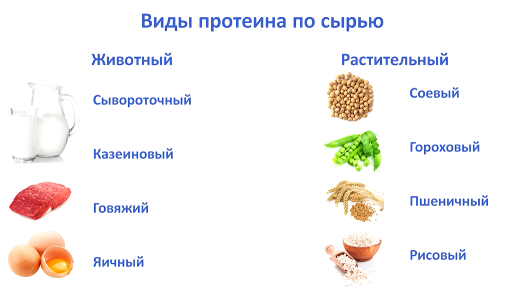

Считается, что животный лучше, так как содержит на 2 аминокислоты больше. Растительный подходит для веганов.

### Виды протеина по способу производства
1. Концентрат
Белка от 60% до 80%. В большинстве случаев около 70%. Самый распространённый. Им представлено около 80% всех протеинов.

2. Гидролизат
Количество белка сильно разнится. Основное отличие - большая часть белка уже расщиплена до аминокислот, то есть проще усваивается.

3. Изолят
Белка более 80%. В большинстве случаев около 85-90%. Очень дорогой, но хорошо подходит худеющим ввиду низкого процента жиров и углеводов.

### Приём протеина

Дозировка зависит от пола, веса, количества потребляемого белка с обычной пищей, частота приёмов пищи, частота тренировок, цель.

- Примерный приём: 1гр. протеина на 1кг веса тела. 50кг = 50г протеина в день.
- Протеин принимать нужно каждый день (не только в тренировочные дни)
- Лучше принимать два раза в день (в первой и второй половине дня)
- Если есть тренировка, принимаем после тренировки
- Количество жидкости не имеет значения (на массу - жирное молоко, похудение - обезжиренное молоко или вода)
- Коктейль пригоден, пока не испортится молоко
- Протеином можно заменять часть обычной пищи (обычно при жиросжигании)

Время приема: Лучше всего принимать протеин после тренировки (в течение 30–60 минут), чтобы ускорить восстановление мышц. Можно также употреблять утром, перед сном или как перекус. Избегайте приема на голодный желудок, чтобы не вызвать дискомфорт.

### Расчёт протеина

Дневная норма протеина зависит от веса, уровня активности, возраста и целей (рост мышц, похудение или поддержание формы). Общая рекомендация - 0.8г на 1кг веса для обычных людей, но для спортсменов и активных - 1.6-2.2 г/кг.

- Пример: если вес 70кг и активные силовые тренировки, то норма - 70x2.0 = 140г в день.

**Формула расчёта**
Формула - умножить свой вес в кг на коэффициент активности

- Для начинающих и умеренно активных: 1.6-1.8 г/кг.
- Для спортсменов и бодибилдеров: 2.0-2.2 г/кг.

Добавки покрывают 20-50% дневной нормы. Женщины могут нуждаться в меньшем количестве протеина, чем мужчины. При похудении нужно увеличивать протеин для сохранения мышц. Не превышайте 3 г/кг без медицинской необходимости, чтобы избежать нагрузки на организм.

### Количество приёмов

Максимум за 1 приём - 20-40г, чтобы протеин полностью усвоился (усвоение ограничивается скоростью метаболизма аминокислот). Больше может вызвать расстройство ЖКТ (тошноту, вздутие).

**Рекомендации по дозировке**

- После тренировки: 20-30г
- В перекус: 15-25г
- Разделить дневную норму на 2-4 приёма (утром, после тренировки и вечером)

**Типы протеина**
Сывороточный (усваивается быстро), идеален после тренировки. Казеиновый - медленно (подходит на ночь). Растительный (горох, соя) - для вегетерианцев, но усваивается хуже.

**Рекомендации**
Новичкам начать с 20г в день и наблюдать за реакцией организма. При избытке могут возникать проблемы с почками или пищеварением, особенно у людей с хроническими заболеваниями.

### Приём протеина для меня

**Сколько принимать за раз и как**
Да, принимать 2 раза в день — разумно, но дозировка зависит от общего плана. Разводите 1 ложку (30 г порошка) в воде — это стандартный способ, чтобы избежать перегрузки ЖКТ. Но для вашей нормы (116 г белка) этого может быть недостаточно, если добавка — основной источник.

**Рекомендуемый прием**
После тренировки: 1–2 ложки (30–60 г порошка, ~25–50 г белка) — для быстрого восстановления.
Утром или в перекус: Еще 1 ложка (30 г порошка, ~25 г белка), если нужно добрать норму.
Общий объем: Разделите дневную норму на 2–4 приема, чтобы белок усваивался равномерно. Максимум за раз — 40 г порошка (чтобы не вызвать дискомфорт, как тошноту или вздутие).
Пример плана на день (предполагая ~25 г белка на 30 г порошка):
Завтрак: 1 ложка (25 г белка) + белковая пища (яйца, йогурт).
После тренировки: 2 ложки (50 г белка) + углеводы (банан, рис).
Итого из добавки: ~75 г белка, плюс ~40 г из пищи = близко к 116 г.

**Пример плохого протеина (SYNTHA-6)**
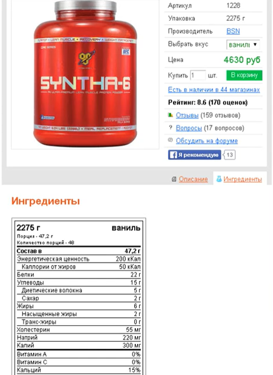
на 47г порошка 22г протеина (менее 50%), что больше подходит для гейнера

**Примеры хорошего протеина (WHEY MUTANT, Maxler)**
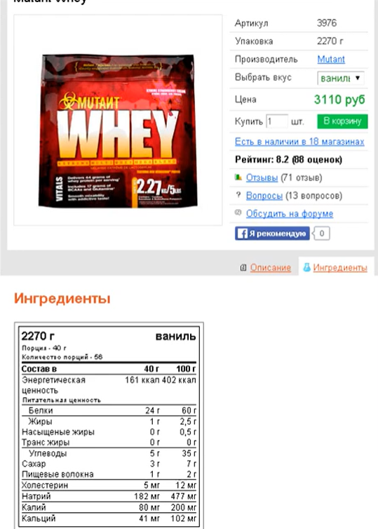
На 100г порошка 60г протеина

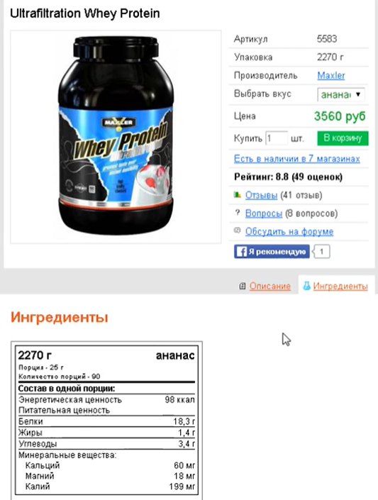
На 25г порошка 18.3г белка

**Пример самого большого % белка (ISO SENSATION)**
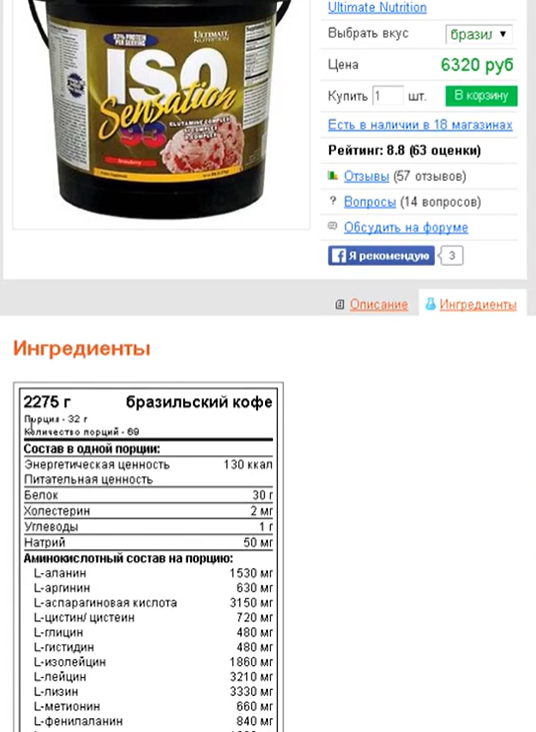
На 32г порошка 30г белка

**Бюджетный вариант по соотношению цена/качество и высокому уровню белка(ProStar Whey Protein)**
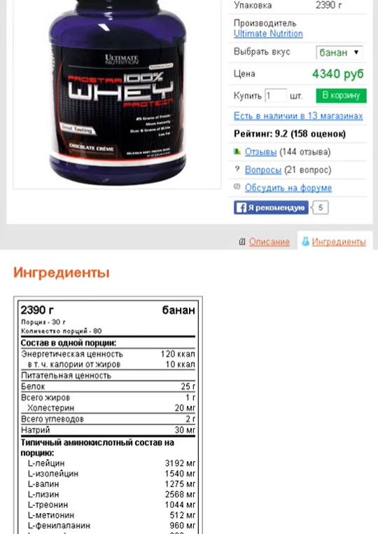
Цена: ~4500 рублей
Вес: ~2кг 300г

## Как правильно выбрать протеин

**Виды**

1. Сывороточный (дорогой, идеально, больше всего BCAA: на 100г белка 22-25% BCAA)
2. Казеин (дорогой, идеально, на 100г белка 20% BCAA)
3. Яичный (усваивается лучше всех, дорогой)
4. Соевый (бюджетный - в два раза дешевле сывороточного, но подходит, на 100г белка 20% BCAA)
5. Говяжий (дорогой, вкус на любителя)
6. Рисовый
7. Пшеничный
8. Гороховый
9. Из семян подсолнечника
10. Комплексный (смесь всех видов протеина - или нескольких из них, не стоит доверять),

### Алгоритм выбора

1. Определяемся с видом протеина

- Если есть деньги, то сывороточный или казеин
- Если денег нет, выбираем соевый
- Яичный и говяжий немного хуже сывороточного и казеина, т.к. у них меньше BCAA и у яичного отсутствует 2 аминокислоты, а стоят они дороже сывороточного или казеина.
- Комплексному протеину (содержащему все или несколько видов) доверять не стоит, потому что производители не указывают процентное соотношение ингредиентов. Он получается дешевле, скорее всего, из-за того, что соевого очень много.

2. Выбираем протеин по количеству белка
   1 группа: изоляты (белка > 80%)

- Больше подходит для похудения (мало жиров и углеводов), но можно и на набор массы
- Для похудения больше подходят те, где суммарно жиры+углеводы не более 10-12%

2 группа: концентраты (белка < 80%)

- Подходит для набора массы

3. Проанализировать качество протеина
   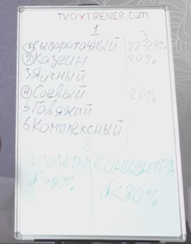

### Сравнительный анализ протеина по аминокислотам (данные на 100% чистого белка, а не готового продукта)

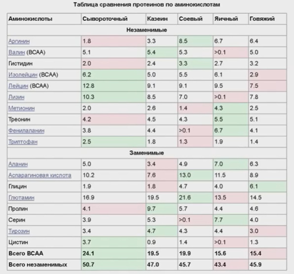

### Сравнительный анализ видов протеина

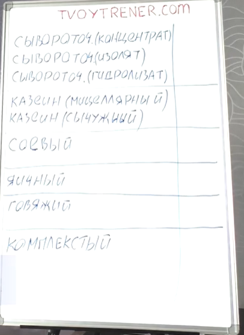

Протеины делятся по 4 признакам:

1. Произведённому материалу
   **Есть лактоза**

- Сывороточный КОНЦЕНТРАТ (молоко)
- Сывороточный ИЗОЛЯТ (молоко) - рельеф и жиросжигание
- Сывороточный ГИДРОЛИЗАТ (молоко)
- Казеин МИЦЕЛЯРНЫЙ (молоко)
- Казеин СЫЧУЖНЫЙ (молоко)

**Нет лактозы**

- Соевый
- Яичный
- Говяжий
- Пшеничный
- Гороховый
- Рисовый
- Из семян подсолнечника
- Комплексный

2. Методу очистки

- Концентрат (не более 80% белка) -- степень очистки
- Изолят (более 80% белка) -- способ очистки
- Гидролизат (способ очистки гидролизом). Проетин частично расщиплён до аминокислот. Гидролизат может быть и изолятом, и концентратом. Из гидролизата в основном и производят аминокислоты. Гидролизат стоит брать при проблемах с почками/печенью, и когда врачи запрещают есть много белка. Желудку легче переварить гидролизат и нагрузка на печень минимальная.

3. Аминокислотному составку
4. Цене

**Сравнение по аминокислотам**

- На первом месте сывороточный протеин лидирует по количеству незаменимых аминокислот
- На втором месте - казеин
- На третьем месте - соевый и говяжий (45-46%)
- На 4 месте - яичный

**Сравнение по BCAA**

- На первом месте сывороточный (~24% BCAA)
- На втором месте - казеин и соевый (19-20%)
- На третьем месте - яичный и говяжий (15-20%)

**Сравнение по наличию/отсутствию аминокислот**

- Сывороточный, говяжий и казеин содержат все аминокислоты
- В соевом нет двух аминокислот (фенилаланин, серин)
- В яичном нет 3 аминокислот (цистин, лизин, валин)
  В итоге:
  1 место: сывороточный
  2 место: казеин
  3 место: говяжий
  4 место: соевый
  5 место: яичный

**Сравнение по цене**

1. Сывороточный концентрат - самый распространённый (100%) - от 100% сывороточного приведены проценты ниже
2. Сывороточный изолят - дороже (150%)
3. Сывороточный гидролизат - самый дорогой (180%)

4. Казеин (сычужный) - дешевле мицеллярного, встречается редко (90%). Плохо растворяется в воде.
5. Казеин (мицелярный) - дороже сывороточного (130%)

6. Соевый - самый бюджетный (45%)
7. Яичный - дорогой (120%), не самый лучший (не хватает BCAA и других аминокислот), вкус на любителя

8. Говяжий - дорогой (120%), но лучше яичного

9. Комплексный - дешевле сывороточного (90%)
   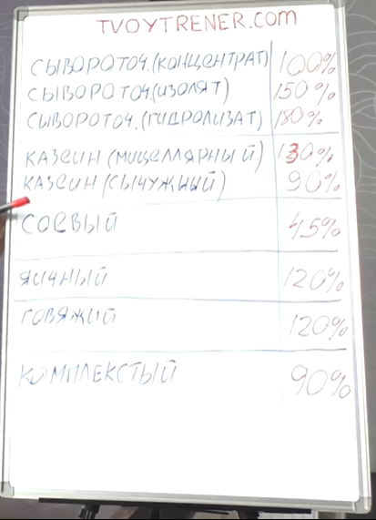

Если нет денег, можно брать соевый (можно даже встретить соевый изолят с 90% белка)
Есть деньги и цель набрать массу - берём сывороточный концентрат
Есть много денег и цель набрать массу/похудение/рельеф - берём сывороточный изолят

### Обнаружение разбавления BCAA в протеине

1. Если мы знаем, что в сывороточном 22-25% BCAA на 100г чистого белка, то при покупке протеина с 80% белка, то BCAA там должно быть от 17 до 20% -> смотрим на этикетку, складываем изолецин, лейцин и валин -> получаем % BCAA в продукте -> если BCAA меньше 17%, то его разбавили

### Протеин для похудения
- Не весь протеин подходит для похудения (подходит изолят: белок > 80%, жиры и углеводы не более 10-12%, при этом неважно - сывороточный, казеин или соевый).
- Протеин принемаем 2 раза в день каждый день утром и вечером
- Потребление 1.5г белка на 1кг веса тела
- Для похудения нужно есть столько же белка, сколько для набора массы. Протеин помогает сохранить мышечную массу при жиросжигании.

### Протеин vs гейнер

Если нужно набрать менее 4 кг - выбираем протеин, если больше 5-6 - гейнер

- на 1г белка нужно 2г углеводов
- Гейнер позволяет набрать массу быстрее, но менее качественную; протеин - дольше, но более качественную.
- Гейнер лучше брать, где белка не менее 30-40%.
- Можно покупать отдельно протеин и гейнер, и смешивать вместе.

## Гейнер

- Дозировка зависит от частоты приёмов пищи, тренировок, общего количества потребляемых калорий в сутках
- Принимать 1.5г на 1кг веса в сутки
- Принимать гейнер нужно каждый день
- Приём за 1 раз, если нужно менее 100г гейнера в день
- Приём за 2 раза, если нужно более 100г гейнера в день
- Для двух раз приём в первой и второй половине дня, в перерывах между приёмами пищи (если тренировка - принимать сразу после тренировки)
- Лучший вариант приёма гейнера - между завтраком и обедом (если 1 раз, если два раза - между завтраком и обедом и сразу после тренировки)
- Количество жидкости не имеет значения

- Основное отличие гейнеров друг от друга - количество белка (от 10 до 40%)
- Гейнер состоит из белков и углеводов (в качестве углеводов мальтадекстрин - дешёвый углевод с высоким гликемическим индексом и изомальтулоза - более дорогой углевод)
- Не стоит брать гейнеры, где белка менее 20%
- Указание количества сахара в гейнерах не отображает реальной картины
- Мальтадекстрин - тот же сахар, но производители могут указывать, что продукт без сахара

**Выбор гейнера**

1. Если нужно набрать много веса и массонабор идёт тяжело (включая жир), то нужен гейнер с 20-25% белка. Если с набором веса всё в порядке и нужно набрать 5-6кг, то нужен гейнер с 30% белка и выше (дороже в полтора раза, чем обычные)
2. Определиться с видом белка (сывороточный, казеиновый, соевый). Обычно в гейнеры добавляют сывороточный белок, реже - сою (для удешевления). Вид белка не критичен, но лучше отдавать предпочтение сывороточному.
3. Обратить внимание на количество сахара. Указание количества сахара в гейнерах не отображает реальной картины. Мальтадекстрин - тот же сахар, но производители могут указывать, что продукт без сахара.
4. Лучше брать гейнер с одним типом белка (не комбинированный)

**Какие гейнеры не брать**

1. Где белка < 20%

### Приготовление гейнров в домашних условиях
1. Диетический гейнер - для следяющих за фигурой или худеющих
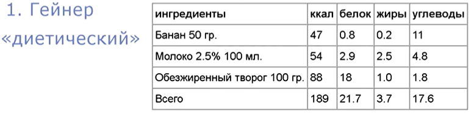

2. Высокоуглеводный - для работающих на работе с физическим трудом
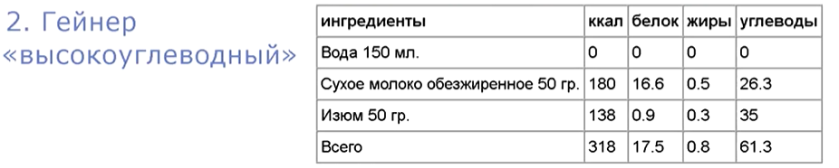

3. Высококалорийный - подходит хардгейнерам, достаточно жирный
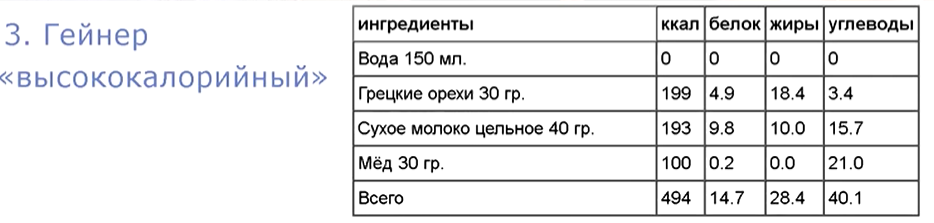

## Трибулус

- Увеличивает тестостерон на 15-20%
- Бывает в порошках и капсулах
- При покупке обращать внимание на: содержание трибулуса и сапонинов (действующих веществ). Содержание сапонинов колеблется от 40% до 90%.
- Принимать нужно 0.5г (45% сапонинов) на 10кг веса тела в сутки
  При 100кг - 5г в сутки, при 60кг - 3г в сутки (если сапонинов 45%, но если больше, то дозировка уменьшается)
- Приём не имеет значения (утром или вечером, до или после тренировки)
- Стараться принимать в одно и тоже время суток
- Суточная дозировка: 2 раза в день - утром и вечером
- Принимать каждый день, от месяца до 3-х месяцев
- Имеет накопительный эффект (результат спустя 5-6 дней)
- После отмены трибулуса тестостерон возвращается в норму

## L-карнитин

- Главное свойство - дополнительная энергия для организма, жиросжигание - вспомогательное действие (нельзя назвать l-карнитин жиросжигателем в классическом понимании)
- L-карнитин помогает сжигать жир, но не стоит от него ждать чуда
- L-карнитин - не гормональное средство, а смесь аминокислоты и витаминов
- L-карнитин потребляем в среднем 4г в сутки (+/- грамм в зависимости от веса)
- Обращаем внимание на процент л-карнитина в порции
- Не рекомендуется брать tartrate и acetyl l-карнитин (они менее изучены)
- Время суток на эффективность не влияет (без привязки к тренировкам)
- Принимать 2 раза в день (утром и вечером) КАЖДЫЙ ДЕНЬ
- Суточняа доза - 0.5г на 10кг веса тела, но не менее 3г за сутки.
- Практика показывает, что l-карнитин менее 3г в сутки не даёт эффекта
- L-карнитин можно принимать хоть всю жизнь без перерывов

**Жидкий**

- Оптимальный размер: 10г на 100мл
- Бывает жидким, порошковым и в капсулах
- Фирма: VP Laboratory, Maxler, Genetic Force
  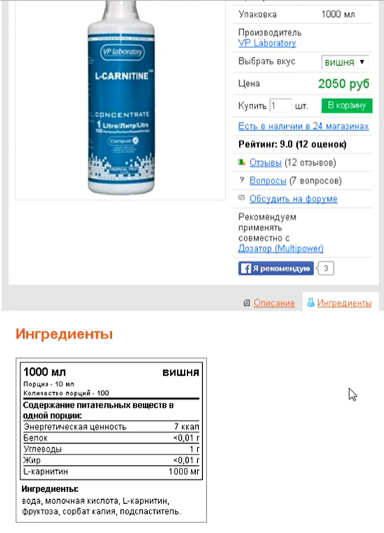

Пример низкой дозировки L-карнитина (Фирма NOW):
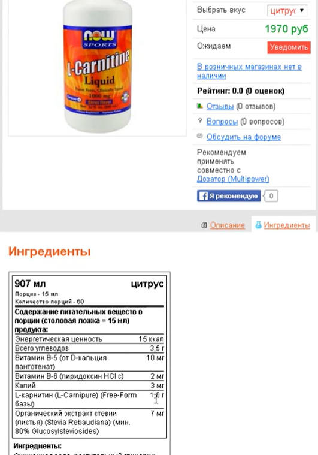

Пример высокой дозировки (Фирма Power Systems):
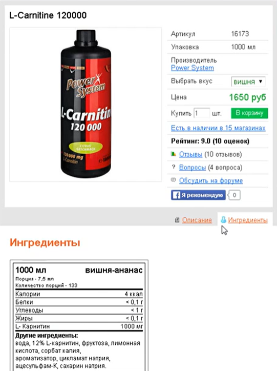

**Капсулы**

- 500мг (полграмма) на 1 капсулу - оптимальный показатель
- Фирмы: Maxler, Universal
  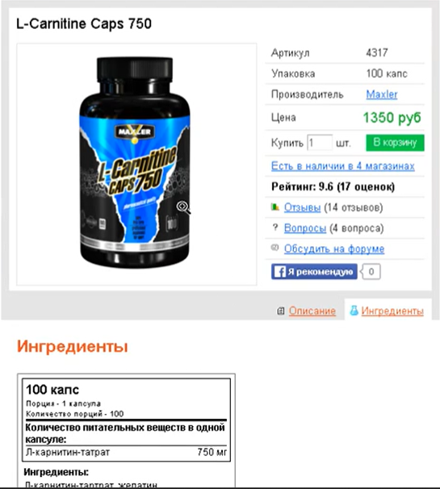

**Порошок**

- Порция: 1 мерная ложка - 5г, состав на 1 порцию: 4.9г l-карнитина
- Минимум 80% л-карнитина в порошке, допустимо 2-3% на примеси и 10% на добавки
- Фирмы: SAN
  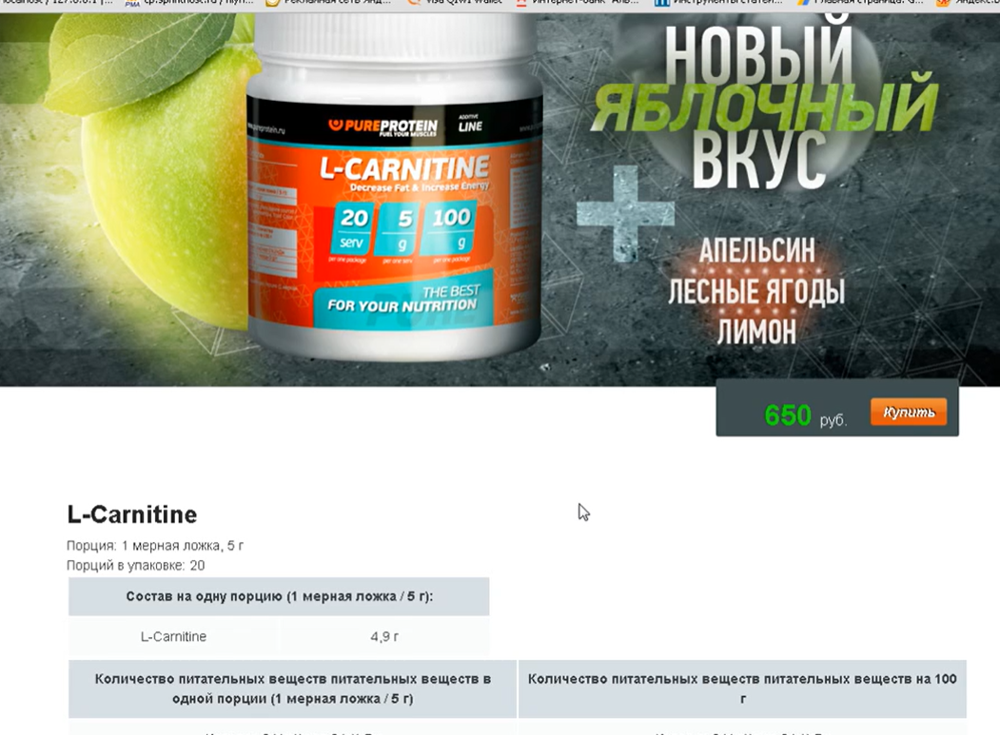

### Дозировка

Суточная норма L-карнитина зависит от целей приёма и состояния здоровья:

- Для общей поддержки и небольшой прибавки к выносливости обычно достаточно 500–1000 мг в день.
- Для активных тренировок и похудения доза может составлять 2000–3000 мг в сутки. Профессиональные спортсмены иногда принимают более высокие дозы, но это возможно только под контролем специалиста.
- В терапевтических целях (при некоторых заболеваниях) врач может назначить дозы до 4–6 г в сутки, но их приём требует обязательного медицинского контроля.

### Время приёма

- Оптимальное время для приёма L-карнитина — за 30–60 минут до начала физической активности. За это время вещество успевает усвоиться и попасть в кровь.
- В дни отдыха от тренировок L-карнитин можно принимать утром или днём, желательно с едой. Это поможет поддержать жировой обмен и уровень энергии в течение дня.
- Не рекомендуется использовать добавку во время и после занятий спортом, так как энергия будет вырабатываться с запозданием, когда организм в ней уже не будет нуждаться.
