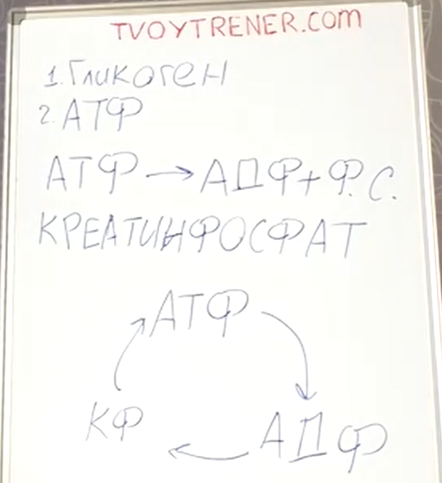

# Принцип работы креатина (моногидрата)

## Источники энергии мышц
1. Гликоген - используется при работе на выносливость. Не мощный, но стабильный источник энергии. 
2. АТФ (аминозин трейтфосфорная кислота). Мощный источник энергии, но быстро заканчивающийся. Используется при мощной и кратковременной работе на силу. Количество АТФ в мышцах ограничено. Синтезируется в митохондриях. 

**Высвобождение энергии**
- АТФ расщипляется до АДФ (аминозин дифосфорной кислоты) + фосфорный остаток. Из-за этого расщипления вырабатывается много энергии для сокращения мышц.

Помимо АТФ, в мышцах есть креатинфосфат.
- Креатинфосфат отдаёт фосфорный остаток и АДФ превращается снова в АТФ. То есть креатинфосфат возвращает источник энергии.

## Креатин моногидрат
Креатинфосфат при потреблении не усваивается, поэтому учёные вывели кретинмоногидрат, который усваивается (но плохо, на 30-40%).
- Чем больше креатина в мышцах, тем больше подходов можно сделать.
- Запас креатинав мышцах накопительный (за неделю)

## Приём креатина
Креатин позволяет увеличить силовую выносливость.
- Суточная норма приёма креатина - 1-1.5г на 10кг веса тела. Для 60 кг - от 6 до 9г креатина.
- Принимать креатин нужно каждый день
- Креатин накапливается в организме медленно (в среднем неделю)
- Менее 10г/день - можно за раз. 10г и более - за 2 раза.
- Приём креатина без привязки к тренировкам (Тимко)
- **Время приёма по ИИ**: в дни тренировок потреблять креатин за 30-40 минут до начала физической активности или сразу после неё - в это время мышцы лучше усваивают питательные вещества. В не тренировочные дни принимать можно в любое время суток.
- Креатиновая загрузка не несёт в себе существенных плюсов (когда человек первые 5-7 дней потребляет двойную дозировку креатина около 20г в день с 4 приёмами по 4г каждый, а потом выравнивается до нормы)
- Креатин лучше употреблять вместе с углеводами, можно добавить в коктейль с протеином/гейнером, или в воду с сахаром/соком.
- **Оптимальный срок приёма креатина** - 6-8 недель, после чего нужен перерыв на 2-4 недели, чтобы дать организму восстановить естественный уровень креатина.
- Долго принимать не нужно, поскольку он не полностью растворяется в воде и имеет песчаный осадок, что может приводить к проблемам с почками (Тимко считает, что можно принимать без ограничений по времени).
- Креатин задерживает воду, от 1 до 2 литров. После отмены креатина в течении 3 дней вода сливается.

