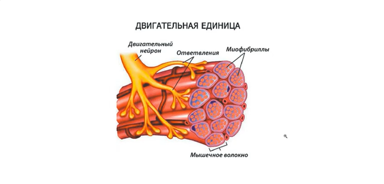
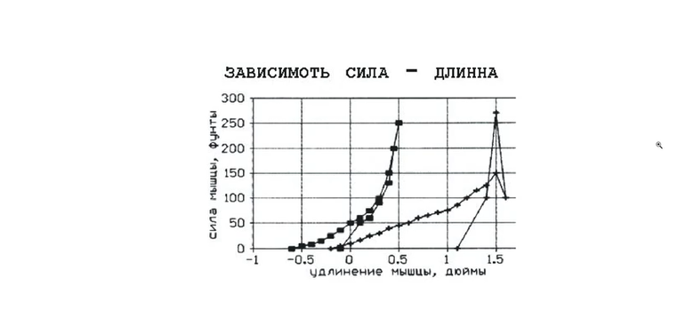
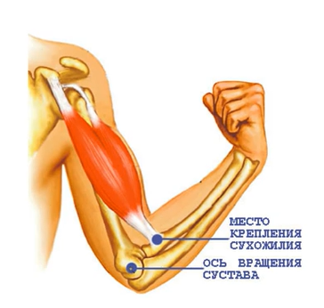
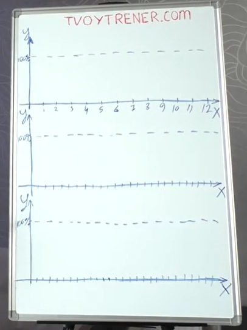
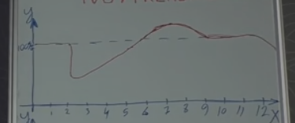
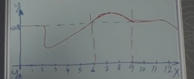
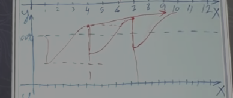
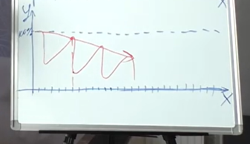
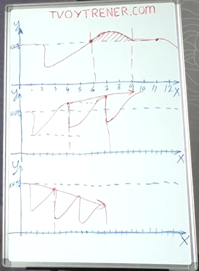

# Что такое сила мышц
Сила мышц - способность мышц противостоять внешнему сопротивлению (штанга, гантели)

## Виды силы
1. Абсолютная
2. Относительная (относительно своего веса)
3. Взрывная (способность мышцы развивать максимальное усилие за минимальное время)
4. Силовая выносливость (способность мышц противостоять утомлению во время силовой работы при долгой работе)

## Факторы, влияющие на силу мышц
1. Можно изменить:
- Объём мышц
- Толщина сухожилия
- Иннервация мышц (снабжение органов и тканей нервами, обеспечивающее их связь с центральной нервной системой (ЦНС))

- Эластичность мышц. Сила мышцы зависит от разницы между её сокращением и растяжением: чем больше разница, тем большую силу может развить мышца. Чем больше эластичность, тем больше разница между сокращением и растяжением. Эластичность фасции влиять на потенциальный рост мышцы в объёме.

- Психомоторное возбуждение

2. Нельзя изменить
- Количество мышечных волокон (можем влиять только на толщину мышечных волокон)
- Толщина костей
- Место крепления мышц

## Методы увеличения силы мышц
1. Тренировочные
- Максимальные веса и минимальные повторения (1-6 повторения для роста силы без массы). Если постоянно заниматься так, будут проблемы с износом сухожилий и суставов, а также нервное напряжение и апатия. Нужно чередовать. 3-4 недели можно работать с максимальными весами. Тренировки на силу эффективны, если вы полностью отдохнувший.
- Статическая работа (происходит усилие без изменения положения тела). При статической работе мышцы способны развить усилие на 15-20% выше, чем при преодолевающей работе. Опасный и эффективный метод (работать с заведомо неподъёмным весом, пытаясь оторвать, например, при становой тяге или жиме ногами)
- Уступающая работа (происходит изменение в углах - когда последнее повторение делается медленно, как бы уступая весу). При уступающей работе мышцы создают усилие на 20-30% выше, чем при преодолевающей нагрузке. Эффект от метода только при больших весах. Или берём 110 кг на жиме лёжа и медленно опускаем на грудь со страховкой.
- Увеличение объёма мышц. Для объёма нужно чередовать тренировки на силу и на объём мышц, а также чередовать большие, маленькие и средние веса.

2. Не тренировочные
- Растяжка (чем вы эластичнее, тем вы сильнее)
- Психоактивные вещества (кофеин, герань, нашатырь). Относится к психомоторному возбуждению.
- Микроэлементы (соль, натрий, калий)
- Фармакология

## Фазы восстановления после тренировки

Y - уровень ресурсов организма (ресурсы - креатинфосфат, АТФ, гикоген, - общие жизненные силы)
X - дни 

**Кейс-1: 100% энергии - мощные тренировки**
1. После тренировки на 100% организму необходимо восстановиться в течении нескольких дней. Сначала организму необходимо восстановить АТФ (первые сутки) -> восстановление гликогена в мышцах -> восстановление мышечной структуры (если тренировка была стрессовой).

2. Если нагрузка не была стрессовой, организм восстановит ресурсы до базового уровня. Если была стрессовая нагрузка, то после восстановления происходит рост (фаза суперкомпленсации - длится несколько дней, отслеживаем по собственным ощущениям). Если тренировки не произошло, происходит угасание до базового уровня. Если тренировки и дальше нет, то происходит спад и дальше:

3. Тренироваться нужно в период суперкомпенсации:

- После очень тяжёлой тренировки мышцы восстанавливаются неделю

**Кейс-2: 60% энергии - умеренные частые тренировки**
Тренироваться нужно в период гиперкомпенсации для наибольшего прогресса (график на 60% по шкале Y):

**Кейс-3: 20% энергии - мало жизненной энергии и частые тренировки**
Если не давать организму время на восстановление, то все показатели будут идти вниз:

**Итоги**
- Рост показателей (масса, сила, выносливость) возможен только на стадии суперкомпенсации.
- Фаза суперкомпенсации возникает при стрессовой нагрузке (максимальный вес, интенсивность, продолжительность)
- Фаза суперкомпенсации не вечна и длится несколько дней (3-4 дня)
- Время от конца тренировки до фазы суперкомпенсации - примерно неделю
- Схему на доске можно отнести к организму в целом, так и к каждой конкретной мыщцы.

