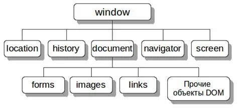
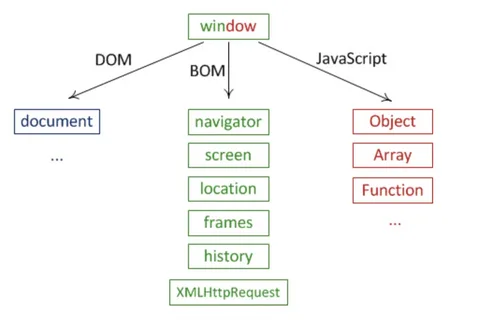

https://www.blackbox.ai/chat/876K65M

## Что такое DOM?
`DOM (Document Object Model)` - это программный интерфейс, предоставляющий HTML- или XML-документ в виде древовидной структуры объектов. Каждый элемент документа (теги, атрибуты, текст) становится узлом в этом дереве, что позволяет программам (например, JavaScript) динамически читать, изменять, добавлять или удалять части документа. DOM стандартизирован W3C и является частью веб-стандартов.

DOM представляет структуру документа как дерево узлов (объектов), где каждый элемент, атрибут или текстовый фрагмент является узлом. DOM позволяет JavaScript динамически взаимодействовать с веб-страницей: изменять содержимое, структуру, стили и обрабатывать события. DOM стандартизирован W3C и является основой для веб-разработки.

DOM не является частью JavaScript, но предоставляется браузерами как API. Когда браузер загружает HTML, он строит DOM-дерево на основе разметки. Это дерево можно модифицировать через скрипты, что делает страницы интерактивными.


**DOM наглядно**


### **Ключевые аспекты DOM**
- Структура. Документ представлен как дерево узлов. Корень – объект `document`, затем идут элементы (например, html, body), атрибуты и текстовые узлы.
- Методы и свойства: Позволяют манипулировать содержимым, стилем и поведением: `document.getElementById()`, `element.innerHTML`, `document.createElement()`.
- Типы узлов: Element (тег), Text (текстовое содержимое элемента), Comment (комментарий), Document (корневой узел всего дом-дерева), DocumentType (объявление типа документа `<!DOCTYPE html>`), Attribute (атрибуты элемента: `id`, `class`, `src`), DocumentFragment (фрагмент дом-дерева - контейнер для узлов, который сам не является частью основного дерева - используется для эффективной вставки группы элементов в документ `appendChild()`, `insertBefore()` - пример: `document.createDocumentFragment()`), CDATASection (предоставляет секцию CDATA в XML - используется для включения текста, который может содержать символы, обычно интерпретируемые как разметка, в HTML практически не применяется), ProcessingInstruction (соответствует инструкции обработки в XML), EntityReference (предоставляет ссылку на сущность в XML).
- События: DOM поддерживает обработку событий (например, клики, загрузка страницы);
- Обновление: Изменения в DOM отражаются в браузере в реальном времени (рендеринг);

DOM не зависит от браузера и работает в любых средах, поддерживающих HTML/XML (например, Node.js с библиотеками вроде jsdom)

**Пример создания нового DOM-элемента**
```javascript
const newElement = document.createElement('p');

newElement.innerText = 'New Element Value';
document.body.appendChild(newElement); // Покажет 'New Element Value" на странице
```

**Пример вставки элемента с insertBefore()**
```javascript
const parent = document.querySelector('.parent');
const target = document.querySelector('.target');

const newP = document.createElement('p');
newP.innerText = 'new value';

parent.insertBefore(newP, target);

    <div class="parent">
        <!-- Вставка -->
        <p  class="new">new value</p>

        <p class="target">Target</p>
    </div>
```


**Вывод document'a в консоле**
```javascript
console.log(document);
```


## Что такое BOM?
`BOM (Browser Object Model)` - это неформальный набор объектов и интерфейсов, предоставляемых браузером для взимодействия с самим браузером и его окружением.
BOM не стандартизирован W3C (в отличие от DOM), но включает объекты, такик как `window`, `navigator`, `location`, `history`, `screen`. Эти объекты позволяют управлять окнами, навигацией, историей, геолокацией и другими аспектами браузера. (wi lo hi na sc)




### Ключевые аспекты BOM
- **Объекты**: Основной - `window` (глобальный объект, представляющий окно браузера). Другие: `navigator` (информация о браузере), `location` (URL и навигация), `history` (история просмотров), `screen` (экран устройства), `localStorage/sessionStorage` (хранение данных).

- **Функциональность**: BOM позволяет открывать новые окна (`window.open()`), управлять историей (`history.back()`), получать данные о пользователе (`navigator.geolocation`).

- **Не стандартизировано**: Поведение BOM может различаться между браузерами (IE, Chrome), хотя основные объекты схожи.

- **Связь с DOM**: DOM является частью BOM, так как `document` - это свойство `window` (`window.document`).

BOM фокусируется на браузере как на платформе, а не на содержимом документа.


### Отличия между DOM и BOM
Хотя DOM и BOM часто упоминаются вместе (и DOM считается подмножеством BOM), они решают разные задачи. Вот исчерпывающий разбор отличий:

| Аспект | DOM | BOM |
|-----------|-----------|-----------|
|     Фокус      |   Структура и содержимое HTML/XML-документа        | Браузер и его окружение (окна, навигация, устройства)          |
|       Стандартизация    |    Полностью стандартизирован W3C       |   Не стандартизирован, зависит от браузера        |
|        Основной объект   |     document (корень дерева документа)      |  window (глобальный объект браузера)         |
|      Функции     |      Манипуляция элементами: добавление/удаление узлов, изменение атрибутов, стилей, текста     |  Управление браузером: открытие окон, навигация, история, геолокация, информация о устройстве         |
|    Примеры объектов/методов       |    document.getElementById(), element.appendChild(), document.querySelector()    | window.alert(), navigator.userAgent, location.href, history.pushState()          |
|   Зависимость        |  Работает в любых средах с документами (браузер, сервер)         | Тесно связан с браузером; не работает вне его (например, в Node.js без эмуляции)          |
|    События       |    События документа (например, click на элементе)       |  События браузера (resize окна, beforeunload и т.д.)         |
|   Обновление        |  Изменения влияют на рендеринг документа         |  Изменения влияют на поведение браузера (например, перенаправление)         |
|    Безопасность       |  Ограничения на доступ к документу (CORS, same-origin policy)         |  Дополнительные ограничения (например, геолокация требует разрешения пользователя)         |


**Ключевой нюанс**: DOM - это модель документа внутри BOM. Вы можете получить доступ к DOM через BOM: `window.document`. BOM шире и включает DOM как один из компонентов. Если DOM - это "дерево страницы", то BOM - это "лес браузера".


### Примеры с BOM
Пример-1 (Взаимодействие с браузером)
```html
<!DOCTYPE html>
<html>
<head>
    <title>BOM Example</title>
</head>
<body>
    <button onclick="showInfo()">Показать информацию о браузере</button>
    <script>
        function showInfo() {
            // BOM: информация о браузере
            alert('User Agent: ' + navigator.userAgent);
            
            // BOM: текущий URL
            alert('Текущий URL: ' + location.href);
            
            // BOM: открыть новое окно
            window.open('https://example.com', '_blank');
            
            // BOM: история (назад)
            // history.back(); // Раскомментируйте для теста
        }
        
        // BOM: событие изменения размера окна
        window.addEventListener('resize', () => {
            console.log('Окно изменено: ' + window.innerWidth + 'x' + window.innerHeight);
        });
    </script>
</body>
</html>
```

Пример-2 (Комбинация BOM и DOM)
```javascript
// BOM: доступ к DOM через window
window.onload = function() {
    // DOM: изменение документа
    document.body.style.backgroundColor = 'lightblue';
    
    // BOM: вывод в консоль браузера
    console.log('Страница загружена. Ширина экрана: ' + screen.width);
};
```

### Дополнительная информация и ресурсы
- История: DOM эволюционировал от ранних версий (DOM Level 0) до современных (DOM Level 4). BOM появился раньше и не стандартизирован, но его объекты описаны в спецификациях вроде HTML5.

- Современные аналоги. Для манипуляции DOM часто используют библиотеки вроде jQuery (упрощает селекторы), или нативные API вроде `querySelector`. BOM расширяется с новыми API (например, Service Workers для оффлайн-работы).

- Ограничения. В строгих режимах (например, CSP) некоторые BOM-функции могут быть заблокированы. DOM может быть медленным при больших деревьях – используйте виртуальный DOM (как в React).

- Тестирование. В браузере используется DevTools, для серверной среды - jsdom.


**BOM и DOM наглядно**




