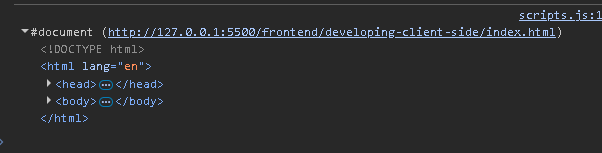
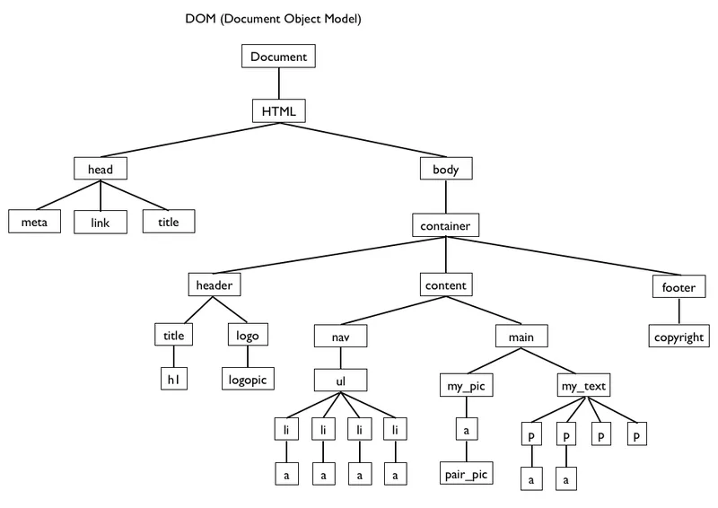

https://www.blackbox.ai/chat/876K65M

#### Что такое DOM?
`DOM (Document Object Model)` - это программный интерфейс, предоставляющий HTML- или XML-документ в виде древовидной структуры объектов. Каждый элемент документа (теги, атрибуты, текст) становится узлом в этом дереве, что позволяет программам (например, JavaScript) динамически читать, изменять, добавлять или удалять части документа. DOM стандартизирован W3C и является частью веб-стандартов.

**Ключевые аспекты DOM**
- Структура. Документ представлен как дерево узлов. Корень – объект `document`, затем идут элементы (например, html, body), атрибуты и текстовые узлы.
- Методы и свойства: Позволяют манипулировать содержимым, стилем и поведением: `document.getElementById()`, `element.innerHTML`, `document.createElement()`.
- Типы узлов: Element (тег), Text (текстовое содержимое элемента), Comment (комментарий), Document (корневой узел всего дом-дерева), DocumentType (объявление типа документа `<!DOCTYPE html>`), Attribute (атрибуты элемента: `id`, `class`, `src`), DocumentFragment (фрагмент дом-дерева - контейнер для узлов, который сам не является частью основного дерева - используется для эффективной вставки группы элементов в документ `appendChild()`, `insertBefore()` - пример: `document.createDocumentFragment()`), CDATASection (предоставляет секцию CDATA в XML - используется для включения текста, который может содержать символы, обычно интерпретируемые как разметка, в HTML практически не применяется), ProcessingInstruction (соответствует инструкции обработки в XML), EntityReference (предоставляет ссылку на сущность в MXL).
- События: DOM поддерживает обработку событий (например, клики, загрузка страницы);
- Обновление: Изменения в DOM отражаются в браузере в реальном времени (рендеринг);

DOM не зависит от браузера и работает в любых средах, поддерживающих HTML/XML (например, Node.js с библиотеками вроде jsdom)

**Пример создания нового DOM-элемента**
```javascript
const newElement = document.createElement('p');

newElement.innerText = 'New Element Value';
document.body.appendChild(newElement); // Покажет 'New Element Value" на странице
```

**Пример вставки элемента с insertBefore()**
```javascript
const parent = document.querySelector('.parent');
const target = document.querySelector('.target');

const newP = document.createElement('p');
newP.innerText = 'new value';

parent.insertBefore(newP, target);

    <div class="parent">
        <!-- Вставка -->
        <p  class="new">new value</p>

        <p class="target">Target</p>
    </div>
```


**Вывод document'a в консоле**
```javascript
console.log(document);
```


**DOM наглядно**
