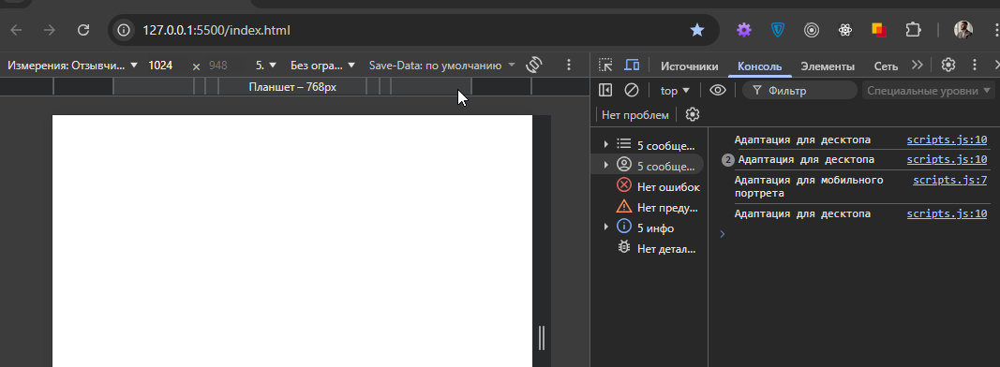
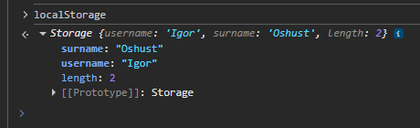

- Комбинированные примеры взаимодействия DOM-элементов: https://www.blackbox.ai/chat/876K65M
-


## Введение в BOM-элементы и их взаимодействие
Browser Object Model (BOM) предоставляет объекты для взаимодействия с браузером и его окружением. Основные элементы: `window` (глобальный объект), `navigator` (информация о браузере), `location` (URL и навигация), `history` (история просмотров), `screen` (экран устройства), `geolocation` (геолокация), `localStorage/sessionStorage` (хранение данных). Они позволяют управлять окнами, получать данные о пользователе, навигировать и хранить информацию.


### Взаимодействие с `window` (глобальный объект браузера)
`window` - корень BOM, представляет окно браузера. Через него доступны другие объекты (например, `window.document` для DOM)

**Пример-1. Открытие нового окна и управление им**
```javascript
// window.open() создаёт новое окно (BOM)
const newWindow = window.open('https://composite.website/', '_blank', 'width=400,height=300');

// Через 2 секунды закрываем его
setTimeout(() => {
    newWindow.close();
}, 2000);

// Выводим размеры текущего окна
console.log('Ширина: ', window.innerWidth, 'Высота: ', window.innerHeight);
```

**Пример-2. Обработка событий окна**
```javascript
// Событие при изменении размера окна
window.addEventListener('resize', function(){
    console.log('Высота:', window.innerHeight, 'Ширина:', window.innerWidth);
});

// Событие перед закрытием страницы
window.addEventListener('beforeunload', function(e){
    e.returnValue = 'Вы уверены, что хотите уйти?'; // Браузер не покажет это сообщение пользователю, текст изменить нельзя.
});
``` 

### Взаимодействие с `navigator` (информация о браузере и устройстве)
`navigator` предоставляет данные о браузере, ОС, поддержке функций.

**Пример-1. Проверка поддержки геолокации и получения данных**
```javascript
if (navigator.getolocation) {
    navigator.geolocation.getCurrentPosition(
        (position) => {
            console.log('Широта:', position.coords.latitude, 'Долгота:', position.coords.longitude);
        },
        (error) => {
            console.error('Ошибка геолокации:', error.message);
        }
    );
} else {
    console.log('Геолокация не поддерживается');
}

// Вывод информации о браузере
console.log('Браузер: ', navigator.userAgent, 'Язык:', navigator.language);
```

**Объяснение**: `navigator.geolocation` – API для геолокации (требует разрешения пользователя). Взаимодействие: проверка поддержки и получение данных о местоположении + метаданные браузера.


**Пример-2. Проверка онлайн-статуса**
```javascript
console.log('Онлайн:', navigator.onLine);

// События изменения статуса
window.addEventListener('online', alert('Соединение восстановлено'));
window.addEventListener('offline', alert('Соединение потеряно'));
```
**Объяснение**: `navigator.onLine` – проверяет интернет-соединение. События BOM реагируют на изменения. Взаимодействие: мониторинг сети.


### Взаимодействие с `location` (URL и навигация)
`location` - управляет текущим URL и позволяет перенаправлять.

**Пример-1. Изменение URL и перезагрузка**
```javascript
// Вывод текущего URL
console.log('Текущий URL:', location.href);

// Изменение адреса (без перезагрузки)
location.pathname = '/new-page';

// Обновление страницы
setInterval(() => {
    // location.reload();
}, 10000);
```
**Объяснение**: `location.href` – полный URL. Изменение свойств (как `pathname`) обновляет адрес. `reload()` перезагружает страницу. Взаимодействие: Навигация без BOM-методов вроде `history`.

**Пример-2. Разбор URL и перенаправление**
```javascript
console.log(`Протокол: ${location.protocol}
Хост: ${location.host}
Путь: ${location.pathname}`);
```
**Объяснение**: Свойства `location` разбирают URL. Присвоение `href` перенаправляет. Взаимодействие: Анализ и изменение навигации.


### Взаимодействие с `history` (история просмотров)
`history` - управляет историей браузера.

**Пример-1. Навигация по истории**
```javascript
console.log('Длина истории:', history.length)

// Назад (аналог history.back())
history.go(-1); // на 1 шаг назад

// Вперёд
history.go(2); // на 2 шага вперёд
// history.forward(); // вперёд на 1 шаг (без аргументов)

```
**Объяснение**: `history.length` - количество страниц. `go(n)` перемещает на n шагов. Взаимодействие: управление навигацией без изменения URL напрямую.

**Пример-2. Добавление записи в историю (без перезагрузки)**
```javascript
// Добавляем новую "страницу" в историю
history.pushState({page: 'new'}, 'Новая страница', '/new-url');

// Обработка события изменения истории
window.addEventListener('popstate', (e) => {
    console.log('История изменилась:', e.state);
});
```
**Объяснение**: `pushState()` - добавляет запись в историю браузера без загрузки страницы (SPA). `popstate` - событие при навигации. Взаимодействие: манипуляция историей для одностраничных приложений.

Подробнее про `pushState()`:
```javascript
history.pushState(state, title, url);

// Адрес в браузере меняется на /new-url, страница не перезагружается, сохранённый объект state будет доступен при навигации назад/вперёд

// state ({page: 'new'}) - объект с данными, который сохраняется вместе с новой записью в истории. Может содержать любую информацию о состоянии приложения.

// title ('Новая страница') - заголовок страницы (игнорируется в большинстве браузров, но можно передать пустую строку)

// url ('/new-url') - новый URL, который отобразится в адресной строке (должен быть из того же домена).
```

Подробнее про `popstate`:
Событие срабатывает, когда пользователь:
- Нажимает кнопку "Назад" (back) в браузере;
- Нажимает кнопку "Вперёд" (forward) в браузере;
- Вызывает методы `history.back()`, `history.forward()`, `history.go()`.

Событие НЕ СРАБАТЫВАЕТ при вызове `pushState()` или `replaceState()`. Срабатывает только при навигации между записями истории (назад/вперёд). Обработчик события получает объект состояния `e`, содержащий полезную информацию.


**Пример (добавляем запись историю)**
1. Нужно добавить несколько страниц в историю
2. Перемещаться по кнопкам `back` и `forward`, чтобы увидеть результат в консоле
```html
<!DOCTYPE html>
<html>
<head>
    <title>Test popstate</title>
</head>
<body>
    <button onclick="addHistory()">Добавить в историю</button>
    <script>
        // Обработчик события
        window.addEventListener('popstate', (e) => {
            console.log('state:', e.state);
        });

        // Функция добавления новой страницы в историю
        function addHistory(){
            const state = { page: Date.now() }
            history.pushState(state, `Page ${state.page}`, `t=${state.page}`);
            console.log('В историю добавлена новая страница: ', state);
        }
    </script>
</body>
</html>
```

### Взаимодействие с `screen` (информация об экране)
`screen` даёт данные о физическом экране устройства пользователя. Он полезен для адаптивного дизайна, аналитики, оптимизации интерфейса и проверки возможностей дисплея. Основные свойства: `width/height` (полные размеры), `availWidth/availHeight` (доступные размеры без панелей), `colorDepth/pixelDepth` (глубина цвета/пикселей). 
```javascript
console.log('Ширина:', screen.width, 'Высота:', screen.height);
console.log('Допустимая ширина:', screen.availWidth, 'Цветовая глубина:', screen.colorDepth);
```
Свойства описывают физический экран. Взаимодействие: полезно для адаптивного дизайна.

**Пример-1 (Адаптивная загрузка изображений на основе размера экрана)**
В реальной практике (например, в новостных сайтах или галереях) `screen` используется для загрузки изображений подходящего разрешения, чтобы сэкономить трафик и улучшить производительность на мобильных устройствах.
- **Сценарий:** Проверяем ширину экрана и загружаем изображение: маленькое для мобильных, большое для десктопов.
```javascript
function loadImageBasedOnScreen(){
    const img = document.getElementById('mainImage');
    if (!img) {
        console.error('Элемент #mainImage не найден!');
        return;
    }
    if (screen.width < 768) {
        img.src = './img-for-mobile.png'; // Для мобильных
    } else {
        img.src = './img-for-desktop.png'; // Для десктопов
    }
}

// Современный способ: добавление слушателя события без перезаписи
document.addEventListener('DOMContentLoaded', loadImageBasedOnScreen);
```
**Объяснение:** `screen.width` определяет физический размер экрана (не окна браузера). Это реально используется в lazy loading (например, в библиотеках вроде Responsive Images или на сайтах вроде BBC). Сравните с `window.innerWidth` для точности - `screen` даёт аппаратные данные.
```javascript
console.log(screen.width); // 1280
console.log(window.innerWidth); // 566 (значение зависимо от размера окна)
```


**Пример-2: Проверка поддержки полноэкранного режима и настройка интерфейса**
В приложениях для просмотра видео (например, YouTube или Netflix) `screen` помогает определить, поддерживает ли устройство полноэкранный режим, и адаптировать UI.
**Сценарий:** Проверяем доступную высоту экрана и предлагаем полноэкранный режим, если места достаточно.
```javascript
function checkFullscreenSupport(){
    if (screen.availHeight >= 780) {
        document.getElementById('fullscreenBtn').style.display = 'block';
        document.getElementById('fullscreenBtn').style.color = 'red';
    } else {
        console.log('Полноэкранный режим не рекомендуется')
    }
}

document.getElementById('fullscreenBtn').addEventListener('click', () => {
    document.documentElement.requestFullscreen();

    setTimeout(() => {
        // Выходим из полноэкранного режима через 3 секунды
        document.exitFullscreen();
    }, 3000);
});
```
**Объяснение:** `screen.availHeight` учитывает панели задач (на Windows/Mac). Реально используется в медиа-плеерах для оптимизации UX. Полноэкранный API (`requestFullscreen()`) комбинируется с `screen` для проверки.

**Дополнительно:**
- `document.documentElement` - свойство объекта `document` (из DOM), которое возвращает корневой элемент HTML-документа. В большинстве случаев это `<html>`. Доступен сразу после загрузки DOM (например, в `DOMContentLoaded`). 
document.documentElement охватывает весь документ, включая `<head>` и `<body>`.

- `requestFullscreen()` - это метод Fullscreen API (часть BOM и HTML5), который переводит элемент (и его потомков) в полноэкранный режим. Браузер скрывает интерфейс (панели, адресную строку) и растягивает элемент на весь экран.
`document.exitFullscreen()` - выход из полноэкранного режима
Связанные события: `fullscreenchange` (при входе/выходе), `fullscreenerror` (ошибка).


**Пример-3: Сбор аналитики о устройстве для маркетинга**
В аналитических инструментах (например, Google Analytics или custom tracking) `screen` собирает данные о дисплее для сегментации пользователей (мобильные vs десктопы).
**Сценарий:** Отправляем данные о экране в аналитику при загрузке страницы.
```javascript
function sendScreenAnalytics(){
    const screenData = {
        width: screen.width,
        height: screen.height,
        colorDepth: screen.colorDepth,
        pixelDepth: screen.pixelDepth
    };

    // Имитация отправки данных с аналитикой (в реальности - fetch или gtag)
    console.log('Отправка аналитики:', screenData);
    // Пример: gtag('event', 'screen_info', screenData);
}

window.addEventListener('load', sendScreenAnalytics);
```
**Объяснение:** `colorDepth` (например, 24 бита для true color) помогает понять возможности дисплея. Реально применяется в e-commerce (Amazon) для персонализации - например, показывать HD-изображения только на подходящих экранах.

**Пример-4: Оптимизация игр для графических приложений** 
В браузерных играх (например, на Canvas или WebGL, как в Phaser.js) `screen` настраивает разрешение для лучшей производительности.
**Сценарий:** Устанавливаем размер Canvas на основе экрана, чтобы игра выглядела хорошо на разных устройствах.
```html
<!DOCTYPE html>
<html lang="en">
<head>
    <meta charset="UTF-8">
    <meta name="viewport" content="width=device-width, initial-scale=1.0">
    <title>Document</title>
</head>
<body>

    <canvas id="gameCanvas"></canvas>

    <script>
        const canvas = document.getElementById('gameCanvas');
        const ctx = canvas.getContext('2d'); // Получаем контекст рисования для элемента

        function resizeCanvas(){
            canvas.width = Math.min(screen.availWidth, 1920); // Ограничение для производительности
            canvas.height = Math.min(screen.availHeight, 1080);
            ctx.fillStyle = 'blue'; // Цвет, градиент или паттерн для заливки фигур
            ctx.fillRect(0, 0, canvas.width, canvas.height); // Рисуем фон (метод для рисования заполненного прямоугольника: 
            // x, y - координаты верхнего левого угла прямоугольника (в пикселях), width - ширина прямоугольника, height - высота)
        }

        resizeCanvas();
        window.addEventListener('resize', resizeCanvas);
    </script>
    
</body>
</html
```
**Объяснение:** `screen.availWidth/Height` предотвращает выход за пределы экрана. Реально используется в играх вроде "2048" или 3D-визуализациях для адаптации под Retina-дисплеи (где pixelDepth > 24).

**Пример-5: Комбинация с другими BOM-элементами для комплексной проверки**
В PWA (Progressive Web Apps) или responsive design `screen` комбинируется с `navigator` и `window` для полной адаптации.
**Сценарий: проверяем экран, браузер и ориентацию для показа подходящего контента**

```javascript
function showContentByDevice(){
    const isMobile = screen.width < 768 && navigator.userAgent.includes('Mobile');
    const orientation = screen.height < screen.width ? 'landscape' : 'portrait'; 

    if (isMobile && orientation === 'portrait') {
        document.body.classList.add('.mobile-portrait');
        console.log('Адаптация для мобильных устройств');
    } else {
        document.body.classList.add('.desktop');
        console.log('Адаптация для десктопных устройств');
    }
}

window.document.addEventListener('orientationchange', showContentByDevice);
```
**Объяснение:** Комбинирует `screen` с `navigator.userAgent` для детекции устройства. Реально применяется в фреймворках вроде Bootstrap для responsive grid. `orientationchange` - BOM-событие для поворота экрана.

**Пример работы программы:**



### Взаимодействие с `localStorage` и `sessionStorage` (хранение данных)
Эти объекты BOM хранят данные локально (localStorage - постоянно, sessionStorage - до закрытия вкладки).
```javascript
// Установка значения
localStorage.setItem('username', 'John');

// Чтение значения
console.log(localStorage.getItem('username')); // 'John'

// Удаление значения
localStorage.removeItem('username');

// Аналогично для sessionStorage
sessionStorage.setItem('tempData', 'Временные данные');
console.log(sessionStorage.getItem('tempData'));
sessionStorage.removeItem('tempData');
```
**Объяснение:** Хранение строковых данных. Взаимодействие: Сохраняет состояние между сессиями или страницами.

**Что представляет из себя localStorage на самом деле - объект**



**Пример-2: Сохранение и восстановление формы (с `localStorage`)**
В формах регистрации/входа нужно сохранять данные, чтобы пользователь не терял ввод при перезагрузке страницы. 
**Сценарий:** Пользователь заполняет форму; данные сохраняются и восстанавливаются при возврате.
```javascript
// Записываем введённые данные в локалсторадж
document.getElementById('username').addEventListener('input', (e) => {
    localStorage.setItem('username', e.target.value);
});

// Запоминаем данные после обновления страницы
document.addEventListener('DOMContentLoaded', () => {
    let savedUsername = localStorage.getItem('username')
    if (savedUsername) {
        document.getElementById('username').value = savedUsername;
    }
});

// Очищаем данные
document.getElementById('form').addEventListener('submit', () => {
    localStorage.removeItem('username');
});
```
**Объяснение:** `localStorage` сохраняет навсегда - данные останутся даже после закрытия браузера. Реально используется в Gmail или Amazon для автозаполнения.

**Пример-2: Корзина покупок (c `sessionStorage`)**
В e-commerce сайтах (интернет-магазинах) храните товары в корзине на время сессии.
**Сценарий:** Добавление товаров в корзину; отображение количества; очистка при закрытии вкладки.
```javascript
// Устанавливаем данные
sessionStorage.setItem('cart', JSON.stringify([{ id: 1, quantity: 1 }]));

// Описываем логику обработки товаров в корзине (подсчёт количества)
function addToCart(productId, quantity){
    const cart = JSON.parse(sessionStorage.getItem('cart' || '[]'));
    const existing = cart.find(item => item.id === productId);
    if (existing) {
        existing.quantity += quantity;
    } else {
        cart.push({ id: productId, quantity });
    }
    sessionStorage.setItem('cart', JSON.stringify(cart));
    updateCartDisplay();
}

// Обновляем количество товаров (если увеличили количество имеющегося)
function updateCartDisplay(){
    const cart = JSON.parse(sessionStorage.getItem('cart' || '[]'));
    document.getElementById('cartCount').textContent = cart.reduce((sum, item) => sum + item.quantity, 0);
}

document.addEventListener('DOMContentLoaded', updateCartDisplay);

addToCart(1, 2);
```

**Комментарии к коду:**
- Метод `find()` ищет первый элемент в массиве, удовлетворяющий заданному условию, и возвращает этот элемент. Если ни один элемент не подходит - возвращает undefined.
В коде 
```javascript
cart.find(item => item.id === productId);
```
1. Метод перебирает элементы массива cart по порядку
2. Для каждого элемента вызывает функцию-коллбек
3. Как только находит элемент, для которого функция возвращает true (т.е. item.id совпал с productId), останавливает поиск.
4. Возвращает этот элемент.
5. Если совпадений нет - возвращает undefined.

- Метод `reduce()` сводит массив к одному значению, последовательно применяя функцию-аккумулятор.
```javascript
array.reduce(callback, initialValue)

(sum, item) => sum + item.quantity // функция-аккумулятор

// sum - "накопитель" (текущее суммарное значение, начинается с initialValue)
// item - текущий элемент массива cart на данной итерации
// sum + item.quantity - прибавляет к накопителю количество товаров в текущем элементе
// 0 - начальное значение накопителя (sum на первой итерации)

// reduce возвращает общую сумму quantity: document.getElementById('cartCount').textContent = 6;
```

Дополнительный пример с выводом подробной информации о товарах
```javascript
sessionStorage.setItem('cart', JSON.stringify([{ id: 1, quantity: 2 }]));

function addToCart(productId, quantity) {
    const cart = JSON.parse(sessionStorage.getItem('cart' || '[]'));
    const existing = cart.find(item => item.id === productId);
    if (existing) {
        existing.quantity += quantity;
    } else {
        cart.push({ id: productId, quantity: quantity });
    }
    sessionStorage.setItem('cart', JSON.stringify(cart));
    updateToDisplay();
}

function updateToDisplay() {
    const cart = JSON.parse(sessionStorage.getItem('cart' || '[]'));
    document.getElementById('cartCount').textContent = `Количество товаров в корзине: ${cart.reduce((sum, item) => sum + item.quantity, 0)}`;
}

document.addEventListener('DOMContentLoaded', updateToDisplay);

addToCart(2, 9);
addToCart(3, 10);
addToCart(4, 9);
addToCart(3, 2);
addToCart(9, 2);

function showCartItems() {
    const cart = JSON.parse(sessionStorage.getItem('cart' || '[]'));
    let count = 1;
    cart.forEach(function(item){
        console.log(`${count}. ID: ${item.id}, quantity: ${item.quantity}`);
        count++;
    });
}
```