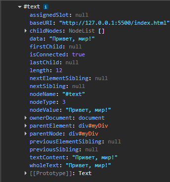
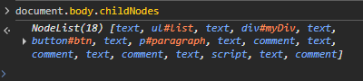
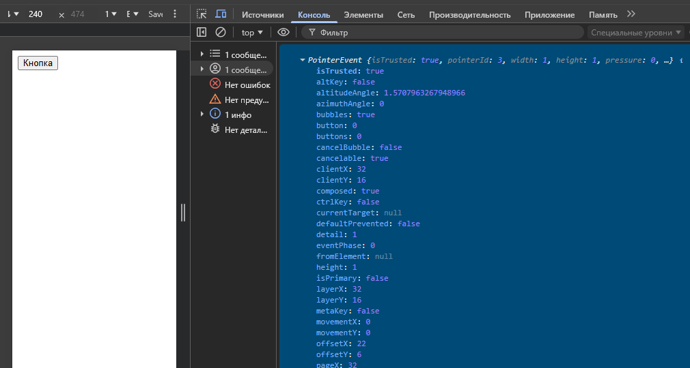

## Что такое DOM?
`DOM` - программный интерфейс для HTML- и XML-документов. Он представляет структуру документа как дерево узлов (объектов), где каждый элемент, атрибут или текстовый фрагмент является узлом. DOM позволяет JavaScript динамически взаимодействовать с веб-страницей: изменять содержимое, структуру, стили и обрабатывать события. DOM стандартизирован W3C и является основой для веб-разработки.

DOM не является частью JavaScript, но предоставляется браузерами как API. Когда браузер загружает HTML, он строит DOM-дерево на основе разметки. Это дерево можно модифицировать через скрипты, что делает страницы интерактивными.

### Теория DOM: основные концепции
**Структура DOM как дерева**
- Дерево узлов. Документ представлен как иерархическое дерево. Корень - объект `document`. Каждый элемент HTML (например, div) - это узел, который может иметь дочерние узлы (вложенные элементы, текст, атрибуты).

- Типы узлов (CADET):
- - Элементные узлы (Element): Теги, такие как `<p>`, `<div>`
- - Текстовые узлы (Text): Содержимое между тегами (например, "Hello world")
- - Атрибутные узлы (Attribute): Свойства элементов, как `id`, `class`
- - Комментарии (Comment): `<!-- -->`
- - Документ (Document): Корневой объект

- Свойства и методы: Каждый узел имеет свойства (например, `nodeName`, `nodeType`) и методы для навигации (родители, дети, соседи) и манипуляции.

**Навигация по DOM**
- Родительские и дочерние узлы: `parentNode`, `childNodes`, `firstChild`, `lastChild`.
- Соседи: `nextSibling`, `previousSibling`.
- Доступ к элементам:
- - По ID: `document.getElementById('myId')`
- - По классу: `document.getElementsByClassName('myClass')`
- - По тегу: `document.getElementsByTagName('div')`
- - Современный способ: `document.querySelector('#myId')` или `document.querySelectorAll('.myClass')` (Поддерживает CSS-селекторы).

**Манипуляция DOM**
- Создание узлов: `document.createElement('div')`, `document.createTextNode('text')`;
- Добавление/удаление: `appendChild()`, `insertBefore()`, `removeChild()`;
- Изменение атрибутов: `setAttribute()`, `getAttribute()`;
- Изменение стилей: Через свойство `style` (например, `element.style.color = 'red'`);
- Обработка событий: `addEventListener()` для реагирования на клики, загрузку и т.д.

**Жизненный цикл и производительность**
- DOM строится при загрузке страницы, но изменения могут вызывать перерисовку (reflow) и перекомпоновку (repaint), что влияет на производительность. Необходимо использовать `DocumentFragment` для пакетных изменений.
- Виртуальный DOM (не часть стандартного DOM, но связан): в фреймворках вроде React - это оптимизация для минимизации реальных изменений DOM.

**Различие между DOM и BOM**
DOM фокусируется на документе, а BOM (Browser Object Model) - на браузере (окна, история, навигация).


### Примеры
Создание и добавление элементов
```html
<!DOCTYPE html>
<html>
<body>
    <ul id="list"></ul>
    <script>
        const list = document.getElementById('list');
        // Создаём новый элемент li
        const newItem = document.createElement('li');
        newItem.textContent = 'Новый пункт списка';
        // Добавляем в конец списка
        list.appendChild(newItem);

        // Добавляем ещё один элемент с классом
        const anotherItem = document.createElement('li');
        anotherItem.textContent = 'Some text for anotherItem';
        anotherItem.className = 'highlight'; // Добавляем класс
        list.appendChild(anotherItem);
    </script>
</body>
</html>
```

Навигация и удаление узлов
```html
<!DOCTYPE html>
<html>
<body>
  <div id="container">
    <p>Первый параграф</p>
    <p id="second">Второй параграф</p>
    <p>Третий параграф</p>
  </div>
  <button id="removeBtn">Удалить второй параграф</button>
  <script>
    const removeBtn = document.getElementById('removeBtn');
    removeBtn.addEventListener('click', function() {
      const secondP = document.getElementById('second');
      // Удаляем узел
      secondP.parentNode.removeChild(secondP);
    });
  </script>
</body>
</html>
```
Объяснение: `parentNode.removeChild()` удаляет элемент. Навигация через `parentNode` показывает, как перемещаться по дереву.

Изменение стиля и размера
```html
<!DOCTYPE html>
<html>
<body>
  
  <button id="changeBtn">Изменить изображение</button>
  <script>
    const img = document.getElementById('myImage');
    const changeBtn = document.getElementById('changeBtn');
    
    changeBtn.addEventListener('click', function() {
      // Меняем атрибут src
      img.setAttribute('src', 'new-image.jpg');

      // Меняем стиль
      img.style.color = 'red';
      img.style.width = '200px';
      img.style.border = '2px solid red';
    });
  </script>
</body>
</html>
```
Объяснение: `setAttribute` изменяет атрибуты, `style` - CSS-свойства. Полезно для динамических изменений медиа.

Использование `querySelector` для сложных селекторов
```html
<!DOCTYPE html>
<html>
<body>
  <div class="box">Бокс 1</div>
  <div class="box highlight">Бокс 2</div>
  <div class="box">Бокс 3</div>
  <script>
    // Выбираем все элементы с классом box
    const boxes = document.querySelectorAll('.box');
    boxes.forEach((box, index) => {
        box.addEventListener('click', function(){
            this.textContent = `Бокс ${index + 1} нажат!`;
        });
    });

    // Выбираем только выделенный бокс
    const highlighted = document.querySelector('.box.highlight');
    highlighted.style.fontWeight = 'bold';
  </script>
</body>
</html>
```
Объяснение: `DocumentFragment` позволяет добавить много элементов за одну операцию, избегая множественных перерисовок DOM.


### Разбор вспомогательных тем
1. **document.createTextNode('text')**
`document.createTextNode('text')` - это метод для создания текстового узла (Text Node) в DOM. Текстовые узлы содержат текст, который отображается на странице, но не являются элементами (не имеют тегов). Это полезно, когда нужно добавить текст отдельно от элементов, например, для точного контроля над содержимым.
```javascript
const textNode = document.createTextNode('Привет, мир!');
const div = document.getElementById('myDiv');
div.appendChild(textNode); // Добавляем текст в div
```
Использование: если текст содержит специальные символы или нужно избежать интерпретации HTML. Безопасен от XSS, если текст от пользователя. Не подходит для сложного содержимого с HTML.

**Если распечатать элемент createTextNode:**




2. **appendChild, removeChild**
- `appendChild(node)`: Добавляет указанный узел как последний дочерний элемент к родительскому узлу. Если узел уже существует в DOM, он перемещается.
- `removeChild(node)`: Удаляет указанный дочерний узел из родительского.
```javascript
const parent = document.getElementById('list');
const child = document.createElement('li');
child.textContent = 'Новый элемент';
parent.appendChild(child); // Добавляет в конец

// Позже
parent.removeChild(child); // Удаляет
```
Использование: для динамического добавления/удаления элементов. `appendChild` возвращает добавленный узел. Недостаток: Нет встроенного способа вставить в середину (для этого нужно использовать `insertBefore`).


3. **addEventListener**
`addEventListener` - основной и рекомендуемый способ добавление обработчиков на событие (стандарт W3C). Позволяет добавлять несколько обработчиков без перезаписи.
```javascript
const btn = document.getElementById('btn');

// Сработают оба события (в раз по клику)
btn.addEventListener('click', () => console.log('Клик 1'));
btn.addEventListener('click', () => console.log('Клик 2'));

// Старый способ (перезаписывает)
btn.onclick = () => console.log('Только это');
```
Рекомендуемо всегда использовать `addEventListener` для гибкости. Он поддерживает фазы захвата/всплытия и удаление через `removeEventListener`.


3. **removeEventListener**
`removeEventListener(eventType, listener, options)` удаляет обработчик события, добавленный через `addEventListener`. Он требует те же параметры (тип события, функция, опции), чтобы точно совпадать. Без этого обработчик остаётся.
Параметры:
- `eventType`: Строка, например 'click'
- `listener`: Функция-обработчик (должна быть той же ссылкой)
- `options`: Объект с `capture`, `once` и т.д. (опционально)

Когда использовать: для очистки памяти, предотвращения утечек (например, при удалении элементов) или динамического управления событиями.

Пример
```javascript
const btn = document.getElementById('btn');
const handler = () => console.log('Clicked');

btn.addEventListener('click', handler);
btn.removeEventListener('click', handler); // Удаляет

btn.addEventListener('click', handler, { capture: true });
btn.removeEventListener('click', handler, { capture: true })
```
Недостатки: не работает с анонимными функциями (нужна ссылка). Для одноразовых событий используется `{ once: true }` в `addEventListener`.


4. **DocumentFragment**
`DocumentFragment` - это легковесный контейнер для узлов DOM, не являющийся часть реального дерева документа. Он используется для группировки изменений перед вставкой в DOM, чтобы минимизировать перерисовки и повысить производительность. 

`document.createDocumentFragment()` создаёт пустой DocumentFragment - объект, похожий на документ, но не часть реального DOM. Он хранит узлы временно, позволяя собирать изменения перед вставкой. 

Используется для пакетной вставки узлов c целью избежания множественных reflow/repaint. **DOM обновляется только при финальном `appendChild(fragment)`**.
**Использовать нужно** при добавлении >10-20 элементов в цикле; используется в библиотеках вроде jQuery для оптимизации.

+ Преимущества
- Производительность: Одно обновление вместо N.
- Легковесность: Не занимает место в DOM до вставки.
- Гибкость: Можно манипулировать как обычным узлом.

+ Недостатки
- Невидим в DOM до вставки (нельзя стилизовать или анимировать);
- Ограниченная поддержка в старых браузерах (IE < 9)
- Для малого количества элементов (1-5) избыточно - обычный `appendChild` быстрее.


```javascript
const fragment = document.createDocumentFragment();
for (let i = 0; i < 100; i++) {
    const li = document.createElement('li');
    li.textContent = `Элемент: ${i}`;
    fragment.appendChild(li);
}
document.getElementById('list').appendChild(fragment);
```
Использование: при добавлении множества элементов. Без него каждое `appendChild` вызывает reflow/repaint.

5. **Node, NodeList, nodeType**
- `Node`: Базовый интерфейс для всех узлов DOM (элементы, текст, комментарии и т.д.). Имеет свойства вроде `nodeName`, `nodeValue`, методы навигации.
- `NodeList`: Коллекция узлов (например, от `querySelectorAll`). Не массив, но имеет `length` и индексы; для перебора нужно использовать `forEach` или `Array.from()`.
- `nodeType`: Числовое свойство, указывающее тип узла (1 - элемент, 3 - текст, 8 - комментарий, 9 - документ и т.д.).
```javascript
const div = document.querySelector('div');
// console.log(div.nodeType); // 1 (элемент)
// console.log(div.nodeName); // 'DIV'

const nodes = document.querySelectorAll('#paragraph');
// console.log(nodes); // NodeList [p]
// console.log(nodes.length); // Количество элементов по селектору p

const text = document.createTextNode('Привет!');
const comment = document.createComment('Ha-hah');
document.body.appendChild(comment);

nodes.forEach(function(node){
    console.log(node.nodeType); // Перебор (покажет 1, что равно "элемент")
    console.log(node.nodeName); // P

    console.log(text.nodeValue); // (Возвращает или устанавливает значение для конкретных узлов (например, 3 - текст))
    console.log(comment.nodeValue); // (Возвращает или устанавливает значение для конкретных узлов (например, 8 - комментарий))
}); 
```
Другие: `childNodes` - NodeList дочерних узлов, `nodeValue` - для текстовых узлов.




5. **Дополнительные возможности Node, NodeList**
`Node` (расширение возможностей):
- Навигация: `parentNode`, `childNodes`, `firstChild`, `lastChild`, `nextSibling`, `previousSibling`.
- Манипуляция: `appendChild()`, `insertBefore()`, `replaceChild()`, `cloneNode(deep)`, `removeChild()`.
- Свойства: `nodeType` (число: 1-элемент, 3-текст), `nodeName` (имя узла), `nodeValue` (для текста/атрибутов).
- Проверка: `hasChildNodes()`, `isEqualNode(otherNode)` (сравнение)
- Другие: `normalize()` (объединяет смежные текстовые узлы)

```javascript
const list = document.querySelector('#list');
const listLi = document.querySelector('.list-li');

const li = document.createElement('li');
li.textContent = "li value";

// Копирование объекта
const clonedLi = listLi.cloneNode(true); // Глубокая копия (с дочерними элементами), false - копирование без дочерних элементов
list.appendChild(clonedLi); // Добавляем копию в список

// list.insertBefore(li, listLi); // Вставляем элемент li перед listLi (<new>, <old>)
// list.replaceChild(li, listLi); // Заменяем элемент listLi на li (<new>, <old>)
// list.removeChild(listLi); // Удалние дочернего элемента
// list.hasChildNodes() // Проверка наличия дочерних узлов 
// list.isEqualNode(clonedLi) // Сравнение узлов

/* Пример работы функции normalize() */
const div = document.createElement('div');

// Создаём два текстовых узла подряд
const text1 = document.createTextNode('Привет');
const text2 = document.createTextNode(' мир! ');
div.appendChild(text1);
div.appendChild(text2);

// Выводим информацию про узлы
console.log('Узлов до нормализации:', div.childNodes.length); // 2 (два узла)

// Применяем normalize()
div.normalize();

// Информация про узлы после проверки
console.log('Узлов после нормализации:', div.childNodes.length); // 1 (один объединённый узел)
console.log(div.textContent); // "Привет мир!"
```

`NodeList`
- Не массив, но имеет `length` и индексы. Для перебора: `forEach()`, `Array.from(nodeList).map()`.
- Методы: Нет встроенных манипуляций; конвертируйте в массив для `filter`, `map`.
- Динамичность: `childNodes` обновляется автоматически; `querySelectorAll` - статический snapshot.
```javascript
const ul = document.querySelector('ul');
console.log(ul.childNodes.length); // NodeList дочерних узлов

ul.childNodes.forEach(node => {
    if (node.nodeType === 1) {
        console.log('Элемент:', node.nodeName);
    }
});

const cloned = ul.cloneNode(true); // Глубокое клонирование
document.body.appendChild(cloned);
```

5. **Отличие previousSibling от previousElementSibling, и nextSibling от nextElementSibling.
Эти свойства используются для навигации по DOM-дереву на одном уровне (среди соседей).
- `previousSibling / nextSibling`: возвращают предыдущий/следующий узел (любой тип: элемент, текст, комментарий, документ). Они учитывают все узлы, включая текстовые (whitespace).
- `previousElementSibling / nextElementSibling`: возвращают только предыдущий/следующий элементный узел, игнорируя текстовые узлы, комментарии и другие не-элементнтные типы.

```html
<div id="container">
    <!-- Комментарий -->
     Текст перед
     <p id="first">Первый параграф</p>
     <p id="second">Второй параграф</p>
     Текст после
</div>

<script>
    const second = document.getElementById('second');

    // nextSibling: Следующий узел - текстовый ("Текст после")
    second.nextSibling.nodeType; // 3 (текст)
    second.nextSibling.textContent; // "Текст после

    // nextElementSibling: Следующий элемент - null (нет элементов после)
    second.nextElementSibling; // null

    // previousSibling: Предыдущий узел - текстовый ("Текст перед")
    second.previousSibling.nodeType; // 3
    second.previousSibling.textContent; // "Текст перед"

    // previousElementSibling: предыдущий элемент - <p id="first">Первый параграф</p>
    second.previousElementSibling.id; // "first"
</script>
```


6. **parentNode, parentElement, offsetParent**
- parentNode: возвращает родительский узел (любой тип: элемент, документ и т.д.)
- parentElement: возвращает родительский элемент (только если родитель - элемент; иначе null)
- offsetParent: элемент, относительно которого рассчитываются координаты (позиционированный предок или body)
```javascript
const child = document.querySelector('p');
console.log(child.parentNode); // Может быть div или body
console.log(child.parentElement); // То же для элемента
console.log(child.offsetParent);
```
Использование: `parentNode` для навигации по дереву, `parentElement` - если нужен только элемент, `offsetParent` - для расчёта позиций (например, в `getBoundingClientRect`).


7. **Что такое узел в контексте DOM?**
Узел (Node) - это базовый объект в DOM-дереве, представляющий часть документа. Каждый элемент HTML, текст, атрибут, комментарий - это узел. Узлы образуют иерархическую структуру: корень - `document`, потомки - элементы, текст и т.д. Узлы имеют типы (nodeType), свойства для навигации и методы для манипуляции. Например, `<div>Hello</div>` - элементарный узел с текстовым дочерним узлом. Узлы помогают программно изменять страницу.


## Представление HTML-документа в виде дерева
HTML-документ строится иерархически: `<html>` - корень, внутри него `<head>` и `<body>`, и т.д. В дереве содержаться:
- Родительские узлы (содержат дочерние);
- Дочерние узлы (вложенные элементы);
- Соседние узлы (элементы на одном уровне).

Навигация по дереву:
- `element.parentNode` - родитель
- `element.children` - массив дочерних элементов.
- `element.nextSibling` - следующий сосед.

## Основные методы управления и манипуляции элементами DOM
1. Поиск элементов
- `getElementById(id)`
- `getElementsByClassName(class)`
- `getElementsByTagName(tag)`
- `getElementsByName(name)` - находит элементы по атрибуту `name`.
- `querySelector(selector)` - возвращает первый элемент, соответствующий CSS-селектору.
- `querySelectorAll(selector)` - возвращает все элементы, соответствующие CSS-селектору (в виде NodeList).
- `closest(selector)` - ищет ближайшего родителя, соответствующего CSS-селектору.

2. Создание элементов
- `createElement(tagName)` - создание нового элемента с указанным тегом
- `createTextNode(text)` - создаёт текстовый узел
- `createDocumentFragment()` - создаёт фрагмент для группировки элементов перед вставкой в DOM
- `importNode(existingNode, deep)` - копирует существующий узел (с дочерними элементами, если `deep = true`).
```javascript
const newNode = document.importNode(existingNode, deep);
```

3. Изменение содержимого
- `innerHTML` - получает/устанавливает HTML-содержимое элемента
- `textContent` - получает/устанавливает текстовое содержимое (без HTML-разметки)
- `innerText` - аналогично `textContent`, но учитывает стили (например, скрытые элементы)

4. Работа с атрибутами
- `setAttribute(name, value)` - устанавливает значение атрибута
- `getAttribute(name)` - получает значение атрибута
- `removeAttribute(name)` - удаляет атрибут
- `hasAttribute(name)` - проверяет наличие атрибута

5. Управление стилями
- `style` - объект для изменения inline-стилей
- `classList` - объект для работы с классами:
- - `add(className)` - добавляет класс;
- - `remove(className)` - удаляет класс;
- - `toggle(className)` - переключает класс;
- - `contains(className)` - проверяет наличие класса;

6. Добавление и вставка элементов
- `appendChild(newElement)` - добавляет элемент в конец родительского элемента.
- `prepend(newElement)` - добавляет элемент (или несколько элементов) в начало родительского элемента. Антагонист `append`, добавляющего элементы в конец.
- `append(...nodes)` - добавляет несколько элементов/текстовых узлов (поддерживает строки, которые преобразуются в HTML).
- `insertBefore(newElement, referenceElement)` - вставляет элемент перед указанным элементом.
- `insertAdjacentHTML(position, htmlString)` - вставляет HTML-код в указанное место (`beforebegin`, `afterbegin`, `beforeend`, `afterend`).

7. Удаление элементов
- `remove()` - удаляет элемент из DOM (без указания родителя).
- `removeChild(childElement)` - удаляет указанный дочерний элемент из родителя.
- `replaceWith(newElement)` - заменяет элемент на новый.
- `replaceChild(newElement, oldElement)` - заменяет дочерний элемент на новый.

8. Клонирование элементов
- `cloneNode(deep)` - создаёт копию элемента. Если `deep=true`, копируются также дочерние элементы.

9. Обход структуры DOM
- `parentNode` - возвращает родительский элемент
- `parentElement` - возвращает родительский элемент (не текстовый узел)
- `childNodes` - коллекция всех дочерних узлов (включая текстовые) (то есть, если будет отступы внутри тега, это будет считаться за элемент "текст")
- `children` - коллекция только дочерних элементов (без текстовых узлов)
- `firstChild / lastChild` - первый/последний дочерний узел (включая текстовые узлы)
- `firstElementChild/ lastElementChild` - первый/последний дочерний элемент.
- `nextSibling / previousSibling` - следующий/предыдущий узел на том же уровне (включая текстовые узлы).
- `nextElementSibling / previousElementSibling` - следующий/предыдущий элемент на том же уровне (без текстовых узлов).

10. Работа с событиями
- `addEventListener(event, handler)` - добавляет обработчик события
- `removeEventListener(event, handler)` - удаляет обработчик события
- `dispatchEvent(event)` - искусственно вызывает событие
```javascript
const btn = document.querySelector('#btn');
const clickEvent = new MouseEvent('click', {
    bubbles: true,
    cancelable: true,
    view: window
});

btn.addEventListener('click', () => {
    console.log('click!!');
})

btn.dispatchEvent(clickEvent); // click!!
btn.click(); // click!! (альтернативный простой способ, не позволяющий настраивать параметры события)
```

11. Прочие методы
- `contains(otherNode)` - проверяет, содержит ли элемент указанный узел
- `hasChildNodes()` - проверяет, есть ли у элемента дочерние узлы
- `normalize()` - объединяет соседние текстовые узлы внутри элемента, убирая пустые или избыточные. Как работает: проходит по всем дочерним узлам элемента, если находит
последоавтельные текстовые узлы (включая пустые) - объединяет их в один, затем удаляет пустые текстовые узлы (например, возникшие из пробелов между тегами).
```html
    <p id="result">
        Текст-1
        Текст-2
    </p>
```
```javascript
const p = document.createElement('p');
p.appendChild(document.createTextNode('Текст-1'));
p.appendChild(document.createTextNode('Текст-2'));

console.log(p.childNodes.length); // 2
p.normalize();
console.log(p.childNodes.length); // 1 (объединено в "Текст-1Текст-2")
```

- `scrollIntoView()` - прокручивает страницу так, чтобы элемент стал видимым в окне браузера. Вызывается на DOM-элементе, браузер автоматически рассчитывает смещение
и выполняет прокрутку, + можно управлять поведением прокрутки (плавно, по вертикали/горизонтали и т.п.).
```javascript
element.scrollIntoView(options);
```
Параметры:
- `behavior`: 'auto' (резко) или 'smooth' (плавно).
- `block`: выравнивание по вертикали ('start', 'center', 'end', 'nearest')
- `inline`: выравниевание по горизонтали ('start', 'center', 'end', 'nearest')
start - выравнивание по верхнему краю окна
center - элемент центрируется по вертикали
end - элемент выравнивается по нижнему краю окна
nearest - только минимальная прокрутка, если элемент почти виден.

Примеры:
```javascript
const target = document.getElementById('section-3');

// Простая прокрутка (через 3 секунды после отображения)
setTimeout(() => {
  target.scrollIntoView();
}, 3000);

// Плавная прокрутка к центру
target.scrollIntoView({
  behavior: 'auto',
  block: 'nearest', // Только минимальная прокрутка, если элемент почти виден
  inline: 'center'
})

```

## Модель событий DOM
Модель событий DOM (Document Object Model Events) – это механизм, позволяющий JS реагировать на действия пользователя или изменения в документе, такие как клики, нажатия клавиш, загрузка страницы и т.д. События представляют собой сигналы, генерируемые браузером при взаимодействии с элементами DOM. Модель событий включает обработчики (listeners), которые выполняют код в ответ на события, и фазы распространения (propagation), определяющие порядок обработки.

DOM Events основаны на стандарте W3C и поддерживаются всеми соверменными браузерами. События могут быть стандратными (click, load) или пользовательскими.

### Основные компоненты модели событий
- **События (Events)**: Объекты, содержащие информацию о произошедшем. Каждый тип события имеет имя (click, keydown, submit).

- **Обработчики событий (Event Handlers)**: Функции, вызываемые при наступлении события. Можно назначать:
- - В HTML: `<button onclick="alert('Клик!')" >Text</button>`
- - В JS: `element.addEventListener('event', function)`

- **Объект Event**: Передаётся в обработчик и содержит свойства, такие как `target` (элемент, вызвавший событие), `type` (тип события), `preventDefault()` (отмена действия по умолчанию), `stopPropagation()` (остановка распространения).

- stopPropagation() - метод, предотвращающий продолжение фазы распространения события. Если событие находится на фазе всплытия (bubbling, по умолчанию), оно не поднимается выше указанного элемента. Если на захвате (capturing), оно не спустится ниже. 
+ Предотвращает срабатывание других обработчиков (если на родительских элементах есть свои слушатели, они не сработают после этого). Это изолирует обработку. 
+ Избегает конфликтов. Если есть глобальный обработчик (например, лог кликов), e.stopProgagation() предотвратит его срабатывание для этого конкретного события
+ Не влияет на preventDefault() - только распространение. Они дополняют друг друга, но работают независимо.
+ В простых случаях (без других слушателей) он не критичен, но добавляет безопасность. Если бы обработчик был на более низком элементе (допустим, на контейнере ссылок), без него событие могло бы всплыть к `document` и вызвать повторную проверку.
В итоге, stopPropagation() обеспечивает полный контроль над событием, предотвращая "побочные эффекты".


Пример
```html
<button type="button" class="btn">Кнопка</button>
```

```javascript
const btn = document.querySelector('.btn');

btn.addEventListener('click', (e) => {
    console.log(e);
});
```

Результат:



### Фазы распространения событий
События распространяются по DOM-дереву в три фазы:
1. `Capturing (Захват)`: событие спускается от корня (`document`) к целевому элементу. Редко используется, но можно слушать с `addEventListener(..., { capture: true })`.
2. `Target (Цель)`: событие достигает целевого элемента.
3. `Bubbling (Всплытие)`: Событие поднимается обратно к корню. По умолчанию обработчики срабатывают на этой фазе.

Это позволяет обрабатывать события на разных уровнях иерархии.

### Примеры
1. **Назначение обработчика события**
```javascript
const btn = document.querySelector('.btn');

btn.addEventListener('click', (e) => {
    console.log('Кнопка нажата!');
    console.log('Тип события:', e.type); // "click"
    console.log('Целевой элемент:', e.target); // <button type="button" class="btn">Кнопка</button>

    console.log('Тип целевого элемента:', e.target.type); // button (по сути, e.target... обращается к атрибутам элемента)
    console.log('Контент целевого элемента:', e.target.textContent); // Кнопка
    console.log('Значение целевого элемента:', e.target.value); // если есть атрибут value, покажет значение
});
```

2. **Работа с фазами распространения**
```html
<div id="parent">
    <button id="child">Кликни меня</button>
</div>
```

```javascript
const parent = document.getElementById('parent');
const child = document.getElementById('child');

// Обработчик на всплытии (по умолчанию) (3)
parent.addEventListener('click', function(){
  console.log('Всплытие: родитель');
});

// Обработчик на захвате (1)
parent.addEventListener('click', function(){
  console.log('Захват: родитель');
}, { capture: true });

// Обработчик на ребёнке (2)
child.addEventListener('click', function(){
  console.log('Цель: ребёнок');
});
// При клике на кнопку: "Захват: родитель" -> "Цель: ребёнок" -> "Всплытие: родитель"
```

3. **Отмена действия по умолчанию и остановка распространения**
```javascript
const link = document.querySelector('a');

// Отмена перехода по ссылке
link.addEventListener('click', function(event) {
    event.preventDefault(); // Не переходит по href
    console.log('Ссылка нажата, но переход отменен');
});

// Остановка всплытия
child.addEventListener('click', function(event) {
    event.stopPropagation(); // Останавливает распространение
    console.log('Всплытие остановлено');
});
```

4. **События клавиатуры и формы**
```javascript
const form = document.querySelector('form');
const btn = document.querySelector('button');

// Обработка ввода с клавиатуры
document.addEventListener('keydown', function(event){
  console.log(event); // KeyboardEvent {isTrusted: true, key: 'd', code: 'KeyD', ...}
  console.log('Нажата клавиша: ', event.key);
});

// Отмена отправки формы (переопределение стандартного поведения)
form.addEventListener('submit', function(event){
  event.preventDefault(); // Отмена отправки
  console.log(event); // SubmitEvent {isTrusted: true, submitter: button, type: 'submit', ...}
  console.log('Кнопка отправки нажата, форма не отправлена')
});
```

5. **Пользовательское событие**
```javascript
const customEvent = new Event('myEvent'); // Кастомное событие
const btn = document.querySelector('button'); // Существующий элемент

document.addEventListener('myEvent', function(e){
    console.log(e.type); // myEvent
    console.log('Пользовательское событие сработало!');
});

btn.addEventListener('click', function(e){
    e.preventDefault(); // Отмена отправки формы 
    console.log(e.type); // click
});

// Генерация события (кастом)
document.dispatchEvent(customEvent);

// Генерация события (существующий элемент)
btn.dispatchEvent(new MouseEvent('click', {
    bubbles: true,
    cancelable: true,
    view: window
}));
```

Эти примеры показывают базовую работу с событиями. Для сложных приложений необходимо использовать делегирование событий (назначение на родителя для динамических элементов). Необходимо избегать inline-обработчиков в пользу `addEventListener` для лучшей управляемости.


## Знакомство с объектами Document и Link
В JS объект Document представляет собой корневой элемент Document Object Model (DOM), который моделирует структуру HTML-документа. Он позволяет взаимодействовать с содержимым страницы, манипулировать элементами, стилями и событиями. Объект Link (часто подразумевает элементы ссылок, такие как `<a>` или `<link>`) относится к интерфейсам DOM для работы с гиперссылками и внешними ресурсами.

### Объект Document
Объект `Document` является глобальным и доступен через `window.document` или просто `document`. Он наследуется от `Node` и предоставляет интерфейс для доступа к элементам, их создания, изменения и удаления.

**Основные свойства**
- `document.body`: Ссылка на элемент body
- `document.head`: Ссылка на элемент head
- `document.title`: Заголовок документа (из title)
- `document.URL`: Полный URL текущего документа
- `document.cookie`: Доступ к cookies
- `document.links`: HTMLCollection всех элементов `<a>` и `<area>` (ссылок)
- `document.forms`: HTMLCollection всех форм
- `document.images`: HTMLCollection всех изображений.


**Основные методы**
- `document.getElementById(id)`: Возвращает элемент по ID
- `document.getElementsByTagName(tag)`: Возвращает коллекцию элементов по тегу
- `document.querySelector(selector)`: Возвращает первый элемент, соответствующий CSS-селектору.
- `document.querySelectorAll(selector)`: Возвращает все элементы, соответствующие селектору
- `document.createElement(tag)`: Создаёт новый элемент
- `document.createTextNode(text)`: Создаёт текстовый узел
- `document.appendChild(node)`: Добавляет дочерний узел
- `document.removeChild(node)`: Удаляет дочерний узел
- `document.addEventListener(event, handler)`: Добавляет обработчик событий

Document также поддерживает события, такие как `DOMContentLoaded` (для выполнения кода после загрузки DOM).

### Объект Link
Link относится к элементам ссылок в DOM. Это может быть:
- HTMLAnchorElement (для `<a>`): представляет гиперссылки.
- HTMLLinkElement(для `<link>`): представляет ссылки на внешние ресурсы (CSS, иконки и т.д.)

Оба наследуются от HTMLElement и предоставляют свойства для работы с URL, атрибутами и поведением.

**Основные свойства HTMLAnchorElement(`<a>`)**
- `href`: URL ссылки (абсолютный или относительный).
- `target`: Где открыть ссылку (например, `_blank` для нового окна)
- `rel`: Отношение к текущему документу (вроде noopener для безопасности)
- `textContent`: Текст ссылки
- `hostname`, `pathname`, `search`: Части URL.

**Основные свойства HTMLLinkElement(`<link>`)**
- `href`: URL ресурса (например, css-файла);
- `rel`: тип связи (например, stylesheet);
- `type`: MIME-тип ресурса;
- `media`: медиа-запросы для применения стиля

Оба типа элементов (HTMLAnchorElement, HTMLLinkElement) можно получить через `document.querySelector('a')` или `document.querySelector('link')`, а коллекцию ссылок - через `document.links`.

### Практические примеры

**1. Работа с Document (доступ к элементам и изменение)**
```javascript
// Получить заголовок документа
console.log(document.title); // Вывод: "Document"

// Изменить заголовок
document.title = "Новый заголовок";

// Получить элемент по ID и изменить его текст
const link = document.getElementById('myLink');
link.textContent = "Обновлённая ссылка";

// Создать новый элемент и добавить его в body
const newElement = document.createElement('div');
newElement.textContent = 'New Element Content';
document.body.appendChild(newElement);

// Использовать querySelector для поиска
const search = document.querySelector('a');
console.log(search.href); // "https://..."
```

**2. Работа с Link (манипуляция ссылками)**
```javascript
// Получить все ссылки
const links = document.links;
console.log(links.length); // Количество ссылок на странице

// Изменить href первой ссылки
if (links[0]) {
  links[0].href = "https://google.com";
  links[0].textContent = "Ссылка на Google";
  links[0].target = "_blank"; // Открывать в новом окне
}

// Создать новую ссылку и добавить её
const newLink = document.createElement('a');
newLink.href = "https://example.com/";
newLink.textContent = "Example";
newLink.rel = "noopener"; // Для безопасности
document.body.appendChild(newLink);
```

**3. Работа с Link (элемент <link> для CSS)**
```javascript
const cssLink = document.createElement('link');
cssLink.rel = 'stylesheet';
cssLink.href = 'https://example.com/';
document.head.appendChild(cssLink);

// Проверить свойства существующего <link>
const existingLink = document.querySelector('link[rel="stylesheet"]');
if (existingLink) {
  console.log(existingLink.href); // URL CSS-файла
  console.log(existingLink.media); // медиа-запросы (при наличии)
}
```

**4. События с Document и Link**
Первый вариант
```javascript
document.addEventListener('DOMContentLoaded', () => {
  console.log('DOM загружен');
});

// Обработчик клика по ссылке (предотвратить переход)
const link = document.getElementById('myLink');
link.addEventListener('click', (event) => {
  event.preventDefault();
  alert('Ссылка нажата, но переход отменён');
});
```

Второй вариант
```javascript
document.addEventListener('DOMContentLoaded', () => {
  const handleLinkClick = (event) => {
    const link = event.target.link('a');
    if (link) {
      event.preventDefault();
      console.log('Переход запрещён');
    }
  }
  document.body.addEventListener('click', handleLinkClick)
});
```

**Заключение**
Объект Document - это основа для манипуляции DOM, позволяющая динамически изменять страницу. Объекты Link (ссылки) полезны для работы с навигацией и ресурсами.

