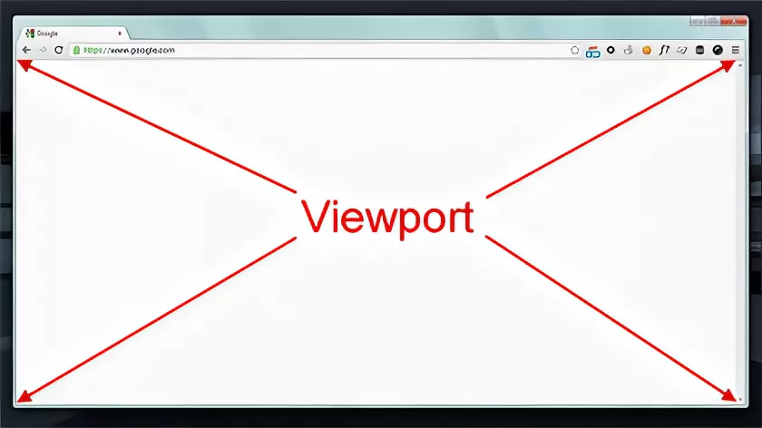
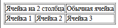
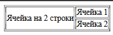

https://www.blackbox.ai/chat/ExOAveC


- Метрики производительности
- Правила WCAG (веб-доступность):
- Content Security Policy (CSP)
- ARIA‑совместимость
- Способы улучшения a11y в веб-разработке (accessability - доступность)
- Resource Hints API
- Тег canvas
- Растровая и векторная графика + svg
- TypeScript


## Введение в предмет и языки разметки. Язык разметки гипертекста HTML
Языки разметки - это системы для форматирования текста, данных или документов. Они используют специальные теги или символы, чтобы описывать элементы контента (заголовки, списки, ссылки), делая информацию понятной для программ (браузеров, редакторов). В отличие от языков программирования, которые выполяют действия, языки разметки **описывают структуру**.

**Назначения и преимущества**
- Структурированние данных. Позволяют описывать контент на логические части (заголовки, абзацы и тд);
- Универсальность. Поддерживаются различными приложениями, от веб-страниц до документов.
- Простота. Не требуют компиляции; легко редактировать в текстовых редакторах.

**Примеры**
- HTML - для создания веб-страниц. Описывает структуру и содержание.
- XML (eXtensible Markup Language): Для хранения и передачи данных. Более гибкий, чем HTML, позволяет создавать собственные теги.
- Markdown: Простой язык для форматирования текста (используется в README-файлах, блогах). Вроде `**жирный**` для жирного текста и тд.
- LaTeX: Для научных документов и математических формул.

Язык разметки эволюционировали от ранних систем вроде SGML (Standart Generalized Markup Language), который стал основой для HTML и XML.


### HTML
HTML - стандартный язык для создания веб-страниц. Он определяет структуру документа, включая текст, изображения, ссылки и мультимедиа. HTML не является ЯП; он статичен, но может взаимодействовать с CSS и JS.

**История**
- Создан Тимом Бёрнерс-Ли в 1991 году как часть World Wide Web.
- Назначение: Описывать гипертекст - текст с ссылками. Позволяет браузерам (Chrome, Firefox) отображать страницы.
- Версии. HTML5 (текущая, с поддержкой видео, аудио и семантических тегов) - самая распространённая.
HTML-документ - это текстовый файл с расширением .html, который браузер интерпретирует для рендеринга страницы.

**Основная структура HTML-документа**
Каждый HTML-документ начинается с декларации `<!DOCTYPE html>` (указывает версию HTML5). Затем идёт корневой элемент `<html>`, содержащий `<head>` (метаданные) и `<body>` (видимый контент).

- Теги. Элементы, заключённые в угловые скобки, например `<p>` для параграфа. Большинство тегов парные: имеют открывающий и закрывающий элемент.
- Атрибуты. Добавляют свойства, например `href` в тег `<a></a>`
- Семантические теги: в HTML5 добавлены теги вроде <header>, <nav>, <article> для лучшей структуры и SEO.

## Структура HTML5 документа
HTML5 - это последняя версия языка разметки гипертекста, стандартизирующая структуру веб-документа для лучшей читаемости, доступности и SEO. Структура HTML5-документа основана на семантических элементах, которые описывают смысл контента (заголовок страницы, основное содержание), а не только его внешний вид. Это позволяет браузерам, поисковым системам и вспомогательным технологиям (например, для людей с ограниченными возможностями) лучше понимать документ.

**Основные компоненты структуры**
1. Декларация DOCTYPE `<!DOCTYPE html>`
- Указывает браузеру, что документ использует HTML5. Это первая строка файла, без неё браузер может переключаться в режим совместимости с устаревшими версиями HTML, что может вызвать ошибки рендеринга.
- Важно: декларация не является тегом HTML, она сообщает о типе документа.

2. Корневой элемент `<html>` - `<html lang="ru">...</html>`
- Оборачивает весь документ. Атрибут lang указывает язык контента, что важно для SEO и доступности (экранные читалки используют это для правильного произношения).

3. Метаданные `<head>`
- Содержит метаданные - информацию о документе, которая не отображается на странице, но влияет на её поведение. Элементы не отображаются на самой странице, но используются браузерами, поисковыми системами, социальными сетями и другими сервисами для обработки документа. Мета-теги имеют атрибуты `name` (для стандартных типов) или `http-equiv` (для HTTP-заголовков), и `content` (для значения). Они важны для SEO (поисковой оптимизации), доступности, производительности и совместимости. Без них страница может плохо индексироваться или отображаться.


- Ключевые элементы внутри `<head>`:
- - `<meta charset="UTF-8">` - указывает кодировку символов (UTF-8 поддерживает русский текст)
- - `<title></title>` - заголовок вкладки браузера и название в поисковых результатах
- - `<meta name="description" content="Описание страницы">` - краткое описание для SEO.
- - `<link rel="stylesheet" href="./styles.css">`
- - `<script src="./script.js"></script>` - подключение JS.
head невидим для пользователей, но критичен для производительности и индексации.

**Подробнее про meta-теги**
- description (описание)
`<meta name="description" content="Краткое описание страницы для поисковиков">` - описание страницы в результатах поиска (до 160 символов). Улучшает CTR (кликабельность) в Google/Yandex.

- keywords (ключевые слова)
`<meta name="keywords" content="HTML, разработка, теги">` - раньше использовался для SEO, поныне игнорируется большинством поисковиков (Google не учитывает). Рекомендуется к отказу от использования.

- author (автор):
`<meta name="author" content="Иван Иванов">` - указывает автора страницы. Полезно для блогов или портфолио.

- viewport (область просмотра):
`<meta name="viewport" content="width=device-width, initial-scale=1.0">` - контролирует адаптивное отображение для мобильных устройств.

- robots (для роботов):
`<meta name="robots" content="index, follow">` - указывает поисковым роботам, индексировать ли страницу и следовать ссылкам. Значения: `noindex` (не индексировать), `nofollow` (не следовать ссылкам).

- http-equiv варианты:
- - `<meta http-equiv="refresh" content="5; url=https://example.com">`; - автоматический редирект через 5 секунд (не рекомендуется для сео, предпочтительнее серверные редиректы с использованием HTTP-кодов состояний - вроде настройки в файлах htaccess для Apache).
- - `<meta http-equiv="content-type" content="text/html; charset=UTF-8">`; - альтернатива charset (устаревшая).
- - `<meta http-equiv="X-UA-Compatible" content="IE=edge">`; - для совместимости с IE (редко нужно в HTML5).

- Другие специфические:
`<meta property="og:title" content="Заголовок для соцсетей">` - Open Graph для Facebook/Twitter.
`<meta name="theme-color" content="#fff">` - Цвет темы для браузерных вкладок на мобильных.

Пример полного `head` с тегами
```html
<head>
    <meta charset="UTF-8">
    <meta name="viewport" content="width=device-width; initial-scale=1.0">
    <meta name="description" content="Учебник по HTML5">
    <meta name="author" content="Статья Ивана Иванова">
    <meta name="robots" content="index; follow"> <!-- noindex, nofollow -->
</head>
```

**Подробнее про <meta name="viewport" content="width=device-width; initial-scale=1.0">**
Мета-тег контролирует отображение страницы на мобильных устройствах и планшетах, предотвращая проблемы с масштабированием.
- `name="viewport"` указывает, что это настройки области просмотра (viewport) - виртуального окна браузера.
- `content="..."` содержит параметры через запятую:
- - width=device-width - ширина viewport равна ширине устройства (например, 375px для iPhone). Без этого страница может отображаться как на десктопе (узкий контент).
- - initial-scale=1.0 - начальный масштаб 100% (без зума). Предотвращает автоматические увеличение/уменьшение.
- - другие опции: `user-scalable=no` (запрещает зум, но не рекомендуется для доступности), `maximum-scale=2.0` (макс.зум)

#### Что такое viewport?
Viewport (область просмотра) - это видимая область браузера, через которую пользователь просматривает веб-страницу. Это виртуальное "окно" или "рамка", определяющее, сколько контента видно без прокрутки.

- На десктопе: viewport - размер окна браузера (например, 1920x1080 пикселей);
- На мобильных: viewport - ширина экрана устройства (например, 375px для iPhone), но без тега `<meta name="viewport>` браузер может симулировать десктопный режим (сделать страницу "узкой" и требующей зума).
- Тег `<meta name="viewport">` контролирует viewport, делая страницу адаптивной. Без него мобильные браузеры могут отображать сайт как на большом экране, ломая layout. 

Пример: без viewport текст на мобильном может быть слишком мелким; с ним - страница масштабируется правильно. Viewport измеряется в CSS-пикселях и влияет на медиа-запросы в CSS.




4. **Body**
Содержит весь видимый контент страницы - текст, изображения, формы и т.д.
Рекомендуется использовать семантические теги для структуры:
- header - верхняя часть страницы (заголовки, логотип, навигация). Это контейнер для вводной информации.
- nav - семантический тег специально для навигационных элементов (меню, ссылки). Используется, когда навигация - основной элемент. Главное меню сайта, хлебные крошки, пагинация или боковое меню. Подчёркивает, что это навигационный блок, улучшая SEO и доступность (экранные читалки распознают его как меню). Пример: главное меню в шапке и футере (nav может быть использован внутри header).
Если навигация - ключевой элемент - используем nav, если это часть шапки с другими элементами - nav помещаем в header. 
Нужно избегать nav для не-навигационных ссылок (например, в `article` - просто `<a>`).


- main - основное содержание (уникальный контент страницы);
- article самостоятельный блок контента (например, статья или пост);
- section - группа связанных элементов;
- aside - боковая панель (реклама, ссылки)
- footer - нижняя часть (копирайт, контакты)
Эти теги улучшают SEO и доступность, заменяя общие `<div>`.

**Минимальная структура HTML5-документа**
```html
<!DOCTYPE html>
<html lang="ru">
<head>
    <meta charset="UTF-8">
    <meta name="viewport" content="width=device-width, initial-scale=1.0">
    <meta name="description" content="Страница со структурой HTML5-документа">
    <meta name="robots" content="index, follow">

    <title>MyPage</title>
</head>

<body>
    <header>
        <h1>Заголовок сайта</h1>
        <nav>
            <ul>
                <li><a href="#home">Главная</a></li>
                <li><a href="#about">О нас</a></li>
            </ul>
        </nav>
    </header>

    <main>
        <section>
            <h2>Основной раздел</h2>
            <p>Это параграф в основном контенте.</p>
        </section>


    </main>

</body>
</html>
```

### Дополнительные HTML5-теги (неполный перечень)
1. Текстовые и форматирующие теги
- `<blockquote>` - Цитата (блок) - добавляет отступ слева. Подходит для длинной цитаты. Может содержать cite
- `<q>` - Короткая цитата - заключает текст в кавычки. Подходит для короткой цитаты. Может содержать cite (реже)
- `<cite>` - Источник цитаты - курсивит текст.
- `<code>` - код
- `<mark>` - выделенный текст (ставит фон на текст жёлтого цвета, как в word-документе)
- `<small>` - мелкий текст
- `<sub>` - нижний индекс
- `<sup>` - верхний индекс
- `<del>` - зачёркнутый текст
- `<pre>` - отображение текста в исходном виде, в котором он написан в HTML-коде, сохраняя пробелы, табы, переносы строк и моноширинный шрифт (как в коде). Ьез него браузер игнорирует лишние пробелы и переносы, сжимая текст. Полезен для кода, диаграмм или форматированного текста, где важен точный вид. Используется для программного кода, ASCII-арта, таблиц в тексте, поэзии или логов.
```html
<pre>
function hello() {
    console.log('Привет, мир!');
}
</pre>
<pre>
   /\
  /  \
 /    \
/______\
</pre>
<pre>
Строка 1    Колонка A    Колонка B
Строка 2    Данные        Данные
</pre>
```


- `<ins></ins>` - вставленный текст (даёт underline как на ссылке, текст чёрного цвета). Выделяет текст, который был добавлен или вставлен в документ (например, при редактировании). Полезен для показа изменений в версих документа. Атрибуты: `cite` (ссылка на источник изменений), `datetime` (дата вставки в формате YYYY-MM-DDTHH:MM:SS)
```html
<p>Это старый текст. <ins datetime="2025-11-28" cite="https://example.com/">А это вставка.</ins></p>
```

- `<time>` - дата/время. Семантически отмечает даты, время или продолжительность. Помогает поисковикам и ассистентам (например, для календарей). Атрибуты: `datetime` (машинно-читаемая дата в формате ISO, например, "2025-10-1T12:00"). Браузер понимает дату; можно использоваться для автоматического форматирования или в JS.
```html
<p>Статья опубликована <time datetime="2023-10-01">1 октября 2023 года</time>.</p>
```

2. Списки (definition list)
- `<dl>` - список определений
- `<dt>` - термин
- `<dd>` - определение
Создаёт список определений (терминов и их описаний). `<dl>` - контейнер, `<dt>` - термин, `<dd>` - определение. Полезно для глоссариев, FAQ. Атрибуты: нет специфических, можно стилизовать CSS.
```html
       <dl>
            <dt>HTML</dt>
                <dd>Язык разметки для создания веб-страниц</dd>
            <dt>CSS</dt>
                <dd>Язык стилей для оформления HTML.</dd>
                <dd>Позволяет адаптировать дизайн под устройства.</dd> <!-- Несколько dd для одного dt-->
        </dl>
```


3. Ссылки и медиа
- `<video>` - видео. Встраивает видео на страницу. Поддерживает форматы MP4, WebM, OGG. Атрибуты: `src`, `controls` (показать кнопки управления), `autoplay` (автозапуск, но часто блокируется браузерами), `loop` (повтор), `muted` (без звука), `width/height` (размеры).

Пример
```html
<video width="640" height="360" controls> <!-- controls/autoplay loop бесконечный повтор, controls/autoplay muted - видео загружается без звука -->
    <source src="video.mp4" type="video/mp4">
    <source src="video.webm" type="video/webm">
    Ваш браузер не поддерживает видео.
</video>
```
Получается видеоплеер с кнопками play/pause. `<source>` позволяет браузеру выбрать подходящий формат.

- `<audio>`. Встравивает аудио (аналогично video). Атрибуты: src, controls, autoplay, muted, loop. Поддерживает MP3, OGG, WAV.

Пример
```html
<audio controls>
    <source src="music.mp3" type="audio/mpeg">
    <source src="music.ogg" type ="audio/ogg">
    Ваш браузер не поддерживает аудио.
</audio>
```

- `<source>` - указывает источник медиа-файла внутри видео или аудио. Позволяет предоставить несколько форматов для совместимости. Атрибуты: src, type (MIME-тип, "video/mp4"). Хотя можно использовать src прямо в видео или аудио, source лучше для fallback.

- `<track>` - добавляет субтитры, captions или метаданные к `<video>`. Файл в формате WebVTT (.vtt). Атрибуты: src, kind (тип: subtitles, captions, descriptions), srclang (язык, например, "ru"), `label` (метка для выбора).

Пример
```html
<video controls>
    <source src="video.mp4" type="video/mp4">

    <track src="subtitles_ru.vtt" kind="subtitles" srclang="ru" label="Русские субтитры">
    <track src="subtitles_ru.vtt" kind="subtitles" srclang="en" label="English subtitles">
</video>
```
Результат: пользователь может включить субтитры через меню плеера. Файл .vtt содержит время и текст ("00:00:05.000" -> "00:00:10.000\nПривет, мир!")


- `<svg>` (scalable vector graphics)
Встраивает векторную графику (масштабируемую без потери качества). Идеально для иконок, логотипов, диаграмм. Атр: `width/height`, `viewBox` (область просмотра для масштабирования).

Пример
```html
<svg width="100" height="100" viewBox="0 0 100 100">
    <circle cx="50" cy="50" r="40" fill="blue" />
    <rect x="10" y="10" width="30" height="30" fill="red" />
</svg>
```
Результат: синий круг и красный квадрат. SVG можно анимировать CSS/JS или редактировать в инструментах вроде Inkscape.


- `<canvas>` - элемент для создания динамической растровой графики (2D/3D) c помощью JavaScript. Сам по себе он пустой (как холст); рисование происходит через Canvas API в JS. Идеален для игр, диаграмм, анимаций, редакторов изображений или визуализаций данных. Атр: `width/height` (в пикселях, по умолчаниию 300x150). Используются для создания интерактивной графики (SVG лучше для статичных векторов).

```html
<canvas id="myCanvas" width="400" height="200"></canvas>

<script>
    const canvas = document.getElementById('myCanvas');
    const ctx = canvas.getContext('2d');

    ctx.fillStyle = 'blue';
    ctx.fillRect(50, 50, 100, 100); // Рисуем синий квадрат
    ctx.beginPath();
    ctx.arc(200, 100, 50, 0, 2 * Math.PI); // Круг
    ctx.fillStyle = 'red';
    ctx.fill();
</script>
```
Для 3D нужно использовать WebGL (ctx.getContext('webgl')). Подробности в MDN Canvas API.


- `<iframe>` - встроенный фрейм (другая страница). Загружает стороннюю страницу внутри текущей страницы, задаёт размеры `width/height`.
```html
<iframe src="https://example.com" width="600" height="400"></iframe>
```
Загружает страницу `https://example.com` внутри текущей страницы, задаёт размеры.


4. Формы и ввод
- `<form>` - форма
- `<input>` - поле ввода (type: text, email, password, etc)
- `<textarea>` - многострочный текст
- `<button>` - кнопка
- `<select>` - выпадающий список для выбора одного или нескольких вариантов. Атр: `name` (отправка формы), `multiple` (множественный выбор), `size` (число видимых опций), `required` (обязательное поле).
- `<option>` - опция в select (вариант внутри списка). Атр: `value` (значение для отправки), `selected` (выбран по умолчанию), `disabled` (недоступен).
```html
<form>
    <label for="country">Страна:</label>

    <select id="country" name="country" required>
        <option value="">Выберите страну</option>
        <option value="ru" selected>Россия</option>
        <option value="us">США</option>
        <option value="de">Германия</option>
    </select>

    <button type="submit">Отправить</button>
</form>
```
Результат: выпадающий список; выбран "Россия" по умолчанию. При отправке формы передаётся `country=ru`.


- `<label>` - метка для поля. Связывает текст с полем формы (input, select и т.д.), улучшая доступность (клики по метке фокусируют поле) и SEO. Атр: `for` (ID связанного элемента).
Пример:
```html
<form>
    <label for="email">Email:</label>
    <input type="email" id="email" name="email">
    <button type="submit">Отправить</button>
</form>
```


- `<fieldset>` - группирует связанные поля формы (например, адрес).Атр: `disabled` (отключает всю группу), `name` (для JS)
- `<legend>` - заголовок для fieldset

Пример
```html
<form>
    <fieldset>
        <legend>Личные данные</legend>
        <label for="name">Имя</label>
        <input type="text" name="name" id="name">
        <label for="age">Возраст</label>
        <input type="number" name="age" id="age">
    </fieldset>
    <button type="submit">Отправить</button>
</form>
```
Результат: поля объединены рамкой с заголовком "Личные данные". В браузерах добавляется визуальная граница.


- `<datalist>` - список автодополнения. Предоставляет список вариантов для автодополнения в `<input>`. Пользователь может выбрать или ввести своё. Атр: `id` (для связи с input). Внутри - `<option>` с `<value>`.

Пример
```html
<form>
    <label for="browser">Браузер:</label>
    <input type="text" id="browser" name="browser" list="browsers"> <!-- list связывает поле ввода с элементом datalist, формирующим список подсказок -->
    <datalist id="browsers">
        <option value="Chrome">
        <option value="Firefox">
        <option value="Safari">
        <option value="Edge">
    </datalist>
    <button type="submit">Отправить</button>
</form>
```
Результат: при вводе в поле появляются подсказки (например, "Chr" покажет "Chrome"). Не требует JS.


- `<output>` - результат вычислений (вывод результата). Отображает результат вычислений или действий формы (например, сумму). Часто обновляется JS. Атр: `for` (ID связанных элементов), `name` (для формы).

Пример (с JS для расчёта)
```html
<form oninput="result.value = parseInt(a.value) + parseInt(b.value)">
    <input type="number" id="a" name="a" value="0"> +
    <input type="number" id="b" name="b" value="0"> =
    <output id="result" for="a b">0</output>
</form>
```
Комментарии
- `oninput` - событийный атрибут, срабатывающий каждый раз, когда пользователь меняет содержимое поля ввода (набирает, удаляет, вставляет текст). Код в атрибуте oninput - это встроенный JS, который выполняется автоматически без перезагрузки страницы. Без oninput результат не обновляется при выводе - возникает необходимость в перезагрузке страницы или использованию кнопок. Благодаря нему можно создавать "живые" калькуляторы или формы без внешнего JS-файла.


- `<progress>` - прогресс-бар. Показывает прогресс задачи (загрузка, процесс). Не интерактивен. Атр: `value` (текущее значение), `max` (максимум, по умолчанию 1.0);
```html
<p>Загрузка файла:</p>
<progress value="75" max="100"></progress>
```
С помощью JS можно динамически менять progress. Мини-пример
```javascript
const progress = document.getElementsByTagName('progress');

/* progress */
progress[0].value = 1;
const intervalId = setInterval(() => {
    progress[0].value += 1

    if (progress[0].value == 100) { 
        clearInterval(intervalId);
        console.log('progress остановлен');
    }
}, 200);
```

- `<meter>` - измеритель (шкала). Отображает значение в диапазоне (например, температура, батарея). Похож на `<progress>`, но для измерений, не прогресса. Атр: `value` (текущее), `min/max` (диапазон), `low/high` (пороги для цветового изменения), `optimum` (оптимальное значение).
```html
<p>Уровень батареи:</p>
<meter value="0.8" min="0" max="1" low="0.2" high="0.8" optimum="1">80%</meter>
```
Комментарий: атрибут optimum указывает оптимальное значение в диапазоне между min и max. Браузеры используют его для автоматического цветового индикатора. Зелёный - значение близко к оптимуму (идеально)
Жёлтый - значение в предупреждающем диапазоне между low и high (например, low=0.4 high=0.8 - жёлтый будет в диапазоне 0.4-0.7, красный - ниже)
Красный - значение выше low и ниже high (плохо)

`optimum` влияет на визуализацию `<meter>`, но его эффект не всегда очевиден и зависит от браузера (в Chrome работает сильнее, чем в Firefox). Он задаёт идеальное значение в диапазоне, которые браузеры используют для цветового индикатора, делая шкалу более информативной. `low/high` определяют "предупреждающие" зоны (жёлтый), а `optimum` - оптимальную точку (зелёный), помогая пользователю понять, насколько значение хорошее.

Пример скрипта для meter
```javascript
/* meter */
const meter = document.getElementById('timer');
let time = 0.8;
const meterInterval = setInterval(() => {
    timer.value = time;
    time -= 0.1;
    if (time <= 0) { 
        clearInterval(meterInterval);
        console.log('meter остановлен');
    }
}, 1000);
```


5. Таблицы
- `<table>` - таблица
- `<thead>` - заголовок таблицы
- `<tbody>` - тело таблицы
- `<tfoot>` - подвал таблицы
- `<tr>` - строка
- `<th>` - заголовок ячейки
- `<td>` - ячейка данных
- `<caption>` - подпись таблицы (может быть только один внутри table)
- `<col>` - колонка
- `<colgroup>` - группа колонку

Пример таблицы по HTML5:
```html
<table>
    <caption>Пример таблицы с данными о продажах</caption> <!-- Подпись таблицы -->
    <colgroup> <!-- Группа колонок -->
        <col style="background-color: lightblue;"> <!-- Первая колонка -->
        <col span="2" style="background-color: lightgreen;"> <!-- Вторая колонка (span позволяет применить стили к двум колонкам подряд) -->
    </colgroup>

    <thead> <!-- Заголовок таблицы -->
        <tr> <!-- Строка -->
            <th>Продукт</th> <!-- Заголовок ячейки> -->
            <th>Количество</th>
            <th>Цена</th>
        </tr>
    </thead>

    <tfoot> <!-- Подвал -->
        <tr> <!-- Строка -->
            <td>Итого</td>
            <td>15</td>
            <td>800 руб.</td>
        </tr>
    </tfoot>

    <tbody> <!-- Тело таблицы -->
        <tr> <!-- Строка -->
            <td>Яблоки</td> <!-- Ячейка данных -->
            <td>10</td>
            <td>500 руб.</td>
        </tr>

        <tr>
            <td>Бананы</td>
            <td>5</td>
            <td>300 руб.</td>
        </tr>

        <tr>
            <td>Апельсины</td>
            <td>10</td>
            <td>120 руб.</td>
        </tr>
    </tbody>

</table>
```
Комментарий: caption и colgroup идут первыми для семантики и стилей. tfoot выше tbody согласно спецификации HTML5. Для доступности можно добавить `scope="col"` в `<th>`, для объединённых ячеек использовать `colspan` в `<td>`/`<th>`.


#### Атрибуты colspan и rowspan
colspan и rowspan позволяют объединить ячейки по горизонтали (столбцы) и вертикали (строки). Они применяются к тегам `<td>` (объединённые ячейки) и `<th>` (заголовки).

**colspan (объединение по столбцам)**
Объединяет соседние ячейки в одной строке по горизонтали. (англ. span - размах, охват).
Значение: целое число >0 - количество столбцов, которые должна занять ячейка.
```html
<table border="1">
    <tr>
        <td colspan="2">Ячейка на 2 столбца</td>
        <td>Обычная ячейка</td>
    </tr>

    <tr>
        <td>Ячейка 1</td>
        <td>Ячейка 2</td>
        <td>Ячейка 3</td>
    </tr>
</table>
```
Результат: первая строка - одна широкая ячейка (занимает 2 столбца) + одна обычная; вторая строка - три отдельные ячейки.


**rowspan (объединение по строкам)**
Объединяет ячейки в одном столбце по вертикали.
Значение: Целое число >0 - количество строк, которые должна занять ячейка.
```html
<table border="1">
    <tr>
        <td rowspan="2">Ячейка на 2 строки</td>
        <td>Ячейка 1</td>
    </tr>

    <tr>
        <td>Ячейка 2</td>
    </tr>
</table>
```
Результат: первый столбец - одна высокая ячейка (занимает 2 строки); второй столбец - две отдельные ячейки в разных строках.



6. **Дополнительные теги**
- `<link>` (ссылка на внешний ресурс) - подключает внешние файлы (CSS, иконки, шрифты) или устанавливает отношения с другими документами. Атр: `rel` (тип связи: stylesheet, icon, preload), `href` (путь к файлу), `type` (MIME-тип, например, "text/css"), `media` (для CSS: screen, print).
Примеры:
- Подключение CSS: `<link rel="stylesheet" href="/css/styles.css">`
- Favicon: `<link rel="icon" href="/favicon.ico" type="image/x-icon">`
- Предзагрузка шрифта: `<link rel="preload" href="/fonts/font.woff2" as="font" type="font/woff2" crossorigin>`
+ для старых браузеров `<link rel="preload" href="/fonts/font.woff2" as="font" type="font/woff" crossorigin>`. Это современный и рекомендуемый способ предзагрузки шрифтов (и других ресурсов) в HTML5. Оптимизирует загрузку, предотвращая задержки и улучшая производительность. Preload эффективнее `@font-face` с `font-display: swap` или JS-загрузки, так как браузер начинает загрузку шрифта сразу при парсинге HTML, не дожидаясь CSS.
`атрибут as` - указывает тип ресурса, чтобы браузер правильно обработал его:
- Приоритезация: браузер знает, как загрузить (например, шрифты имеют низкий приоритет, но `as="font"` повышает его).
- Безопасность и CORS: для шрифтов с `as="font"` браузер применяет правила CORS (если шрифт с другого домена, нужен crossorigin). Без `as` ресурс может быть заблокирован или загружен неправильно.
- Оптимизация: Помогает браузеру предсказать использование (например, не загружать шрифт как изображение)
- Обязателен для шрифтов: Без `as="font"` preload не сработает корректно - браузер может игнорировать или выдать ошибку.
`атрибут crossorigin` обязателен для шрифтов с CDN (например, Google Fonts) для избежания CORS-ошибок. 
Результат: шрифт загружается заранее; в CSS необходимо использовать `@font-face` для применения.

Пример комбинации загрузки шрифтов в html + css:
```html
<!-- HTML -->
<link rel="preload" href="/fonts/custom.woff2" as="font" type="font/woff2" crossorigin>
```
```css
<!-- CSS -->
@font-face {
    font-family: 'CustomFont';
    src: url('/fonts/custom.woff2') format('woff2');
    font-display: swap; /* Показывает fallback-шрифт, пока загружается */
}
```
Результат: шрифт готов сразу, без задержек.


- `<base>` (Базовый URL)
Устанавливает базовый URL для всех относительных ссылок в документе (избежание конфликтов при перемещений файлов). Атр: `href` (базовый URL), `target` (цель для ссылок: _blank, _self). 
Пример
```html
<base href="https://example.com/" target="_blank">
<a href="page.html">Ссылка</a> <!-- Перейдёт на https://example.com/page.html в новом окне -->
```
Результат: все относительные ссылки/изображения используют базовый URL. Использовать тег нужно осторожно, так как может сломать локальные ссылки.

- `<noscript>` (контент без JS)
Отображает контент, если JS отключён или не поддерживается (например, сообщение или альтернативная навигация). Не имеет атрибутов. Может использоваться в <head>, но тогда ограничен только <link>, <style>, `<meta>`, вне <head> содержимое может быть более разнообразным, но нельзя вкладывать один <noscript> внутрь другого.

Пример:
```html
<noscript>
    <p>Ваш браузер не поддерживает JavaScript. <a href="/no-js-version">Перейти к версии без JS</a></p>
</noscript>
```
Результат: видно только без JS, с JS - скрыто. Полезно для доступности.

**MIME-тип**
MIME-тип (Multipurpose Internet Mail Extensions) - это стандарт, определяющий тип и формат данных, передаваемых через интернет. Он подсказывает браузерам и серверам, как обрабатывать полученные данные.


**Вложенность элементов друг в друга имеет значение**
Необходимо пользоваться приципами:
1. Приоритета содержания (внешний тег должен отображать основной тип контента - текст, код, цитата и тд, внутренние теги - уточнения и акценты).
2. Логический иерархии (тег-контейнер должен быть шире по смыслу, чем вложенный)
3. Проверка на читаемость. Прочитайте структуру вслух:
- *код, в котором выделено...* -> `<code><mark>...</mark></code>`
- *выделение, содержащее код* -> `<mark><code>...</code></mark>`
4. Тестирование. Проверить отображение в различных браузерах.


HTML-страница с описанием
```html
<!DOCTYPE html> <!-- Декларация-->
<html lang="en"> <!-- Корень с языком -->
<head> <!-- Мета-данные -->
    <meta charset="UTF-8"> <!-- Кодировка с поддержкой большинства язык (включая русский) -->
    <meta name="viewport" content="width=device-width, initial-scale=1.0"> <!-- Контроль отображения на мобильных устройствах (контент по ширине устройства, зум 100%)-->
    <meta name="description" content="Учебник по HTML-структуре"> <!-- Описание страние страницы в результатах поиска (до 160 символов). Улучшает CTR (кликабельность) в Google/Yandex -->

    <link rel="stylesheet" href="/styles.css">
    <script defer src="/scripts.js"></script>

    <title>Document</title>
</head>
<body> <!-- Тело страницы -->

    <header>
        <h1>Контакты</h1>
    </header>

    <main>
        <form action="" method="get">
            <label for="name">Имя:</label> <!-- label ссылается на id -->
            <input type="text" name="name" id="name"><br><br> <!-- name нужен для идентификации поля при отправке данных формы на сервер -->
            <label for="email">Эмейл:</label>
            <input type="text" name="email" id="email">
            <button type="submit">Отправить</button>
        </form>
    </main>

    <footer>
        <p>&copy; 2025 Мой сайт</p>
    </footer>
    
</body>
</html>
```