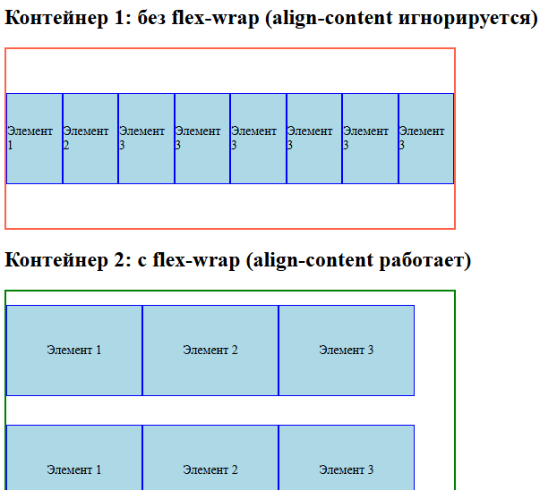

https://www.blackbox.ai/chat/vsyo7La


## Введение в Flexbox
Flexbox (Flexible Box Layout) - это модуль CSS для создания гибких макетов. Он позволяет легко управлять расположением элементов в контейнере, адаптируя их к разным размерам экранов. Flexbox идеален для одномерных макетов (строки или столбцы), в отличие от Grid, который подходит для двумерных.

Flexbox упрощает центрирование, распределение пространства и изменение порядка элементов без сложных расчётов. Поддерживается всеми современными браузерами (с префиксами для старых).

### Основы Flexbox
- Flex-контейнер: Элемент с `display: flex` или `display: inline-flex`. Его дочерние элементы становятся flex-элементами.
- Flex-элементы: Дети контейнера, которые можно гибко позиционировать.


### Свойства flex-контейнера
Эти свойства применяются к контейнеру и влияют на все элементы.

1. **flex-direction**
Определяет НАПРАВЛЕНИЕ главной оси (ось, вдоль которой укладываются элементы):
- `row` (по умолчанию): слева направо
- `row-reverse`: справа налево
- `column`: сверху вниз
- `column-reverse`: снизу вверх


2. **justify-content**
Распределяет ПРОСТРАНСТВО вдоль главной оси.
- `flex-start` (по умолчанию): элементы у начала
- `flex-end`: элементы в конце
- `center`: по центру
- `space-between`: равное пространство между элементами
- `space-around`: равное пространство вокруг каждого
- `space-evenly`: равное пространство между и вокруг


3. **align-items**
Выравнивает элементы вдоль ПОПЕРЕЧНОЙ оси (перпендикулярной главной). Отвечает за выравнивание отдельных flex-элементов внутри их строки/колонки. Действует на каждый элемент в отдельности, работает всегда, независимо от значения `flex-wrap`.

- `stretch` (по умолчанию): растягивает до высоты контейнера
- `flex-start`: у начала поперечной оси
- `flex-end`: у конца поперечной оси
- `center`: по центру
- `baseline`: по базовой линии текста (базовая линия - это воображаемая горизонтальная линия, проходящая по нижнему краю основных частей букв, без учёта выносных элементов, таких как хвостики у буквы "p"). Для каждого флекс-элемента определяется базовая линия текста внутри него, затем все элементы выравниваются так, чтобы их базовые линии находились на одном уровне, верхняя и нижняя границы элементов могут не совпадать - важно только положение текстовой базовой линии.
Пример работы `baseline`:
```css
.container {
    display: flex;
    flex-direction: row; /* Определяет направление главной оси (вдоль которой выстраиваются элементы) */
    justify-content: center;
    align-items: baseline; /* Элементы будут выровнены по нижней текстовой границе самого большого элемента, иначе будет разброс */

    height: 400px;
}
```

4. **align-content**
Выравнивает строки элементов вдоль поперечной оси (работает только при `flex-wrap: wrap`). Отвечает за распределение пространства между строками/колонками flex-контейнера. Действует на группы элементов (строки/колонки), а не на отдельные элементы. Это свойство выравнивает несколько flex-линий (строк или столбцов) вдоль поперечной оси, распределяя свободное пространство между ними. Используется, когда элементы переносятся на несколько линий и нужно распределить пространство между ними, например, центрировать группы элементов. Работает только при переносе элементов на несколько строк (то есть когда задано `flex-wrap: wrap` или `wrap-reverse`). align-content может перекрывать поведение align-items при наличии нескольких строк.

- `stretch`
- `flex-start`
- `flex-end`
- `center`
- `space-between`
- `space-around`
- `space-evenly`
```css
.item-1 { font-size: 16px; }
.item-2 { font-size: 24px; }
.item-3 { font-size: 12px; }
```

Сравнение align-items и align-content:
`align-items: center` - каждый элемент в своей строке будет выровнен по центру вертикали.
`align-content: space-between` - строки будут равномерно распределены по высоте контейнера с равными отступами между ними (только при переносе).
align-items влияет на выравнвание элементов внутри линий, а align-content - на выравнивание самих линий внутри контейнера.

Если `align-content` задан и есть перенос строки, то:
- `align-items` влияет только на выравнивание элементов внутри каждой строки;
- `align-content` определяет, как строки распределяются по поперечной оси.

Если только одна строка или перенос запрещён (`flex-wrap: nowrap`), `align-content` не работает - действует только `align-items`.

**Различия align-items и align-content**
1. `flex-wrap: nowrap`
- Все элементы принудительно размещаются в одной строке (линии);
- Если элементы не помещаются по ширине контейнера, они выходят за его границы;
- Для выравнивания элементов внутри этой единственной строки используется `align-items` (перпендикулярно главной оси).

2. `flex-wrap: wrap` / `wrap-reverse`
- Элементы переносятся на новые строки, если не помещаются в текущую.
- Появляются несколько линий (строк) flex-элементов
- **Здесь вступают в игру два свойства**:
- - `align-items` - выравнивает элементы внутри каждой отдельной строки (как при `nowrap`);
- - `align-content` - управляет разделением пространства между строками (линиями) и их выравниванием внутри контейнера.


Пример разницы свойств:
```html
<!DOCTYPE html>
<html lang="ru">
<head>
    <meta charset="UTF-8">
    <title>Flexbox align-items vs align-content</title>
    <style>
        /* Общие стили для элементов */
        .item {
            width: 150px;
            height: 100px;
            background: lightblue;
            border: 1px solid blue;
            display: flex;
            align-items: center;
            justify-content: center;
            font-size: 14px;
        }

        /* Контейнер 1: без flex-wrap (align-content не работает) */
        .container1 {
            display: flex;
            flex-direction: row;
            /* flex-wrap: nowrap; (по умолчанию) */
            justify-content: flex-start;
            align-items: center;  /* Центрирует элементы вертикально в строке */
            align-content: space-around;  /* Не работает, так как нет переноса */
            height: 200px;
            width: 500px;
            border: 2px solid tomato;
            margin-bottom: 20px;
        }

        /* Контейнер 2: с flex-wrap (оба свойства работают) */
        .container2 {
            display: flex;
            flex-direction: row;
            flex-wrap: wrap;  /* Позволяет перенос на новую строку */
            justify-content: flex-start;
            align-items: center;  /* Центрирует элементы вертикально в своих строках */
            align-content: space-around;  /* Распределяет строки с отступами */
            height: 400px;
            width: 500px;
            border: 2px solid green;
        }
    </style>
</head>
<body>
    <h2>Контейнер 1: без flex-wrap (align-content игнорируется)</h2>
    <div class="container1">
        <div class="item">Элемент 1</div>
        <div class="item">Элемент 2</div>
        <div class="item">Элемент 3</div>
        <div class="item">Элемент 3</div>
        <div class="item">Элемент 3</div>
        <div class="item">Элемент 3</div>
        <div class="item">Элемент 3</div>
        <div class="item">Элемент 3</div>
    </div>

    <h2>Контейнер 2: с flex-wrap (align-content работает)</h2>
    <div class="container2">
        <div class="item">Элемент 1</div>
        <div class="item">Элемент 2</div>
        <div class="item">Элемент 3</div>
        <div class="item">Элемент 1</div>
        <div class="item">Элемент 2</div>
        <div class="item">Элемент 3</div>
        <div class="item">Элемент 1</div>
        <div class="item">Элемент 2</div>
        <div class="item">Элемент 3</div>
    </div>
</body>
</html>
```




5. **flex-wrap**
Определяет, могут ли элементы переноситься на новую строку.
- `nowrap` (по умолчанию): без переноса.
- `wrap`: перенос на новую строку.
- `wrap-reverse`: перенос в обратном направлении.

6. **flex-wrap**
Сокращённая запись для одновременной настройки двух ключевых свойств Flexbox:
- `flex-direction` (определяет направление главной оси и порядок расположения элементов);
- `flex-wrap` (управляет переносом элементов на новые строки при нехватке места)
```css
.container {
    flex-flow: <flex-direction> <flex-wrap>
}

/*
.container {
    flex-flow: column wrap;
}
*/
```


### Свойства flex-элементов
Эти свойства применяются к отдельным элементам

1. **flex-grow** - определяет, насколько элемент может расти, чтобы заполнить свободное пространство. Значение - число (по умолчанию 0). Чем больше значение `flex-grow`, тем большую долю свободного пространства элемент займёт относительно соседей с меньшими значениями.
```css
.item1 { flex-grow: 1; } /* Занимает 1 часть */
.item2 { flex-grow: 2; } /* Занимает 2 части */
.item3 { flex-grow: 0; } /* Не растет */
```

2. **flex-shrink** - определяет, насколько элемент может сжиматься при нехватке места. Значение - число (по умолчанию 1 - элемент может сжиматься пропорционально). Работает параллельно `flex-grow`: вместо роста при избытке пространства, оно управляет сжатием при нехватке.
```css
.item1 { flex-shrink: 1; } /* Сжимается нормально */
.item2 { flex-shrink: 2; } /* Сжимается сильнее */
.item3 { flex-shrink: 0; } /* Не сжимается */
```
**Важно**: сжатие происходит только если `flex-wrap: nowrap` (по умолчанию). Если элементы могут переноситься (`wrap`), сжатие не применяется.

3. **flex-basis** - устанавливает начальный размер элемента вдоль главной оси. Может быть в px, %, auto (по умолчанию). Этот размер используется как "стартовый" перед применением `flex-grow` (рост) или `flex-shrink` (сжатие). Значение по умолчанию `auto` - элемент берёт свой естественный размер (например, ширину от контента или заданную `width/height`). Если `flex-direction: row`, `flex-basis` влияет на ширину; если `column` - на высоту.
`flex-basis` - это "базис", на котором строится рост/сжатие. Если `flex-grow: 1` и `flex-basis: 100px`, элемент начинается с 100px и занимает оставшееся пространство. Если `flex-shrink: 1` и контейнер мал, элемент сожмётся от 100px.

4. **flex** (сокращение) - Комбинирует `flex-grow`, `flex-shrink`, `flex-basis`. Например, `flex: 1 1 auto;` (по умолчанию).
```css
.item { flex: 1; } /* flex-grow: 1, flex-shrink: 1, flex-basis: 0% */
```

5. **align-self** - переопределяет align-items для конкретного элемента.
- `auto`
- `stretch`
- `flex-start`
- `flex-end`
- `center`
- `baseline`
```css
.item { align-self: flex-end; } /* Выравнивание в конце поперечной строки */
```

6. **order** - изменяет порядок элементов. Значение - число (по умолчанию 0). Меньшие числа идут первыми
```css
.item1 { order: 2; } /* Второй в порядке */
.item2 { order: 1; } /* Первый */
```


// Разобрать практические примеры