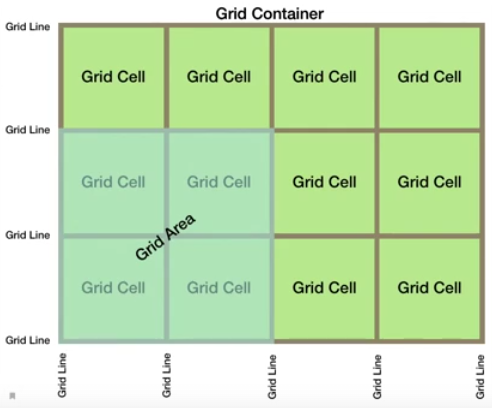
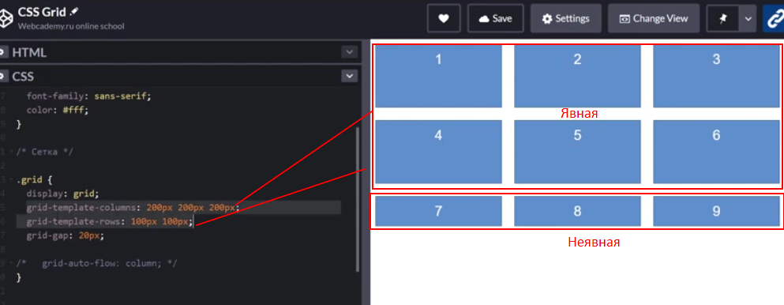
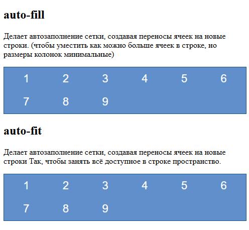

- Двумерные / трёхмерные / одномерные макеты
- Разобрать конструкцию `:nth-child(3n + 1)` - на примере "сетка 3x3" в данном файле
- Разрбрать: `grid-template-columns: repeat(auto-fit, minmax(200px, 1fr))`
- grid-auto-flow: dense
- CSS Grid Inspector в DevTools
- 1fr - fr - что такое?
- пиксели - что это?
- Единицы измерения в css
- Выучить кейсы создания grid-макетов для примера


https://www.blackbox.ai/chat/ExOAveC

## Введение в CSS Grid
CSS Grid - это мощная система раскладки в CSS, введённая в 2017 году (поддержка современными браузерами с 2018 года). Она позволяет создавать сложные двумерные макеты (строки и столбцы) без использования флоатов, позиционирования или JavaScript. Grid идеален для адаптивных дизайнов, заменяя Flexbox для 2D-раскладок. Преимущества: простота, гибкость, контроль над пространством и автоматическое выравнивание.

- **Базовая концепция**: Контейнер (grid-container) с `display: grid` содержит элементы (grid-items), которые размещаются в сетке.
- **Поддержка**: Работает в Chrome 57+, Firefox 52+, Safari 10.1+, Edge 16+. Для старых браузеров - fallback с Flexbox.
- **Использование**: Для макетов с несколькими колонками/строками (например, галереи, дашборды). Flexbox лучше для 1D (линейных раскладок).

Grid наглядно


### Основные свойства CSS Grid
Grid использует свойства для контейнера и элементов. Контейнер определяет сетку, элементы – своё положение.

**Свойства контейнера**
- `display: grid` - включает grid-раскладку
- `grid-template-columns` - определяет столбцы (например, `1fr 2fr` - две колонки, вторая в 2 раза шире). Задаёт ширину колонок (горизонтальные размеры). Определяет количество колонок в сетке + ширину каждой из них.
- `grid-template-rows` - определяет строки (аналогично). Задаёт высотку строк (вертикальные размеры). Определяет количество строк в сетке + какую высоту займёт каждая строка;
- `grid-template-areas` - визуальное создание макета сетки через строковое представление.
```css
.container {
    display: grid;
    grid-template-columns: 1fr 2fr;
    grid-template-rows: auto 1fr auto;
    grid-template-areas:
        "header header"
        "sidebar content"
        "footer footer";
}
```
Каждая строка - ряд сетки, каждое слово - именованная область. Одинаковые имена объединяются в одну область.
`grid-area` - свойство для элемента внутри сетки, указывающее, какую именованную область он должен занять.
```css
.header { grid-area: header; }
.sidebar { grid-area: sidebar; }
.content { grid-area: content; }
.footer { grid-area: footer; }
```
Результат: Классический макет. `grid-template-areas` именует области для простоты. 
Преимущества: наглядность макета, облегчённое изменение структуры посредством изменения строки (grid-template-areas), улучшает читаемость кода.

- `grid-gap или gap` - расстояние между ячейками (например, 10px). Принимает два параметра: `gap: <отступ между рядов> <отступ между колонок>`. Одно значение указывает отступ между колонками и между рядами.

- `column-gap` - отступы между колонками ( grid-column-gap устаревший )
- `row-gap` - отступы между строками ( grid-row-gap устаревший )
- `grid-auto-columns/rows` - размеры автоматических колонок/строк

- `justify-items` - выравнивание элементов по горизонтали (start, center, end, stretch).
- `justify-self` - выравнивание по горизонтали конкретного элемента (переопределение justify-items) 
- `justify-content` - выравнивание все сетки по горизонтали (start, end, center, stretch, space-around, space-between, space-evenly)

- `align-items` - выравнивание элементов по вертикали (start, center, end, stretch)
- `align-self` - выравнивание по вертикали конкретного элемента (переопределение align-items)
- `align-content` - выравнивание по вертикали (start, end, center, stretch, space-around, space-between, space-evenly)


Подсказка:
`justify-*` - позиционирование по горизонтали
`align-*` - позиционирование по вертикали
`*-content` - выравнивание сетки внутри контейнера
`*-items` - выравнивание элементов внутри ячеек

**Свойства элементов**
- `grid-column` - позиционирование элемента внутри CSS-сеткиЖ положение по столбцам (например, `1 / 3` - занимает 1-2 столбцы). Объединяет пары свойств: grid-column = grid-column-start + grid-column-end. Указывает, между какими линиями сетки должен располагаться элемент по горизонтали.
```css
grid-column: <start> / <end>;

/* 
    start - номер или имя линии, от которой начинается элемент
    / - обязательный разделитель
    end - номер или имя линии, на которой элемент заканчивается
*/
```

Примеры:
```css
grid-column: 2 / 4; /* от линии 2 до линии 4 */

grid-column: 1 / -1; /* от первой до последней линии (вся ширина) */

grid-column: sidebar-start / sidebar-end; /* если заданы grid-template-areas или через [имя] */

grid-column: 2 / span 2; /* начать с линии 2, занять 2 колонки (span + число (растянуть на N ячеек)) */

grid-column: 1 / span footer; /* от линии 1 до линии с именем "footer" */

grid-column: auto / auto; /* элемент займёт одну ячейку по умолчанию */
```


`span` позволяет задать количество ячеек, на которые сместиться элемент, не указывая конечную грид-линию. Удобно для указания пространства занимаемого элемента без необходимости в расчёте конечной грид-линии. 
`span N - займи N ячеек, начиная с текущей позиции`. Используется в паре с начальной линией или автоматически (если начальная линия не указана)
```css
grid-column: <начало> / span <число>; /* Занимает количество строк, начиная со start (1 / span 2 - займёт 1 и 2 колонку) */

/* Без указания начала - старт с текущей позиции */
grid-column: span <число>;

grid-column: span 2 / 3; /* Начать с позиции, отстоящей на 2 колонки назад от линии 3, и закончить на линии 3 */
/*
    span 2 говорит "элемент должен занимать 2 колонки"
    чтобы занять 2 колонки и закончиться на линии 3, элемент должен начаться на линии 1 (потому что между линиями 1 и 3 - две колонки)

    итог:
    элемент занимает пространство от линии 1 до линии 3 (т.е. 2 колонки)
    эквивалентная запись без span: grid-column: 1 / 3;
*/

```

Пример работы span
```html
<div class="complex">
    <div class="item1">Большой блок</div>
    <div class="item2">Маленький 2</div>
    <div class="item3">Маленький 3</div>
    <div class="item4">Средний</div>
</div>
```

```css
.complex {
    display: grid;
    grid-template-columns: 1fr 1fr 1fr;  /* 3 равные колонки */
    grid-template-rows: 1fr 1fr;        /* 2 равные строки */
    gap: 10px;
    height: 300px;
}
.item1 {
    grid-column: 1 / 3;  /* Занимает 2 колонки подряд */
    grid-row: span 2;     /* Занимает 2 строки подряд */
    background: red;
}
.item2 { 
    background: blue; 
}
.item3 { 
    background: green; 
}
.item4 { 
    grid-column: span 2;  /* Занимает 2 колонки подряд */
    background: yellow; 
}
```


- `grid-row` - положение по строкам.

- `grid-auto-flow` - выстраивание "направления" контента. По умолчанию row, можно указать column (row, column, row dense и column dense - алгоритм плотной укладки заполняет дыры в сетке, если есть подходящие по размеру элементы)

- `grid-auto-rows` - стили для "неявных" строк (те, что вышли за пределы заданных в grid-template-rows)

- `grid-auto-columns` - стили для "неявных" колонок (вышедшие за пределы указанных в grid-template-columns).


- `grid-area` - комбинированное положение (строка/колонка)
- `justify-self` - выравнивание элемента по горизонтали
- `align-self` - выравнивание по вертикали

**Единицы измерения**
- `fr` (fraction) - доля пространства (например, `1fr 2 fr`). fr - фракция - часть чего-либо целого.

```css
grid-template-columns: 2fr 1fr 1fr; /* Ширина в 3 колонки разделена на 4 фракции - две отданы первой колонки, вторая и третья делят оставшееся пространство */
```


- `px`, `%`, `em` - фиксированные
- `minmax(min, max)` - диапазон (например, `minmax(100px, 1fr)`). Функция задаёт диапазон размеров для каждого столбца: 100px - минимальный размер, 1fr - максимальный размер (доля свободного пространства). Принцип работы: браузер пытается разместить как можно больше столбцов шириной минимум 100px. Если места хватает, столбцы растягиваются до 1fr (равномерно делят доступное пространство). Когда ширина контейнера становится меньше суммы минимальных ширин (100px × N), браузер уменьшает число столбцов (переносит элементы на новую строку). Это создаёт адаптивный перенос а-ля flex-wrap во Flexbox. 1fr - распределение пространства - оставшееся место после учёта минимальных размеров делится поровну между всеми столбцами в строке (например, если в строке 3 столбца, каждый получит 1fr, то есть 1/3 доступного пространства).

minmax() позволяет задать отзывчивую ширину для колонок (изменение ширины соразмерно окну). 

В примере размер блока варьируется от размера окна
```css
grid-template-columns: minmax(100px, 500px);
grid-template-rows: 100px minmax(100px, auto) 100px; /* auto позволяет полностью разместить контент внутри блока, чтобы он не вываливался

Высота варьируется от 100px до авто, рассчитываясь автоматически, чтобы уместить весь контент. Остальные ячейки тоже будут растягиваться соразмерно ячейке c auto.
*/
```
Меньше минимального значения блок сжиматься не будет (появится горизонтальный скролл).


- `repeat()` - повтор (например, `repeat(3, 1fr)` - три равные колонки). Позволяет задавать количество и размер колонок без повторения кода.
auto-fit - подгоняет столбцы под доступное пространство. Если места много, столбцы растягиваются (до 1fr), если места мало - уменьшает число столбцов. 

```css
grid-template-columns: repeat(2, 50px 200px); /* два раза повторяем: колонка 50px + 200px + 50px + 200px */

/* Аналогичная запись */
grid-template-columns: 50px 200px 50px 200px;
```

`auto-fit` - ключевое слово в CSS Grid, которое автоматически подгоняет количество и размер колонок под доступную ширину контейнера, "схлопывая" пустые дорожки и растягивая заполненные элементы. Используется внутри repeat совместно с функцией minmax().
```css
grid-template-columns: repeat(auto-fit, minmax(220px, 1fr));
```
Механизм работы:
1. Определяется минимальный размер колонки через `minmax(min, max)` (обычно в районе 200-280px);
2. Браузер вычисляет количество таких колонок, уместимых в контейнере;
3. Все заполненные колонки растягиваются на доступное пространство (`1fr`)
4. Пустые дорожки "схлопываются" (исчезают), не занимая места.
В итоге, auto-fit: автоматически регулирует количество колонок, заполняет доступное пространство, убирает пустые дорожки, упрощает вёрстку динамического контента.

Запись
```css
grid-template-columns: repeat(auto-fit, minmax(200px, 1fr));
grid-template-rows: repeat(auto-fit, minmax(100px, 1fr));
```
Создаёт полностью адаптивную сетку, которая:
- Подстраивает количество колонок под ширину;
- Подстраивает количество строк под высоту;
- Заполняет всё доступное пространство.


`auto-fill` - сохраняет все возможные колонки (даже пустые), из-за чего элементы не растягиваются до края контейнера.
```css
/* auto-fill - пустые колонки сохраняются */
.grid-fill {
    grid-template-columns: repeat(auto-fill, minmax(200px, 1fr));
}
```

1. **Простой пример (сетка 3x3)**
```html
    
    <div class="grid">
        <div>1</div>
        <div>2</div>
        <div>3</div>
        <div>4</div>
        <div>5</div>
        <div>6</div>
        <div>7</div>
        <div>8</div>
        <div>9</div>
    </div>
```
```css
.grid {
    display: grid;
    grid-template-columns: repeat(3, 1fr); /* 3 равные колонки */
    grid-template-rows: repeat(3, 100px); /* 3 строки по 100px */
    gap: 10px;
}
```
Результат: 3x3 сетка с равными ячейками и отступами. Элементы автоматически размещаются слева-направо, сверху вниз.

2. Пример-2 (Адаптивная галерея)
```html
<div class="gallery">
    <div>Фото 1</div>
    <div>Фото 2</div>
    <div>Фото 3</div>
    <div>Фото 4</div>
</div>
```
```css
.gallery {
    display: grid;
    grid-template-columns: repeat(auto-fit, minmax(200px, 1fr));
    gap: 15px;

    /*
    auto-fit определяет поведение при нехватке/избытке места
    minmax(min, max) задаёт диапазон размеров для каждого столбца
    */
}

.gallery-item {
    background: lightblue;
    padding: 20px;
    text-align: center;
}
```
Результат: колонки адаптируются под ширину экрана (на мобильном - 1 колонка, на десктопе - несколько). auto-fit создаёт столько колонок, сколько помещается.


3. **Пример-3. Разметка типовой структуры сайта**
```html
    <div class="layout">
        <header>Header</header>
        <aside>Sidebar</aside>
        <main>Main content</main>
        <footer>Footer</footer>
    </div>
```

```css
.layout {
    display: grid;
    grid-template-areas:
        "header header"
        "sidebar main"
        "footer footer";
    grid-template-columns: 200px 1fr;  /* Sidebar 200px, main — остальное */
    grid-template-rows: auto 1fr auto;  /* Header/footer авто, main — растягивается */
    gap: 10px;
    height: 100vh;
}
header { 
    grid-area: header; 
    background: lightcoral; 
}
aside { 
    grid-area: sidebar; 
    background: lightgreen; 
}
main { 
    grid-area: main; 
    background: lightblue; 
}
footer { 
    grid-area: footer; 
    background: lightyellow; 
}
```


#### Дополнительно по теме
- `1fr` (fraction) - доля свободного пространства в сетке. 1fr = 1 часть от оставшегося места.
```css
grid-template-columns: 1fr 2fr; /* вторая колонка будет в 2 раза шире первой */
```

- `vh` (viewport height) - 1% от высоты видимой области браузера. `100vh` = полная высота экрана. Полезно для полноэкранных секций.

- `rem` (root em) - размер шрифта относительно корневного элемента (`<html>`). По умолчанию: `1rem = 16px` (если не переопределено). Глобальная единица - меняется при изменении шрифта на `<html>`. Рекомендуется для отступов, размеров контейнеров.

- `em` - размер шрифта относительно текущего элемента. Локальная единица - зависит от шрифта конкретного элемента, может "накапливаться" в вложенных элементах. Для внутренних отступов кнопок, полей ввода.

Название происходит от типографского термина "em-quad" (или "em-square"), где em - самостоятельная единица измерения; quad - сокращение от quadrat (квадрат-заполнитель в металлической типографике). "em-quad" буквально означает "квадрат размером em".

- `clamp()` - позволяет задать значение с ограничениями:
```css
property: clamp(MIN, PREFERRED, MAX);
/* 
    MIN - минимальное значение;
    PREFERRED - предпочтительное (гибкое) значение;
    MAX - максимальное значение;
*/

/* Пример */
font-size: clamp(16px, 2vw, 24px); /* Минимум 16px, предпочтительно 2vw (2% от ширины экрана), максимум 24px */
```
Применяется для адаптивных шрифтов, гибких отступов, размеров карточек, ширины контейнеров.
Альтернативы: min() и max() для простых случаев, медиазапросы - для сложных условий.

Плюсы `clamp()`:
- Одна строка вместо нескольких медиазапросов;
- Плавная адаптация;
- Предсказуемый диапазон значений.


#### Задание свойств через `[имя]` (именованные линии)
В CSS Grid можно присваивать имена грид-линиям, чтобы ссылаться на них в `grid-column`, `grid-row` и др. Это делает код понятнее и облегчает изменение макета.

Как задать имена линий: указываются в свойствах `grid-template-columns` и `grid-template-rows` через квадртаные скобки:
```css
.container {
    display: grid;
    grid-template-columns:
        [sidebar-start] 1fr
        [content-start] 2fr
        [content-end] 1fr
        [sidebar-end];
    grid-template-rows:
        [header-start] auto
        [main-start] 1fr
        [main-end] auto
        [footer-start] auto
        [footer-end];
}
```
Имена могут быть любыми (без пробелов и спецсимволов), одну линию можно назвать несколькими именами:
```css
grid-template-columns: [col1 start] 1fr [col2 end];
```
Имена не влияют на визуал, это только метки для позиционирования.

Пример использования:
```css
.item {
    grid-column: sidebar-start / sidebar-end;
    grid-row: header-start / span 2; /* от "main-start" на 2 строки */
}
```

Плюсы: читаемость, гибкость (можно менять размеры колонок/строк, не перезаписывая позиции элементов), семантика (имена отражают роль области - header, sidebar, footer и т.д.);

Пример полного макета:
```html
<div class="container">
    <header class="header">Шапка</header>
    <aside class="sidebar">Сайдбар</aside>
    <main class="content">Контент</main>
    <footer class="footer">Футер</footer>
</div>
```

```css
.container {
    display: grid;
    grid-template-columns:
        [sidebar] 1fr
        [content] 2fr;
    grid-template-rows:
        [header] auto
        [main] 1fr
        [footer] auto;
}

.header { grid-column: sidebar / content; grid-row: header; }
.sidebar { grid-column: sidebar; grid-row: main; }
.content { grid-column: content; grid-row: main; }
.footer { grid-column: sidebar / content; grid-row: footer; }
```


#### Разбор кейсов
1. **Задание двух колонок в сетке:**
```css
grid-template-columns: 1fr 2fr;
```
Первая колонка занимает `1fr` (1 долю) свободного пространства;
Вторая колонка занимает `2fr` (2 доли) свободного пространства;

Принцип распределения ширины:
1. Браузер сначала отводит место под фиксированные элементы (если есть);
2. Оставшееся пространство делится на части: `1fr + 2fr = 3 части`;
3. Первая колонка получает `1/3` оставшегося пространства, вторая - `2/3`.

Пример:
Если после отступов осталось 600px:
- 1-я колонка: `600px x 1/3 = 200px`;
- 2-я колонка: `600px x 2/3 = 400px`;


2. **Задание трёх строк с разными правилами высоты**
```css
grid-template-rows: auto 1fr auto;
```
Первая строка (auto)
- Высота определяется содержимым этой строки. Если в строке текст или картинка, строка "подстроится" под их высоту. Нет жёстких ограничений - строка будет ровно такой, чтобы вместить контент.

Вторая строка (1fr). 
- Занимает всё оставшееся пространство после учёта строк `auto`. Работает как резиновый контейнер - растягивается, заполняя пустоту.
Идеально для основного контента (например, текстового блока).

Третья строка (auto)
- Аналогично первой: высота зависит от содержимого. 
Обычно используется для подвала (footer) или подписи.

Как это работает вместе:
- Сначала браузер вычисляет высоту строк `auto` (верх и низ);
- Затем оставшуюся высоту отдаёт строке `1fr` (центр);
- Если содержимого мало, центральная строка растянется на всё доступное место.


## Вебкадеми (CSS)
```html
<!-- <div class="grid">
         <div class="item">1</div>
         <div class="item">2</div>
         <div class="item">3</div>
         <div class="item">4</div>
         <div class="item">5</div>
         <div class="item">6</div>
         <div class="item">7</div>
         <div class="item">8</div>
         <div class="item">9</div>
     </div> -->

     <h2>auto-fill</h2>
     <p>Делает автозаполнение сетки, создавая переносы ячеек на новые строки. 
        (чтобы уместить как можно больше ячеек в строке, но размеры колонок минимальные)</p>
     <div class="grid auto-fill">
        <div>1</div>
        <div>2</div>
        <div>3</div>
        <div>4</div>
        <div>5</div>
        <div>6</div>
        <div>7</div>
        <div>8</div>
        <div>9</div>
     </div>

     
     <h2>auto-fit</h2>
     <p>Делает автозаполнение сетки, создавая переносы ячеек на новые строки так, чтобы занять всё доступное в строке пространство.
        
     </p>
     <div class="grid auto-fit">
        <div>1</div>
        <div>2</div>
        <div>3</div>
        <div>4</div>
        <div>5</div>
        <div>6</div>
        <div>7</div>
        <div>8</div>
        <div>9</div>
     </div>
```

```css
.grid {
    padding: 10px 15px;
    background-color: rgb(96, 143, 204);
    border: 1px solid rgb(24, 84, 133);
    text-align: center;
    font-size: 22px;
    font-family: sans-serif;
    color: #fff;
}

/* .grid {
    display: grid;
    grid-template-columns: minmax(100px, 500px) 200px 50px 200px;
    grid-template-rows: 100px minmax(100px, auto) 100px;
    /* column-gap: 30px;
    row-gap: 20px; //

    grid-auto-flow: column;

    grid-auto-rows: 200px; /* Стили для неявных строк /
    grid-auto-columns: 100px; /* Стили для неявных колонок /

    gap: 50px 20px; /* ряд, колонка /
}

.item {
    border: 1px outset gold;
} */


/* =========== auto-fill, auto-fit ========= */
.grid {
    display: grid;
    /* колонки автоматически размещаются в доступном пространстве, избегая горизонтальной прокрутки */
    /* grid-template-columns: repeat(auto-fill, 200px); */
    gap: 20px;
}

.auto-fill {
    grid-template-columns: repeat(auto-fill, minmax(50px, 1fr));
}

.auto-fit {
    grid-template-columns: repeat(auto-fit, minmax(50px, 1fr));
}
```


**Явная и неявная сетка**
Явная сетка - описанная с помощью grid-template-columns и grid-template-rows.

Неявная сетка - разметка, которая распределяется внутри блока по "остаточному принципу" - к ней не применяются указанные стили. Применяются `grid-auto-rows` и `grid-auto-columns`




**auto-fit, auto-fill**
Используются размещения автоматического количества элементов внутри ряда.

Для автоматического расчёта количества размещаемых ячеек (избежание горизонтального скролла).

Допустим, нужно сделать количество отображаемых ячеек в ряду автоматическим (если помещается 3, то и отображаться будет 3).

Пример автоматического размещения колонок в доступном пространстве.
```css
grid-template-columns: repeat(auto-fill, 200px); 
```

Общее: оба свойства переносят элементы на новые строки, но auto-fill старается уместить максимальное количество элементов в строке (не растягивая их на всю ширину и ужимая в размере, а auto-fit растягивает ячейки по всей ширине)



**Позиционирование ячеек по линии сетки**
```css
.grid {
    padding: 10px 15px;
    background-color: rgb(96, 143, 204);
    border: 1px solid rgb(24, 84, 133);
    text-align: center;
    font-size: 22px;
    font-family: sans-serif;
    color: #fff;
}

.grid {
    display: grid;
    grid-template-columns: 150px 150px 150px 150px;
    grid-auto-rows: 50px; /* стили для неявных строк */
    grid-gap: 20px;
}

.grid > div:nth-child(1) {
    /* grid-column-start: 1;
    grid-column-end: -1; */
    grid-column: 2 / 4;
    grid-row: 2;
}

.grid > div:nth-child(2) {
    grid-column: 2 / 4;
    /* grid-row-start: 1;
    grid-row-end: 3; */
    grid-row: 1 / 3;
}


.grid > div:nth-child(3) {
    grid-column: 2 / 4;
    grid-row: 4;
}

.grid > div:nth-child(4) {
    grid-column: 1;
    grid-row: 1;
}

.grid > div:nth-child(5) {
    grid-column: 4;
    grid-row: 1;
}
```

**Выравнивание ячеек внутри колонок и рядов**
По умолчанию ячейки тянутся на всю ширину колонки и на всю ширину ряда. Регулируется это свойством `justify-items` по горизонтали и `align-items` по вертикали.
```css
.grid {
    padding: 10px 15px;
    background-color: rgb(96, 143, 204);
    border: 1px solid rgb(24, 84, 133);
    text-align: center;
    font-size: 22px;
    font-family: sans-serif;
    color: #fff;
}

.grid {
    display: grid;
    grid-template-columns: 150px 150px 150px 150px;
    grid-auto-rows: minmax(100px, auto); /* стили для неявных строк */
    grid-gap: 20px;

    /* start, end, center, stretch */
    justify-items: start; /* Выравнивание ячеек внутри по горизонтали */
    align-items: end; /* Выравнивание ячееку внутри по вертикали */
}

.grid > div:nth-child(6) {
    justify-self: end;
    align-self: center;
}
```


**Сокращённая запись grid-template**
`grid-template: rows / columns;`
```css
.grid {
    display: grid;
    /* grid-template-columns: 150px 150px 150px 150px;
    grid-template-rows: repeat(3, 100px); */

    grid-template: repeat(3, 100px) / repeat(4, 150px);

    grid-gap: 20px;
}
```

**Растянуть блок на всю высоту экрана**
```html
    <div class="grid">
        <header>Header</header>
        <aside>Sidebar</aside>
        <main>Main content</main>
        <footer>Footer</footer>
    </div>
```


```css
html, 
body {
    height: 100%; /* указать height: 100% тут */
}


.grid {
    height: 100%; /* и тут */
    padding: 10px 15px;
    background-color: rgb(96, 143, 204);
    border: 1px solid rgb(24, 84, 133);
    text-align: center;
    font-size: 22px;
    font-family: sans-serif;
    color: #fff;
}

.grid {
    display: grid;
    grid-gap: 20px;
    grid-template-columns: 200px 1fr;
    grid-template-rows: 100px 1fr 100px;
    grid-template-areas:
        "header header"
        "aside main"
        "footer footer";
}

header { grid-area: header; }
aside { grid-area: aside; }
main { grid-area: main; }
footer { grid-area: footer; }
```

**Можно создавать grid внутри grid**
```html
    <div class="grid">
        <header>Header</header>
        <aside>Sidebar</aside>
        <main>
            <div>item-1</div>
            <div>item-2</div>
            <div>item-3</div>
            <div>item-4</div>
        </main>
        <footer>Footer</footer>
    </div>
```

css
```
...
main {
    display: grid;
    grid-template-columns: 1fr 1fr;
    grid-gap: 10px;
}
...
```
