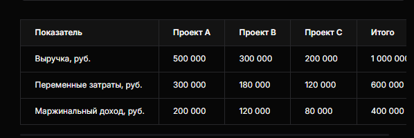

## 109 Система «директ-костинг» в управлении прибылью

### Сущность метода

**Директ‑костинг** (direct costing, метод маржинального учёта затрат) — система управленческого учёта, при которой в себестоимость продукции включаются только переменные затраты, а постоянные затраты не распределяются по видам продукции, а списываются на финансовый результат в целом за период.

Метод введён американским экономистом Д. Харрисом в 1936 году, широкое распространение получил с 1953 года после публикации Национальной ассоциации бухгалтеров‑калькуляторов.

**Ключевое уравнение директ‑костинга:**

$$
\text{Маржинальный доход (маржа)} = \text{Выручка} - \text{Переменные затраты}
$$

$$
\text{Чистая прибыль} = \text{Маржинальный доход} - \text{Постоянные затраты}
$$

## Классификация затрат в директ‑костинге

**Переменные затраты** (зависят от объёма производства/продаж):

- сырьё и материалы;
- сдельная зарплата производственных рабочих;
- упаковка;
- транспортные расходы на доставку сырья и готовой продукции;
- электроэнергия на работу оборудования.

**Постоянные затраты** (не зависят от объёма производства):

- аренда помещений;
- зарплата административного персонала;
- амортизация основных средств;
- коммунальные платежи (базовая часть);
- расходы на рекламу и маркетинг.

## Этапы расчёта по методу директ‑костинг

1. **Классификация затрат** на переменные и постоянные.
2. **Расчёт маржинального дохода** по каждому продукту/проекту/подразделению:

   $$
   \text{Маржинальный доход} = \text{Выручка} - \text{Переменные затраты}
   $$
3. **Определение точки безубыточности** — объёма продаж, при котором маржинальный доход покрывает постоянные затраты:

   $$
   \text{Точка безубыточности (в деньгах)} = \frac{\text{Постоянные затраты}}{\text{Коэффициент маржинального дохода}}
   $$

   где коэффициент маржинального дохода = $\frac{\text{Маржинальный доход}}{\text{Выручка}}$.
4. **Анализ структуры ассортимента** с целью выявления наиболее и наименее прибыльных продуктов.
5. **Принятие управленческих решений** на основе полученных данных (ценообразование, ассортимент, оптимизация затрат).

## Пример расчёта

**Постоянные затраты компании** — 300 000 руб. (аренда, управленческий персонал, амортизация).

**Чистая прибыль:** 400 000 − 300 000 = **100 000 руб.**

**Выводы:**

- Наибольший вклад в прибыльность вносит Проект А.
- Проект B приносит умеренную маржу, может быть оптимизирован.
- Проект C небольшой по объёму, но положительно влияет на итоговую прибыль.

## Преимущества директ‑костинга в управлении прибылью

- **Простота и наглядность** — менеджеры получают понятные показатели для анализа.
- **Оперативность** — быстрое принятие решений по ассортименту, ценообразованию и затратам.
- **Анализ прибыльности** — оценка вклада каждого продукта/подразделения в покрытие постоянных затрат и формирование прибыли.
- **Поддержка планирования** — удобно рассчитывать бюджеты и прогнозировать результат.
- **Расчёт точки безубыточности** — определение минимального объёма продаж для покрытия постоянных затрат.
- **Гибкость ценообразования** — возможность моделировать сценарии «что если» при изменении цен

## Недостатки и ограничения директ‑костинга

Хотя метод мощный, у него есть важные минусы — их нужно учитывать, чтобы не принять ошибочные решения.

* **Не показывает полную себестоимость.** Поскольку постоянные затраты не «сажают» в себестоимость единицы товара, по директ‑костингу нельзя корректно оценить, сколько реально стоит производство одной единицы с учётом всех ресурсов компании (в т. ч. для долгосрочных инвестиционных решений). Для этого нужен расчёт полной себестоимости.
* **Сложности с классификацией затрат.** На практике мало «чисто постоянных» или «чисто переменных» расходов — многие являются условно‑переменными (полупостоянными). Например, электроэнергия: часть идёт на работу станков (зависит от объёма — переменная), часть — на освещение цеха (почти не зависит — постоянная). Разделение требует обоснованных методик (метод высшей и низшей точки, регрессионный анализ и т. п.), иначе расчёты будут искажены.
* **Искажение оценки запасов.** В управленческой отчётности остатки готовой продукции и незавершённого производства оцениваются только по переменным затратам. При больших остатках это занижает стоимость активов и может временно «просаживать» прибыль в отчётности.
* **Не подходит для внешней отчётности.** Директ‑костинг — это инструмент управленческого учёта. Для бухгалтерской (финансовой) отчётности и налогового учёта в РФ и по МСФО требуется полная себестоимость, поэтому цифры по директ‑костингу не используют напрямую для налогов и официальных отчётов.
* **Риск краткосрочного мышления.** Поскольку постоянные затраты списываются «сразу», менеджер может слишком легко рекомендовать отказаться от продукта с низкой маржой, не учитывая, что постоянные расходы всё равно останутся (и их придётся покрывать другими продуктами).

---

## Практические управленческие задачи, которые решает директ‑костинг

Здесь метод даёт наибольшую пользу, если применять его осознанно.

* **Выбор между производством и закупкой комплектующих.** Сравнивают переменные затраты собственного производства с ценой закупки. Постоянные затраты в расчёт не берут (они не исчезнут при отказе от собственного производства), если только проект не предполагает радикального сокращения мощностей.
* **Принятие дополнительного заказа по сниженной цене.** Ключевой вопрос: покроет ли цена заказа переменные затраты и принесёт ли положительный маржинальный доход? Если да — и при этом есть свободные мощности, заказ может быть выгоден даже при цене ниже «полной себестоимости».
* **Оптимизация ассортимента при ограниченных ресурсах.** Когда есть «узкое место» (дефицит времени станка, сырья, рабочей силы), считают маржинальный доход на единицу ограничивающего фактора. Например, маржу на машино‑час или на килограмм сырья. Это показывает, какой продукт выгоднее выпускать в условиях дефицита.
* **Ценообразование и сценарии «что если».** Моделируют, как изменится прибыль при разных ценах и объёмах. Поскольку постоянные затраты отделены, легко увидеть, при какой цене и объёме маржинального дохода хватит на покрытие постоянных расходов.
* **Оценка эффекта масштаба.** Показывают, как рост объёма продаж влияет на маржинальный доход и прибыль, без «шума» от распределения постоянных затрат по единицам.

---

## Пример полноценного расчёта по директ‑костингу (с продолжением твоего фрагмента)

**Исходные данные по трём проектам:**

| Показатель                         | Проект A | Проект B | Проект C | Итого |
| -------------------------------------------- | -------------- | -------------- | -------------- | ---------- |
| Выручка, руб.                      | 500 000        | 300 000        | 200 000        | 1 000 000  |
| Переменные затраты, руб. | 300 000        | 180 000        | 120 000        | 600 000    |
| Маржинальный доход, руб. | 200 000        | 120 000        | 80 000         | 400 000    |
| Маржинальность, %              | 40%            | 40%            | 40%            | 40%        |

Постоянные затраты компании — 300 000 руб. (аренда, управленцы, амортизация).

**Расчёты:**

* Маржинальный доход итого: 400 000 руб.
* Чистая прибыль: 400 000 − 300 000 = **100 000 руб.**
* Точка безубыточности (в деньгах): 300 000/0,40=750 000300\ 000 / 0,40 = 750\ 000**300** **000/0**,**40**=**750** **000** руб.
* Запас финансовой прочности: (1 000 000−750 000)/1 000 000×100%=25%(1\ 000\ 000 - 750\ 000) / 1\ 000\ 000 \times 100\% = 25\%**(**1** **000** **000**−**750** **000**)**/1** **000** **000**×**100%**=**25%. Это значит, что компания может позволить себе падение выручки на 25% и всё ещё оставаться безубыточной.

**Управленческие выводы:**

* Все три проекта имеют одинаковую маржинальность (40%), поэтому в условиях неограниченных ресурсов их относительная привлекательность по марже одинакова.
* Если есть «узкое место» (например, лимитировано время ключевого оборудования), нужно смотреть не на общую маржу, а на маржу на единицу дефицитного ресурса. Допустим, Проект A тратит 2 машино‑часа на 500 000 руб. выручки, Проект B — 3 часа на 300 000 руб., Проект C — 1 час на 200 000 руб. Тогда маржа на машино‑час:

  * Проект A: 200 000 / 2 = 100 000 руб./час
  * Проект B: 120 000 / 3 = 40 000 руб./час
  * Проект C: 80 000 / 1 = 80 000 руб./час

  В условиях дефицита времени приоритет — Проект A, затем C, затем B.
* Если поступит дополнительный заказ на Проект B по цене ниже текущей, но выше переменных затрат (например, 280 000 руб. при переменных 180 000 руб.), он даст маржу 100 000 руб. и будет выгоден, даже если цена ниже «средней» реализации, при условии наличия свободных мощностей.

---

## Как внедрить директ‑костинг на практике

1. **Настроить раздельный учёт затрат.** В учётной системе (Excel, 1С, BI) завести отдельные статьи для переменных и постоянных затрат. Для полупеременных — выделить переменную часть (например, по нормативам расхода на единицу).
2. **Определить базу распределения (если нужно).** Для некоторых переменных затрат базой может быть объём производства, для других — время работы оборудования или количество заказов.
3. **Построить отчёты о маржинальном доходе.** Вместо традиционного отчёта о прибыли сделать двухступенчатый: сначала «Выручка − Переменные затраты = Маржинальный доход», затем «Маржинальный доход − Постоянные затраты = Чистая прибыль».
4. **Анализировать продукты/направления по маржинальному доходу** , а не по «прибыли на единицу» с распределёнными постоянными затратами.
5. **Регулярно пересматривать классификацию затрат** , так как при изменении процессов одни и те же расходы могут менять характер (например, переход с сдельной на окладную оплату превращает часть затрат из переменных в постоянные).

---

## Связь директ‑костинга с другими инструментами

Директ‑костинг редко используют в изоляции — он хорошо сочетается с:

* **CVP‑анализом** (Cost‑Volume‑Profit, анализ «затраты‑объём‑прибыль»), где исследуют, как изменения объёма влияют на прибыль через маржинальный доход.
* **ABC‑калькулированием** (Activity Based Costing) для более точного выделения переменных затрат по видам деятельности.
* **Бюджетированием и сценарным моделированием** , где важно быстро пересчитывать результаты при разных ценах, объёмах и структуре затрат.
