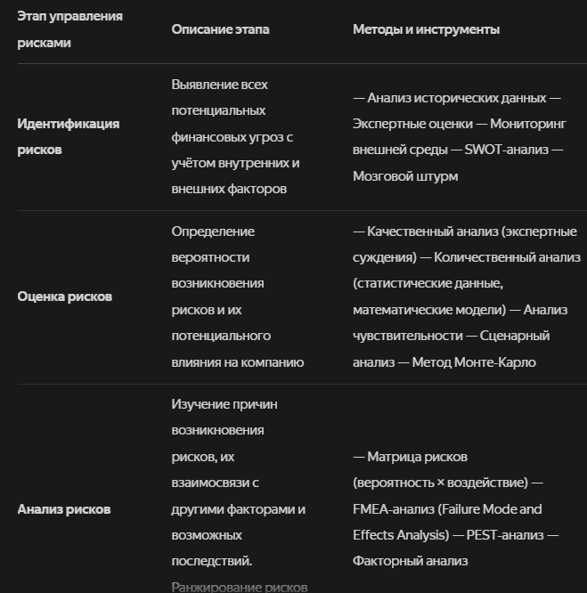
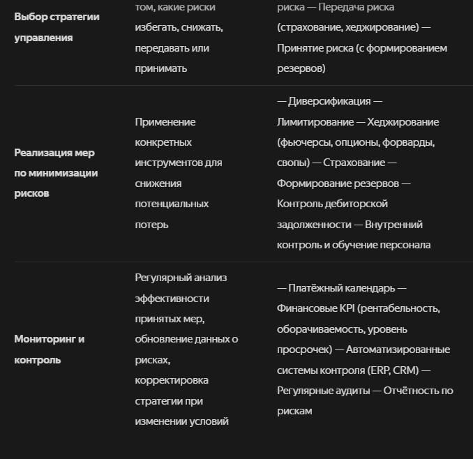

# 113 Управление рисками в финансовом менеджменте.

Управление рисками в финансовом менеджменте — это процесс идентификации, оценки, анализа, контроля и минимизации потенциальных угроз, которые могут негативно повлиять на финансовые результаты компании. Цель такого управления — снизить вероятность потерь и повысить устойчивость бизнеса. 
bosscontrol.ru +1

Основные этапы управления рисками
Идентификация рисков. Необходимо определить все потенциальные финансовые угрозы. Для этого используют анализ исторических данных, экспертные оценки, мониторинг внешней среды. Важно учитывать как внутренние (связанные с деятельностью компании), так и внешние (макроэкономические, рыночные) факторы. 
alfabank.ru +1

Оценка рисков. Определяется вероятность возникновения рисков и их возможное влияние на компанию. Оценка может быть качественной (на основе экспертных суждений) или количественной (с использованием статистических данных, математических моделей). Применяются методы анализа чувствительности, сценарного анализа и др. 
alfabank.ru +1

Анализ рисков. Изучаются причины возникновения рисков, их взаимосвязь с другими факторами, возможные последствия. На этом этапе риски ранжируются по степени опасности. 

Выбор стратегии управления. Определяется, какие риски стоит избегать, какие — снижать, а какие — принимать. Стратегия должна соответствовать общей политике компании и уровню её толерантности к рискам. 

Реализация мер по минимизации рисков. Применяются различные методы и инструменты для снижения потенциальных потерь.

Мониторинг и контроль. Регулярный анализ эффективности принятых мер, обновление данных о рисках, корректировка стратегии при изменении внешней или внутренней среды. 

Виды финансовых рисков
Финансовые риски можно классифицировать по разным критериям:

По сфере возникновения: внутренние (связанные с деятельностью компании) и внешние (обусловленные изменениями во внешней среде). 
По степени управляемости: управляемые (зависят от действий компании) и неуправляемые (макроэкономические, политические риски). 
По типу угрозы: кредитные (невыполнение обязательств контрагентами), рыночные (колебания цен на рынках), операционные (ошибки, сбои, мошенничество в финансовых операциях), валютные, инвестиционные, процентные, репутационные и др.. 
Среди наиболее значимых видов рисков выделяют кредитные, рыночные и риск ликвидности. 

Методы управления рисками
 

Инструменты управления рисками
Бюджетирование с лимитами и допусками. Система, при которой любое отклонение от плана контролируется и сопровождается корректирующими мерами. 
Платёжный календарь. Позволяет заранее увидеть кассовые разрывы, синхронизировать входящие и исходящие платежи. 
Анализ чувствительности. Оценка того, как изменение одного параметра (курса, цены, спроса) влияет на итоговый результат. 
Финансовые KPI (рентабельность, оборачиваемость, уровень просрочек и др.) — как индикаторы возможных отклонений. 
Цифровые системы контроля. Технологические инструменты для мониторинга операций и управления рисками. 
Важные аспекты
Интеграция с общей стратегией компании. Управление рисками должно поддерживать рост бизнеса, а не тормозить инициативу. 
Регулярный пересмотр системы. Эффективность системы управления рисками нужно периодически оценивать, особенно при изменениях на рынке. 
Баланс между риском и доходностью. Полное устранение рисков может привести к упущенной выгоде. Задача риск-менеджмента — найти оптимальный баланс. 
Управление рисками — непрерывный процесс, требующий постоянного внимания, обучения и адаптации к изменениям внешней и внутренней среды. 