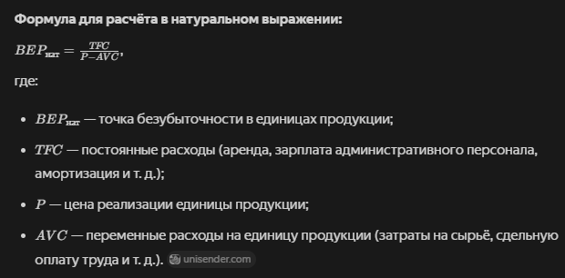

## 33 Финансовые основы оценки проекта. Этапы, точка BEP, закон прочности

Финансовые основы оценки проекта включают анализ его экономической целесообразности, рисков и потенциала прибыльности. Ключевыми элементами являются этапы оценки, точка безубыточности (BEP) и понятие запаса финансовой прочности. «Закон прочности» в этом контексте, вероятно, относится к принципам надёжности и устойчивости проекта, что может пересекаться с концепцией запаса прочности.

### Этапы оценки проекта
Оценка проекта — комплексный процесс, который охватывает весь его жизненный цикл. Можно выделить три основных этапа:

1. Предварительная инвестиционная оценка. Проводится на стадии планирования. На этом этапе:
- определяются цели проекта и ожидаемые результаты;
- оценивается потенциальный рынок и конкурентная среда;
- рассчитываются предполагаемые издержки и прогнозируемая доходность;
- анализируются риски и разрабатываются стратегии их минимизации;
- проект сравнивается с альтернативными вариантами инвестирования. 

2. Оценка на стадии реализации. В процессе реализации проекта происходит регулярный мониторинг и анализ:
- сравниваются фактические результаты с запланированными;
- отслеживаются соблюдение бюджета и сроков;
- оценивается качество выполнения работ и удовлетворённость заказчика;
- анализируются возникающие проблемы и принимаются корректирующие меры;
- при необходимости пересматриваются прогнозы и планы. 

3. Итоговая оценка после завершения проекта. На этом этапе:
- сравниваются фактические результаты с первоначальными целями;
- анализируются финансово-экономические итоги;
- оценивается удовлетворённость всех заинтересованных сторон;
- выявляются факторы, которые повлияли на успех или неудачу проекта;
- формулируются выводы и рекомендации для будущих проектов. 

### Точка безубыточности (BEP)
Точка безубыточности (Break-Even Point, BEP) — это финансовый показатель, который демонстрирует объём продаж, при котором доходы компании полностью покрывают её расходы, а чистая прибыль равна нулю. После достижения этой точки каждая дополнительная единица продукции или услуга начинает приносить прибыль. 

**Виды точки безубыточности:**
1. в натуральном выражении — минимальное количество продукции, при котором доход от реализации полностью компенсирует издержки на производство;
2. в денежном выражении — сумма выручки, необходимая для покрытия всех затрат.

Формула для расчёта в натуральном выражении:

Формула для расчёта в денежном выражении:

**Когда нужно рассчитывать BEP:**
- при планировании нового бизнеса для формирования ценообразования и объёма производства;
- при изменениях в финансовой модели для корректировки затрат, цен и производительности;
- при поиске выхода из кризиса для понимания необходимого объёма продаж;
- при продаже бизнеса для оценки его рентабельности;
- при разработке франшизы для расчёта её стоимости

### Запас финансовой прочности (ЗФП)
Запас финансовой прочности — это показатель, который отражает разрыв между фактическими результатами работы компании и её характеристиками в точке безубыточности. Он помогает оценить устойчивость бизнеса к снижению объёма продаж или выручки.

Формула расчёта:

Интерпретация результатов:
- если ЗФП < 0,2, компания находится на грани банкротства;
- при ЗФП от 0,2 до 0,5 у бизнеса есть небольшая «подушка безопасности»;
- показатель > 0,5 считается относительно стабильным;
- ЗФП > 1 указывает на высокую финансовую прочность компании

### «Закон прочности» в контексте проектов
Под «законом прочности» в контексте проектов, вероятно, подразумевается принцип устойчивости и надёжности проекта. Это может включать:
- Устойчивость к внешним воздействиям (изменение рынка, экономические кризисы и т. д.).
- Надёжность финансовой модели — способность проекта сохранять рентабельность даже при отклонениях от плана.
- Качество планирования и управления рисками, что обеспечивает выполнение проекта в срок и в рамках бюджета.

«закон прочности» можно рассматривать как совокупность факторов, которые делают проект устойчивым и снижают вероятность его неудачи.