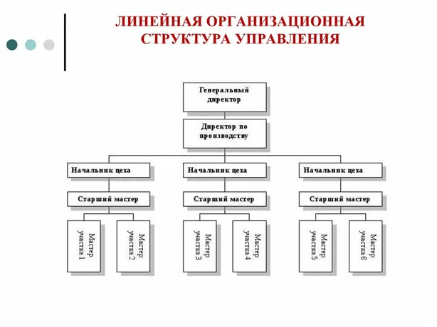
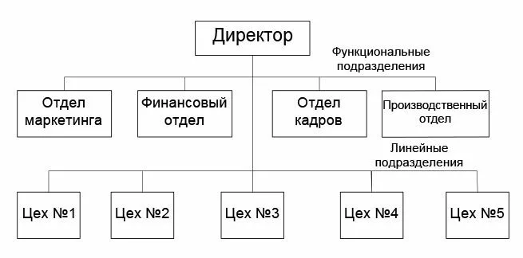
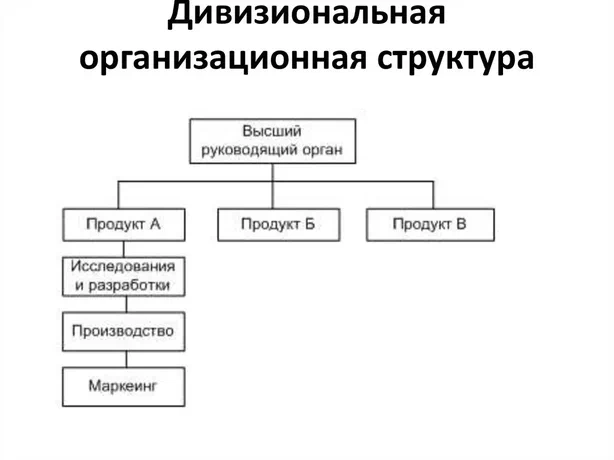
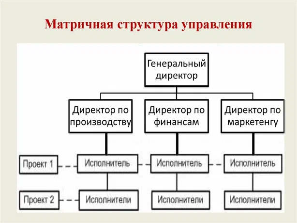

## 36 Структура организации. Типы организационных структур. Принципы и методы построения организационных структур.

Организационная структура — это система подразделений, уровней управления и связей между ними, которая определяет распределение обязанностей, полномочий и ответственности в компании. Она позволяет координировать работу всех элементов организации, обеспечивать контроль и достигать поставленных целей. 

### Принципы построения организационных структур
При создании оргструктуры важно соблюдать ряд принципов:

- Соответствие целям и задачам бизнеса. Структура должна отражать стратегию компании и поддерживать её деятельность. 

- Гибкость. Способность быстро адаптироваться к изменениям внешней и внутренней среды. 

- Централизация. Разумное сосредоточение полномочий в ключевых службах при передаче операционного управления в нижние звенья. 

- Специализация. Каждое подразделение выполняет определённый функционал, закреплённый в должностных инструкциях. 

- Нормоуправляемость (оптимальная нагрузка). Рациональное число подчинённых у руководителя (например, у высшего звена — 4–8 человек, у среднего — 8–20, у нижнего — 20–40). 

- Единство прав и ответственности. Права и обязанности подразделений и сотрудников должны быть сбалансированы. 

- Разграничение полномочий. Линейное руководство отвечает за выпуск продукции, функциональное — за подготовку и исполнение решений. 

- Экономичность. Стремление к оправданному снижению затрат на построение и содержание административного аппарата. 

- Иерархичность. Достаточное количество уровней управления с делегированием полномочий. 

- Системность. Рассмотрение субъекта и объекта управления как единого целого. 

### Методы построения организационных структур
- Метод аналогий. Использование форм и методов управления, ранее эффективно применявшихся в компаниях с похожими характеристиками. 

- Экспертно-аналитический метод. Привлечение экспертов-аналитиков для разработки индивидуальной схемы с учётом особенностей компании. 

- Структуризация целей. Формирование структуры на основе долгосрочных целей бизнеса. Включает создание «дерева целей», экспертный анализ и разработку карт полномочий. 

- Организационное моделирование. Разработка структур с использованием математических моделей и компьютерной аналитики. Выделяют математико-кибернетические, графоаналитические, натурные и математико-статистические модели

### Типы организационных структур

- Линейная. Иерархическая структура с вертикальным подчинением. Во главе стоит единоличный руководитель, каждому нижестоящему руководителю последовательно подчиняется следующий уровень. Подходит для небольших компаний с простой деятельностью. 

- Функциональная. Сотрудники и подразделения специализируются по функциональным областям (производство, финансы, маркетинг и т. д.). Подразделения формируются по принципу схожести работ и квалификации сотрудников. Подходит для организаций с несколькими сферами деятельности или видами продукции. 

- Линейно-функциональная. Комбинация линейной вертикали подчинения и специализации подразделений по функциональным областям. Функциональные руководители подчиняются линейным по специальным вопросам. 

- Дивизиональная. Компания разделяется на крупные производственно-хозяйственные подразделения (дивизионы) по видам товаров, регионам или группам потребителей. Дивизионы обладают большой самостоятельностью и несут полную ответственность за результаты. Подходит для компаний с несколькими филиалами или товарными группами. 

- Матричная. Сочетает признаки функционального и дивизионального типов. В такой организации одновременно существуют постоянные функциональные подразделения и отдельные проекты, в которые специалистов привлекают по необходимости. Одна из самых сложных структур, характерна для крупных организаций с исследованиями и разработками. 

- Адаптивные структуры (командные, сетевые). Подходят для динамичных отраслей. Командные структуры создают самоуправляемые группы для решения конкретных задач, сетевые объединяют независимых специалистов и компании для совместной деятельности. 

### Элементы организационной структуры
В любой структуре управления обязательно присутствуют три базовых элемента:

- Звенья (подразделения). Структурные единицы, выполняющие определённую функцию. Они могут быть линейными (связаны с порядком принятия решений и управлением) и функциональными (консультируют и поддерживают).

- Уровни управления. Последовательность подчинения одних звеньев другим. Обычно выделяют высший уровень (топ-менеджмент), средний (руководители подразделений), низший (исполнители).

- Горизонтальные и вертикальные связи. Вертикальные отражают подчиненность, направление решений сверху вниз. Горизонтальные показывают равноправное взаимодействие звеньев по решению общих вопросов.

### Этапы построения организационной структуры
Процесс создания оргструктуры обычно включает следующие этапы:

- Анализ целей, стратегии и бизнес-процессов компании.
- Определение типа структуры.
- Распределение задач и формирование структурных подразделений.
- Определение полномочий и ответственности для каждого уровня управления и подразделения.
- Разработка системы коммуникаций, определение информационных потоков и регламентов взаимодействия подразделений.
- Формирование штатного расписания, определение персонального состава подразделений, должностных обязанностей и матрицы распределения полномочий и ответственности.
- Документальное оформление и утверждение структуры в виде положений о подразделениях, должностных инструкций, штатного расписания и т. д.

Выбор типа структуры зависит от множества факторов: размера компании, сферы деятельности, стратегии развития, квалификации персонала, стиля управления и т. д. Оргструктуру нужно регулярно анализировать и совершенствовать по мере развития компании и изменения внешних условий