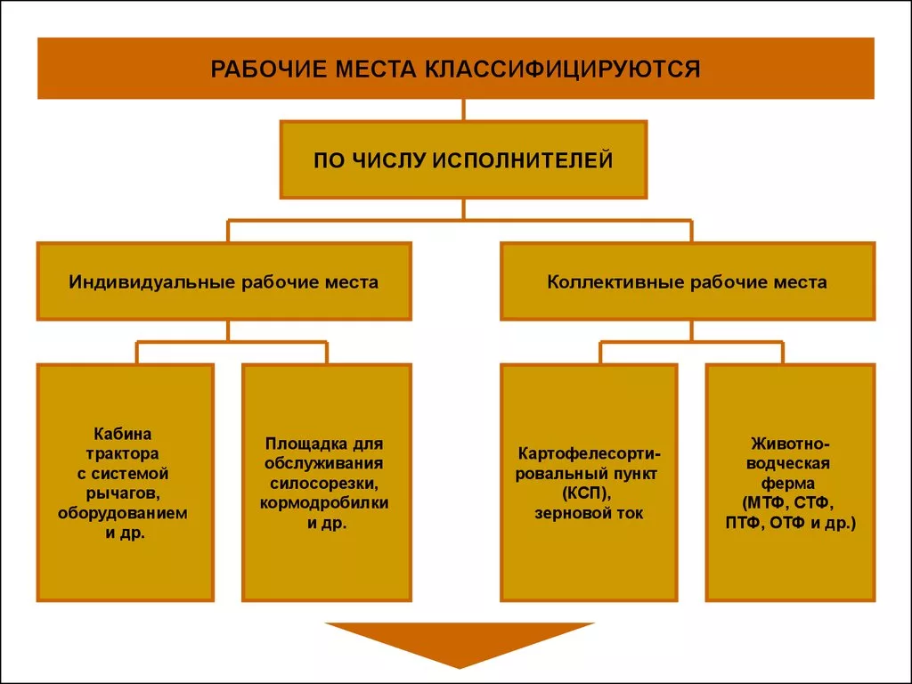
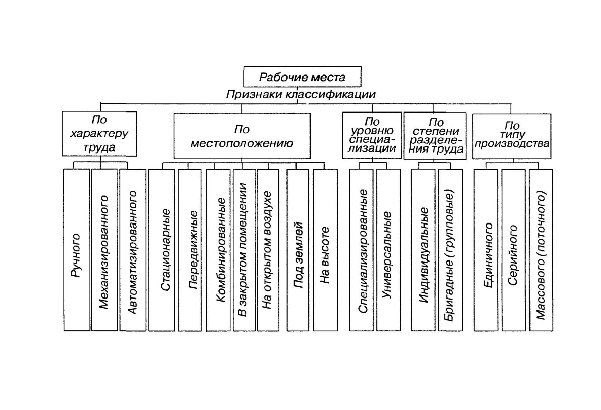
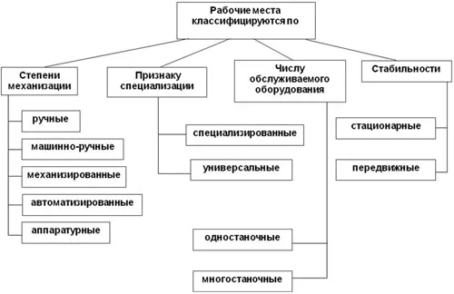

## 70 Понятие и классификации рабочих мест. Планировка рабочих мест. Специализация и оснащение рабочих мест. Обслуживание рабочих мест. 

Рабочее место — это первичное звено производственной структуры, закреплённая за работником (или группой работников) часть производственной площади, оснащённая оборудованием и предназначенная для выполнения определённой части производственного процесса. Оно рассматривается в двух аспектах: как зона приложения труда, организованная для трудовой деятельности, и как зона организации жизнедеятельности людей.

### Классификация рабочих мест
Рабочие места можно классифицировать по различным признакам. Некоторые из них:

1. **По степени специализации:**
- Универсальные — выполняется более 10 разнообразных операций. Используются в единичном производстве. 
- Специализированные — закреплено от 3 до 10 операций. Характерны для серийного производства. 
- Специальные — закреплено от 1 до 3 операций. Применяются в массовом производстве. 

2. **По уровню автоматизации:**
- с ручной работой;
- ручной механизированной работы;
- машинно-ручной работы;
- машинное;
- автоматизированное;
- аппаратурное. 

3. **По выполняемым функциям:** рабочее место рабочего, специалиста, служащего, руководителя, младшего обслуживающего персонала и т. д.. 

4. **По условиям труда:** с нормальными условиями, с тяжёлым физическим трудом, с вредными условиями, с особо тяжёлым физическим трудом, с особо вредными условиями, с высокой нервно-психической напряжённостью, с монотонным трудом. 

5. **По времени функционирования:** односменные, многосменные. 

6. **По количеству обслуживаемого оборудования:** без оборудования, одностаночные (одноагрегатные), многостаночные (многоагрегатные, многоаппаратные). 

7. **По степени подвижности:** стационарные, передвижные. 

8. **По профессиональному признаку:** рабочее место бухгалтера, врача, плотника и т. д.

### Планировка рабочих мест
Планировка рабочего места — это взаимное (трёхмерное) пространственное расположение на производственной площади основного и вспомогательного оборудования, технологической и организационной оснастки и самого работника. 

**Различают внешнюю и внутреннюю планировку.**

1. Внешняя планировка определяет положение рабочего места относительно других рабочих мест, участка, линии, цеха, грузопотоков, стен, колонн и т. д. Её цель — обеспечить минимальное расстояние перемещений работника в течение смены, экономное использование рабочей площади и удобство в работе. 

2. Внутренняя планировка касается размещения технологической оснастки и инструмента в рабочей зоне, инструментальных шкафах и тумбочках, правильного расположения заготовок и деталей на рабочем месте. Она должна обеспечивать удобную рабочую позу, короткие и малоутомительные движения, равномерное и по возможности одновременное выполнение трудовых движений обеими руками. 

**При внутренней планировке соблюдают следующие правила:**
- для каждого предмета должно быть отведено определённое место;
- предметы, которыми пользуются во время работы чаще, должны располагаться ближе к работнику и по возможности на уровне рабочей зоны;
- предметы необходимо размещать так, чтобы трудовые движения работника свести к движениям предплечья и пальцев рук;
- всё, что берётся левой рукой, располагается слева, всё, что правой, — справа;
- материалы и инструменты, которые берутся обеими руками, располагаются с той стороны, куда во время работы обращён корпус работника. 

### Зона досягаемости
Зона досягаемости — пространство, объём которого ограничен возможными траекториями движения рук работника. Оптимальная зона ограничивается траекториями движения полусогнутых рук, осуществляемого без наклонов корпуса при свободно опущенных плечах. Максимальная зона ограничивается траекториями движения вытянутых рук.

### Специализация рабочих мест
Специализация рабочего места — это установление чёткого производственного профиля, закрепление за ним однотипных операций или действий. В основе специализации лежат работы по стандартизации, нормализации и унификации изделий, а также типизация технологических процессов. 

Специализация позволяет заниматься оснащением рабочего места в соответствии с последним уровнем производительности оборудования, технологической и организационной оснастке, а также даёт возможность уменьшить время на подготовительно-заключительные и вспомогательные работы и активно применять эффективные приёмы и методы труда. 

### Оснащение рабочих мест
Оснащение рабочего места — это комплект размещённого на рабочем месте основного технологического и вспомогательного оборудования, технологической и организационной оснастки, средств сигнализации и охраны труда. 

Характер оснащения обуславливают такие факторы, как специализация, тип производства, а также характер технологического процесса. 

**В комплекс оснащения рабочих мест входят следующие составляющие:**
- основное технологическое оборудование (станок, агрегат, пульт и т. д.);
- вспомогательное оборудование (подъёмно-транспортные устройства, подставки для хранения или квантование деталей и т. д.);
- инвентарь и рабочая мебель (инструментальные шкафы, тумбочки, стеллажи, поворотные сиденья, подлокотники и т. д.);
- производственная тара для хранения заготовок, деталей (ящики, контейнеры, кассеты и т. д.);
- инструмент и технологическая оснастка (режущий и мерительный инструмент и т. д.);
- организационная оснастка (устройства связи, сигнализации, приспособления для уборки рабочего места и т. д.);
- устройства охраны труда, санитарно-гигиенического и культурно-бытового назначения (ограждения, защитные экраны, вентиляция, освещение, предметы интерьера и т. д.). 

Средства оснащения подразделяются на постоянные и временные.

### Обслуживание рабочих мест
Обслуживание рабочего места — это составная часть организационного процесса, направленная на обеспечение его бесперебойного и эффективного функционирования. 

Организационные формы обслуживания рабочих мест:

1. **Дежурное.** Обслуживающий персонал вызывается на рабочее место по мере необходимости. Чаще всего носит характер самообслуживания. 

2. **Планово-предупредительное.** Имеет предварительный характер, требует большой предварительной работы, что целесообразно лишь при высокой серийности производства.

3. **Стандартное (регламентированное).** Наиболее совершенная форма обслуживания, характерна для условий поточно-массового производства. 

Обслуживание включает производственный инструктаж, снабжение сырьём и материалами, ремонт оборудования, доставку инструмента и т. д..