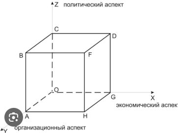

## 78 Типы бизнес-стратегий и их характеристики. Оценка эффективности стратегии. Стратегический контроль за выполнением стратегии. Стратегический куб как модель стратегического состояния организации

### Типы бизнес-стратегий
Бизнес-стратегии можно классифицировать по разным критериям. Вот некоторые распространённые типы:

1. **По уровню планирования:**
- Базовая. Определяет общее направление развития компании, её продуктов, услуг и структуры. Включает перераспределение ресурсов, организационные изменения, новые бизнес-процессы. 
- Конкурентная. Направлена на укрепление позиций на рынке, переманивание клиентов у конкурентов, рост показателей (прибыли, объёмов продаж). 
- Функциональная. Фокусируется на внутренних процессах и работе отдельных подразделений (производство, маркетинг, финансы и т. д.). 

2. **По целям развития:**
- Стратегия динамичного роста. Компания стремится к лидерству по темпам развития, превышая средние темпы роста рынка. 
- Стратегия скачкообразного роста. Резкое увеличение темпов развития за короткий промежуток времени. 
- Стратегия умеренного роста. Адаптация к средним темпам роста рынка. 
- Стратегия медленного роста. Увеличение экономического потенциала при темпах развития ниже рыночных возможностей. 
- Стратегия замедления роста. Снижение темпов увеличения экономических показателей при сохранении их абсолютного роста. 
- Стратегии стабилизации, защиты и выживания. Направлены на сохранение рыночной ниши и доли рынка. 

3. **По подходам Майлза и Сноу:**
- Стратегия изыскателя. Агрессивная стратегия с активным поиском новых рынков и возможностей, разработкой новых продуктов. 
- Стратегия защитника. Фокус на стабильном рынке, минимизация рисков, избегание радикальных изменений. 
- Анализатор. Баланс между стабильностью и инновациями, расширение в близких к ключевой компетенции областях. 
- Реактор. Отсутствие чёткой стратегии, реакция на события по мере их возникновения. 

4. **По конкурентным преимуществам (по М. Портеру):**
- Лидерство по издержкам. Фокус на производстве и сбыте более дешёвой продукции, чем у конкурентов. 
- Дифференциация. Создание уникального торгового предложения (УТП) для выделения на рынке. 
- Фокусирование. Ориентация на узкий сегмент целевой аудитории. 

5. **По направлениям развития:**
- Концентрированный рост. Укрепление позиций в текущей нише, улучшение существующих продуктов или разработка новых в рамках выбранной ниши. 
- Вертикальная интеграция. Расширение компании путём включения новых бизнес-структур (поглощение организаций в смежных отраслях или создание собственных подразделений). 
- Диверсификация. Выход в новые отрасли или продукты. Бывает центрированной (расширение ассортимента без изменения бизнес-процессов), горизонтальной (новые продукты для текущей аудитории) и конгломеративной (совершенно новые продукты, не связанные с текущей деятельностью)

### Оценка эффективности стратегии
Эффективность стратегии — это степень достижения поставленных целей и устойчивости организации в долгосрочной перспективе. 

**Критерии и методы оценки эффективности стратегии:**
- Планомерность. Соответствие стратегии миссии организации. 
- Пригодность. Возможность реализации стратегии в текущих рыночных условиях. 
- Выполнимость. Наличие у компании необходимых ресурсов (финансовых, кадровых и т. д.). 
- Приемлемость. Соответствие стратегии интересам ключевых сотрудников и стейкхолдеров. 
- Превосходство. Возможность обойти конкурентов по ключевым показателям.

**Методы оценки:**
- Сравнение фактических результатов с плановыми показателями. Анализируют достижение целей, сроки реализации, полученный эффект. 
- Балансированная система показателей (BSC). Учитывает финансовые и нефинансовые показатели, стратегический и оперативный уровни управления, интересы стейкхолдеров. 
- SWOT- и PESTEL-анализ. Помогают оценить внутренние и внешние факторы, влияющие на стратегию. 
- Анализ экономической эффективности. Включает расчёт ROI, EVA (экономической добавленной стоимости) и других метрик.

### Стратегический куб
Стратегический куб — это модель стратегического состояния организации, которая графически отображает её положение в трёхмерной системе координат. Вершины куба представляют предельные стратегические состояния, а реальное положение компании определяется точкой внутри куба с координатами (x, y, z), отражающими баланс трёх аспектов: экономического, политического и организационного. 

| Вершина куба | Название состояния | Описание состояния | Ключевые особенности | Риски и недостатки |
|------------|------------------|-----------------|------------------|-------------------|
| **A** | Рычащая бюрократия | Доминирование организационного аспекта | — Чёткая регламентация процессов&#10;— Жёсткие правила и процедуры&#10;— Иерархическая структура | — Подавление инициативы сотрудников&#10;— Низкая гибкость и адаптивность&#10;— Ориентация на процесс, а не на результат |
| **C** | Непредвиденные коалиции | Доминирование политического аспекта | — Формирование групп по интересам&#10;— Борьба за влияние внутри организации&#10;— Личные связи важнее формальных правил | — Конфликты между группами&#10;— Размытость стратегических целей&#10;— Неэффективное использование ресурсов |
| **G** | Рациональная система | Доминирование экономического аспекта | — Фокус на эффективности и прибыли&#10;— Рациональное принятие решений&#10;— Оптимизация затрат | — Игнорирование человеческого фактора&#10;— Снижение мотивации персонала&#10;— Краткосрочная ориентация |
| **B** | Авторитарная организация | Комбинация политического и организационного аспектов | — Централизация власти&#10;— Сильный лидер во главе&#10;— Чёткая иерархия | — Зависимость от личности руководителя&#10;— Подавление альтернативных мнений&#10;— Риск ошибочных решений |
| **D** | Постоянное движение | Комбинация политического и экономического аспектов | — Активная внешняя экспансия&#10;— Гибкость в принятии решений&#10;— Поиск новых возможностей | — Отсутствие стабильности&#10;— Недостаток системности&#10;— Перегрузка персонала |
| **H** | Слепой механизм | Комбинация организационного и экономического аспектов | — Стандартизация процессов&#10;— Автоматизация операций&#10;— Фокус на операционной эффективности | — Игнорирование социальных факторов&#10;— Формальный подход к управлению&#10;— Потеря креативности и инноваций |
| **O** | Неорганическая система | Отсутствие всех трёх аспектов | — Хаос в управлении&#10;— Отсутствие чётких целей и стратегии&#10;— Низкая координация действий | — Неспособность реагировать на изменения внешней среды&#10;— Высокая вероятность банкротства&#10;— Дезорганизация всех процессов |
| **F** | Стратегическое равновесие | Баланс экономического, политического и организационного аспектов | — Гармоничное развитие всех направлений&#10;— Учёт интересов всех стейкхолдеров&#10;— Адаптивность к изменениям | — Требует высокой квалификации менеджмента&#10;— Сложнодостижимое состояние&#10;— Необходимость постоянного мониторинга и корректировки |

**Пояснения к таблице:**
- Экономический аспект — ориентация на прибыль, эффективность, рыночные показатели.
- Политический аспект — учёт интересов групп влияния, коалиций, неформальных лидеров.
- Организационный аспект — структура, процессы, регламенты, формальные правила.

Стратегический куб позволяет оценить текущее состояние организации и определить, к какой вершине она ближе всего. Идеальное состояние — вершина F (стратегическое равновесие), где все три аспекта сбалансированы. Отклонения в сторону других вершин указывают на дисбалансы, которые необходимо корректировать для устойчивого развития.