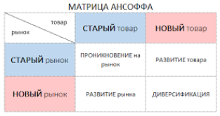
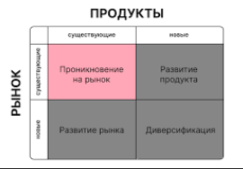

## 85 Методика оценки привлекательности отрасли И. Ансоффа. Показатели синергии. Оценка уровня синергии.

Методика оценки привлекательности отрасли по И. Ансоффу связана с его концепцией стратегического роста бизнеса, которая выражается в матрице «товар — рынок» (матрице Ансоффа). Эта модель помогает определить направления развития компании, оценивая комбинации существующих/новых продуктов и существующих/новых рынков. Хотя матрица напрямую не оценивает привлекательность отрасли в целом, она позволяет анализировать возможности роста и риски в рамках конкретной отрасли с учётом текущих и потенциальных рыночных условий.

### Матрица Ансоффа включает четыре стратегии:
1. Проникновение на рынок — увеличение продаж существующего продукта на существующем рынке. Подходит для компаний, которые хорошо знают свою аудиторию и рынок. Риск относительно низкий. 
2. Развитие рынка — вывод существующего продукта на новый рынок (новый географический регион, сегмент потребителей и т. д.). 
3. Развитие продукта — создание нового продукта для существующего рынка. 
4. Диверсификация — запуск нового продукта на новом рынке. Самая рискованная стратегия

**Факторы оценки привлекательности модели Ансоффа:**
- потенциал роста рынка (темпы роста, насыщение рынка);
- уровень конкуренции и барьеры для входа в отрасль;
- соответствие отрасли возможностям и компетенциям компании;
- риски, связанные с выходом на новый рынок или разработкой нового продукта.

Для более глубокой оценки отрасли могут применяться и другие инструменты, например PEST-анализ (оценка политических, экономических, социальных и технологических факторов) или анализ пяти сил Портера.

### Показатели синергии
Синергия — это эффект, при котором совокупный результат взаимодействия элементов системы (подразделений, продуктов, рынков) превышает сумму их отдельных результатов. В стратегическом менеджменте синергия рассматривается как ключевой фактор повышения конкурентоспособности и эффективности бизнеса. 

**Некоторые показатели, которые могут использоваться для оценки синергии:**
- увеличение прибыли в денежном выражении;
- снижение операционных расходов (например, за счёт оптимизации процессов, совместного использования ресурсов);
- снижение потребности в инвестициях;
- ускорение достижения стратегических целей. 

Также синергию можно измерять через рост доли рынка, улучшение качества продукции, усиление конкурентных преимуществ, повышение лояльности клиентов и другие нефинансовые показатели.

### Оценка уровня синергии
Для оценки уровня синергии используются различные методы и подходы. Один из них — матричный метод, предложенный в работах по стратегическому менеджменту. 

**Алгоритм оценки с помощью матрицы синергии:**
1. Составить матрицу, где по строкам располагаются стратегические зоны хозяйствования (СЗХ), предоставляющие ресурсы, а по столбцам — получающие ресурсы. 
2. Экспертным путём оценить по шкале от 0 до 10 уровень синергии, который «дающая» СЗХ предлагает «получающей» в настоящее время.
3. Вывести суммы по строкам и столбцам — они покажут силу воздействия по каждому из направлений.
4. Оценить степень зависимости одной СЗХ от другой с помощью сумм по строкам. Суммы по столбцам покажут степень важности одних СЗХ для других.
5. На основании полученных оценок определить важнейшие общие линии связи, действующие в настоящее время.
6. Повторить процедуру для оценки потенциальных линий связи на основе будущих факторов успешного применения стратегии и управленческих возможностей.
7. Сопоставить действующие и потенциальные линии связи, чтобы найти желаемые линии синергизма, которые в дальнейшем следует рассматривать как ориентиры организации. 

### Другие методы оценки синергии
- **Экономико-математические модели.** Например, расчёт разницы между денежными потоками объединённой компании и суммой потоков независимых компаний до слияния. 
- **Сбалансированная система показателей (ССП).** Позволяет оценить синергию через призму финансовых результатов, позиции на рынке, внутренних бизнес-процессов и развития персонала. 
- **Метод анализа иерархий (МАИ) и метод «Электра-1».** Используются для определения индикаторов эффекта синергии на корпоративном, бизнес- и функциональном уровнях. 

Важно учитывать, что синергия не всегда имеет положительный характер. Может возникать и «отрицательная синергия» (антисинергия), когда взаимодействие элементов системы приводит к снижению эффективности по сравнению с их раздельным функционированием. Это может быть связано с конфликтами в управлении, несовместимостью культур, неэффективной интеграцией ресурсов и т. д. 

При оценке синергии необходимо учитывать как количественные, так и качественные факторы, а также динамику изменений во времени.

### Заключение
Важно учитывать, что синергия не всегда имеет положительный характер. Может возникать и «отрицательная синергия» (антисинергия), когда взаимодействие элементов системы приводит к снижению эффективности по сравнению с их раздельным функционированием. Это может быть связано с конфликтами в управлении, несовместимостью культур, неэффективной интеграцией ресурсов и т. д. 

При оценке синергии необходимо учитывать как количественные, так и качественные факторы, а также динамику изменений во времени.