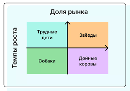
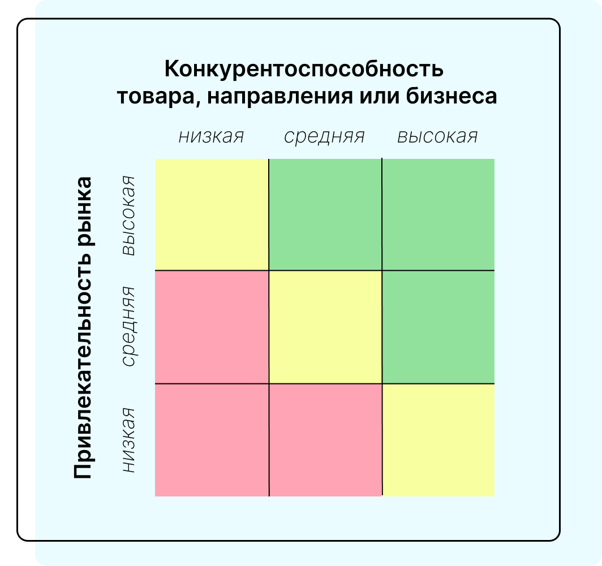
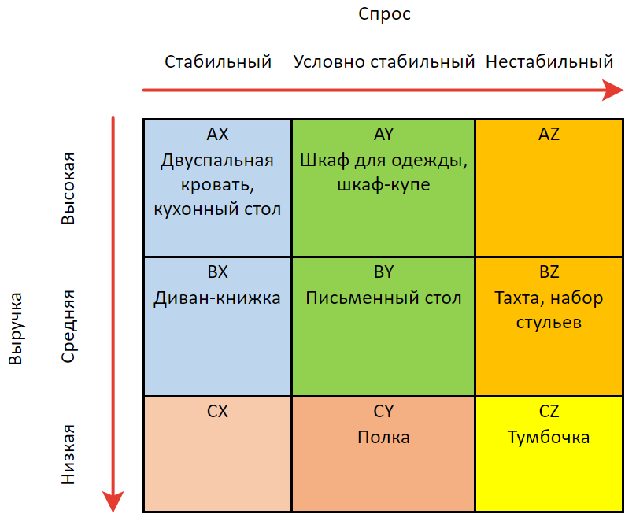
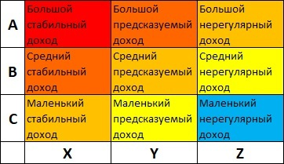

- №1 модель LCAG (алгоритм сокращения времени на достижение соглашения между узлами в распределённых системах, использующий графовую модель, где узлы сети представлены вершинами графа, а связи между ними - рёбрами)

- №2 модель LCAG (по инициалам авторов: Lerned, Christensen, Andrews, Guth), которая основана на анализе сильных и слабых сторон предприятия, возможностей и угроз внешней среды, а также системы базовых ценностей руководителей компании. Основной принцип — поиск соответствия между внутренними ресурсами компании и внешними условиями с учётом ценностей менеджмента. 

- Матрица БКГ

- Матрица McKinsey

- PEST, PESTEL

- ABC‑XYZ‑анализ
ABC‑анализ классифицирует объекты по степени их влияния на результат 
XYZ‑анализ классифицирует объекты по стабильности и предсказуемости спроса

- Метод анализа иерархий (МАИ) и метод «Электра-1» - это два подхода к многокритериальному принятию решений, которые используются для сравнения альтернатив с учётом различных критериев. Они применяются в бизнесе, управлении, здравоохранении, образовании и других сферах